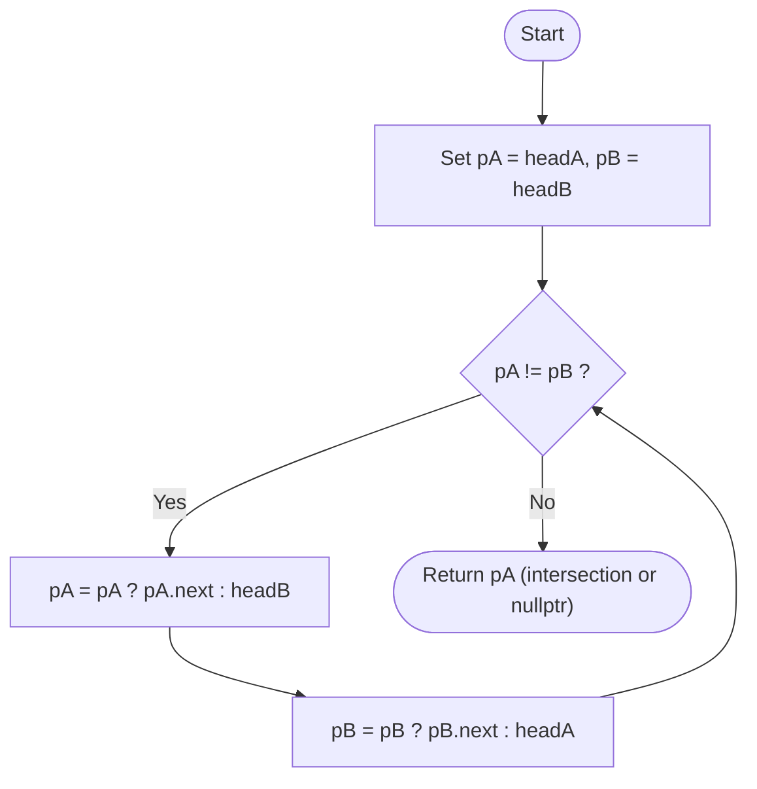
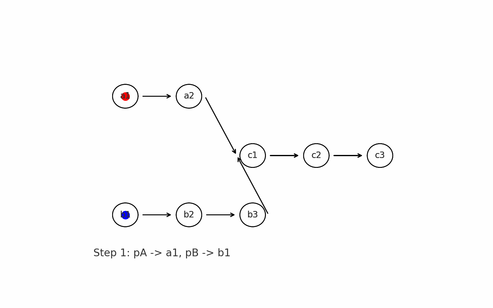
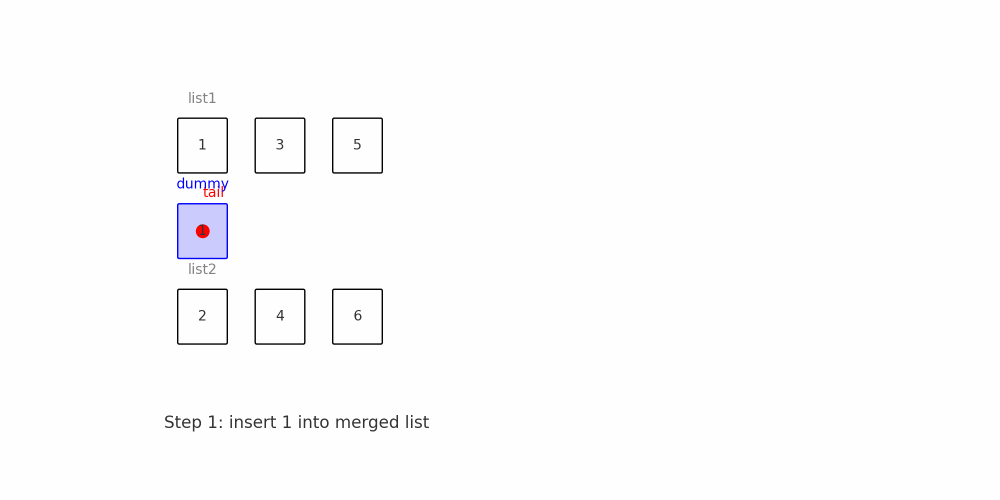

# 链表

<a href="#目录" style="font-size: 16px; color: #666;">▲ 返回目录</a>


## 🧠 一、链表操作的核心原则

### ✅ 原则1：**改结构就用哨兵（dummy）节点**

* **目的：** 防止头节点被动手术时需要额外判断（例如删除/插入第一个节点）
* **适用场景：** 删除节点、插入节点、反转链表、partition等
* **记忆口诀：**

  > 改结构别犹豫，dummy挂头最省事

---

### ✅ 原则2：**访问就用 `curr`，操作就带上 `prev` 和 `next`**

* `curr`：当前正在访问的节点
* `prev`：`curr` 的前一个节点（用于修改 `prev->next`）
* `next`：提前保存 `curr->next`，防止链断

| 操作类型 | 需要指针                      | 说明                                   |
| ---- | ------------------------- | ------------------------------------ |
| 遍历链表 | `curr`                    | 逐个访问节点                               |
| 删除节点 | `prev`, `curr`            | 要用 `prev->next = curr->next`         |
| 插入节点 | `prev`, `curr`, \[`next`] | 插入新节点时，处理 `prev->next` 和 `new->next` |
| 反转链表 | `prev`, `curr`, `next`    | 必须保存 `next` 再改 `curr->next = prev`   |

* **记忆口诀：**

  > 遍历靠 `curr`，删改带 `prev`，变序别忘 `next`

---

## 🔁 二、典型操作的模板总结

### ✂️ 1. 删除链表中的某个节点

```cpp
ListNode* deleteNode(ListNode* head, int val) {
    ListNode* dummy = new ListNode(0);
    dummy->next = head;
    ListNode* prev = dummy, *curr = head;
    while (curr) {
        if (curr->val == val) {
            prev->next = curr->next;
            break;
        }
        prev = curr;
        curr = curr->next;
    }
    return dummy->next;
}
```

* ❗注意：你想删 `curr`，**操作的是 `prev->next`**
* ✅ 模板结构：`prev`、`curr`前后推进

---

### ➕ 2. 插入节点（在值为 `x` 的节点前插入）

```cpp
ListNode* insertBefore(ListNode* head, int x, int val) {
    ListNode* dummy = new ListNode(0);
    dummy->next = head;
    ListNode* prev = dummy, *curr = head;
    while (curr) {
        if (curr->val == x) {
            ListNode* node = new ListNode(val);
            prev->next = node;
            node->next = curr;
            break;
        }
        prev = curr;
        curr = curr->next;
    }
    return dummy->next;
}
```

---

### 🔁 3. 反转链表（经典模板）

```cpp
ListNode* reverseList(ListNode* head) {
    ListNode* prev = nullptr;
    ListNode* curr = head;
    while (curr) {
        ListNode* next = curr->next;  // ⚠️ 必须提前保存
        curr->next = prev;
        prev = curr;
        curr = next;
    }
    return prev;
}
```

* 反转时最常犯错：**指针丢失（没保存 `next`）**
* ✅ 三指针：prev、curr、next 各守其职

---

## 🧷 三、哨兵节点 dummy 的使用时机总结

| 操作类型       | 是否建议用 dummy         |
| ---------- | ------------------- |
| 删除节点       | ✅ 推荐，防止删头麻烦         |
| 插入节点       | ✅ 推荐，插入头部很常见        |
| 分割链表/重组    | ✅ 推荐，常需要多个 dummy 链表 |
| 简单遍历/求和等只读 | ❌ 不需要               |
| 反转链表       | ❌ 一般不需要（除非递归反转头）    |

* dummy 最常与 `prev` 一起使用
* dummy 后接原头节点，操作完成后返回 `dummy->next`

---

## 📌 四、容易忘记的细节点

| 问题类型     | 常见错误                                    |
| -------- | --------------------------------------- |
| 遍历后未推进指针 | 忘记 `curr = curr->next`，死循环              |
| 操作指针顺序错  | 提前修改导致链断，尤其是反转                          |
| 返回头节点错误  | 没用 dummy 时忘了更新 head，返回错节点               |
| 内存泄漏     | new 节点未 delete，或 dummy 未 delete（实际题中可略） |

---

## 🔑 五、建议的记忆法

### ✅ 类比“链条”：

链表操作就是一根链条上的连接点，你操作一个节点，必须同时控制它的**前后两端** —— 所以：

* 想动 `curr`，就必须保住 `prev` 和 `next`
* `dummy` 就是链子的“头卡扣”，可以自由接入或断开

### ✅ 多画图：

每当写链表操作时 **画指针结构图**，1分钟省10分钟调试！

---

## 🧪 六、建议练习的模板题目

| 题目         | 链接           |
| ---------- | ------------ |
| 删除链表中指定值节点 | Leetcode 203 |
| 反转链表       | Leetcode 206 |
| 合并两个有序链表   | Leetcode 21  |
| 分隔链表       | Leetcode 86  |
| 回文链表判断     | Leetcode 234 |

---

## ✅ 总结口诀（建议背下来）

> 改结构别犹豫，dummy挂头最省事
> 遍历靠 `curr`，删改带 `prev`，变序别忘 `next`
> 动链条想前后，画图查指针走

---


## 目录

* [LeetCode 链表问题总结](#LeetCode-linked-list-总结)
  * [目录](#目录)
  * [160. 链表交叉](#160-intersection-of-two-linked-lists)
  * [21. 合并两个有序链表](#21-merge-two-sorted-lists)
  * [141. 检查链表中的环](#141-linked-list-cycle)
  * [203. 删除链表中的节点](#203-removed-linked-list-elements)
  * [206. 翻转链表](#206-reverse-linked-list)
  * [243. 单链表回文判断](#243-palindrome-linked-list)
  * [83. 删除排序链表中重复节点](#83-remove-duplicates-from-sorted-list)
  * [82. 删除排序链表中所有重复节点](#82-remove-duplicates-from-sorted-list-2)
  * [1290. 转换二进制链表值为整数](#1290-convert-binary-number-in-a-linked-list-to-integer)
  * [3507. 删除数组中的最小对](#3507-minimum-pair-removal-to-sort-array)
  * [705. 设计哈希集合](#705-design-hashset)
  * [707. 设计链表](#707-design-linked-list)
  * [86. 分拆链表](#86-partition-list)

---

## 160. Intersection of Two Linked Lists

### ✅ 链表结构（有交点）：

[](https://raw.githubusercontent.com/zongwave/leetcode/main/linkedlist/diagram/intersection_of_two_linked-list.png)


```
List A: a1 → a2
                ↘
                    c1 → c2 → c3
                   ↗
List B: b1 → b2 → b3
```

* 链表 A 长度：2（a1→a2）+ 3（c1→c2→c3） = 5
* 链表 B 长度：3（b1→b2→b3）+ 3（c1→c2→c3） = 6

---
```c++
/**
 * Definition for singly-linked list.
 * struct ListNode {
 *     int val;
 *     ListNode *next;
 *     ListNode(int x) : val(x), next(NULL) {}
 * };
 */
class Solution {
public:
    ListNode *getIntersectionNode(ListNode *headA, ListNode *headB) {
        ListNode *pA = headA;
        ListNode *pB = headB;

        while (pA != pB) {
            pA = pA ? pA->next : headB;
            pB = pB ? pB->next : headA;
        }
        return pA;
    }
}；

```
<a href="#目录" style="font-size: 16px; color: #666;">▲ 返回目录</a>
---

### ✅ 严格对齐的双指针遍历轨迹

我们按顺序列出 **每一步 pA 与 pB 的指针位置**，直到首次相遇：

| 步骤 | pA      | pB      |
| -- | ------- | ------- |
| 1  | a1      | b1      |
| 2  | a2      | b2      |
| 3  | c1      | b3      |
| 4  | c2      | c1      |
| 5  | c3      | c2      |
| 6  | nullptr | c3      |
| 7  | b1      | nullptr |
| 8  | b2      | a1      |
| 9  | b3      | a2      |
| 10 | c1 ✅    | c1 ✅    |

🎉 **在第10步两者第一次重合，相遇在交点 `c1`。**

---

### 🧠 简洁总结：为什么一定能对齐？

因为：

* pA 走的是 `A + B`
* pB 走的是 `B + A`
* 它们都走了 `m + n` 步

**只要有交点，一定会在最后相交段（即 c1 开始）重合；如果没有交点，就同时走到 `nullptr`。**

---

### 🔁 Mermaid 流程图（补充解释逻辑）

下面是重新整理过的 Mermaid 流程图，便于你在 Markdown 编辑器中使用：



[](https://raw.githubusercontent.com/zongwave/leetcode/main/linkedlist/diagram/intersection_demo.gif)


---

### ✅ 最终提示

你总结的这句话非常经典，可以作为这道题的“口诀”：

> **两个指针都走同样的步数，n+m 它们一定会同时走完，如果有相同的“道路”，会是在终点。那么两个指针必然会在道路上“相遇”。**


## 21. Merge Two Sorted Lists


[](https://raw.githubusercontent.com/zongwave/leetcode/main/linkedlist/diagram/merge_ex1.jpg)


### ✅ 推荐解法：使用哨兵节点 + 双指针（LeetCode 官方解法）
```cpp
/**
 * Definition for singly-linked list.
 * struct ListNode {
 *     int val;
 *     ListNode *next;
 *     ListNode() : val(0), next(nullptr) {}
 *     ListNode(int x) : val(x), next(nullptr) {}
 *     ListNode(int x, ListNode *next) : val(x), next(next) {}
 * };
 */
class Solution {
public:
    ListNode* mergeTwoLists(ListNode* list1, ListNode* list2) {
        ListNode dummy();
        listNode tail = &dummy;

        while (list1 != NULL && list2 != NULL) {
            if (list1->val < list2->val) {
                tail->next = list1;
                list1 = list1->next;
            } else {
                tail->next = list2;
                list2 = list2->next;
            }
            tail = tail->next;
        }
        tail->next = list1 ? list1 : list2;
    }
    return dummy.next;
};

```
<a href="#目录" style="font-size: 16px; color: #666;">▲ 返回目录</a>


[](https://raw.githubusercontent.com/zongwave/leetcode/main/linkedlist/diagram/merge_two_lists_with_pointer.gif)


---


### 📈 性能分析

* **时间复杂度**：`O(m + n)`，m 和 n 为两个链表长度
* **空间复杂度**：`O(1)`（不额外申请节点，只操作指针）

---

### ✅ 总结建议

| 方案类型      | 是否推荐  | 原因说明             |
| --------- | ----- | ---------------- |
| 手动插入节点遍历  | ❌ 不推荐 | 容易出错，逻辑混乱，指针难以维护 |
| dummy+双指针 | ✅ 推荐  | 简洁高效，逻辑清晰，是标准解法  |


## 141. Linked List Cycle

[](https://raw.githubusercontent.com/zongwave/leetcode/main/linkedlist/diagram/circularlinkedlist.png)

你的代码已经基本上可以正确判断链表中是否存在环（环检测问题），但存在一点**冗余逻辑**，可以稍作**简化与规范化**：

---

### 🔍 存在的问题：

1. **`fast != NULL && slow != NULL`** 是冗余的。

   * `slow` 是每次只走一步，初始化为非空 `head`，只要 `fast != NULL && fast->next != NULL`，`slow` 也一定不会提前为 `NULL`，因此 `slow != NULL` 可以省略。
   * `fast` 每次走两步，所以你应当每轮循环前确认 `fast` 和 `fast->next` 均不为 `NULL`。

2. 初始化时将 `fast = head->next` 可能使得初始 `fast == slow`，导致直接跳出循环。

   * 建议初始化为 `fast = head`，统一判断逻辑。

---

### ✅ 推荐修改版本：

```cpp
class Solution {
public:
    bool hasCycle(ListNode *head) {
        if (head == nullptr) return false;

        ListNode *slow = head;
        ListNode *fast = head;

        while (fast != nullptr && fast->next != nullptr) {
            slow = slow->next;
            fast = fast->next->next;
            if (slow == fast) return true;
        }

        return false;
    }
};
```
<a href="#目录" style="font-size: 16px; color: #666;">▲ 返回目录</a>

---

### ✅ 简洁说明：

* **快慢指针法**：

  * `slow` 每次走一步；
  * `fast` 每次走两步；
  * 如果存在环，那么 `fast` 最终会追上 `slow`；
  * 否则 `fast` 或 `fast->next` 会变成 `nullptr`，跳出循环。

---

如需进一步拓展，还可加上：

* **返回相遇节点**（检测入口）；
* **计算环长度**；
* **移除环** 等高级操作。需要我帮忙的话也可以继续补充。


## 203. Removed Linked List Elements

[](https://raw.githubusercontent.com/zongwave/leetcode/main/linkedlist/diagram/removelinked-list.jpg)


你的代码逻辑上接近正确，但存在一个关键 bug，会导致跳过一些节点 **没有正确更新 `prev` 指针的位置**。下面是详解和修复建议。

---

### ❌ 问题说明

你的循环中，**无论是否删除节点，`prev` 都会前移**：

```cpp
if (curr->val == val) {
    prev->next = curr->next;  // 删除
}
curr = curr->next;
prev = prev->next;            // ← 始终前移，哪怕删除了当前节点！
```

这个在删除时就出错了：
删除节点后，`prev->next` 变了，但你还是把 `prev` 前移了，导致跳过了后续元素。

---

### ✅ 正确做法是：**只在未删除时前移 `prev`**：

```cpp
class Solution {
public:
    ListNode* removeElements(ListNode* head, int val) {
        ListNode dummy(0);
        dummy.next = head;
        ListNode* prev = &dummy;
        ListNode* curr = head;

        while (curr != nullptr) {
            if (curr->val == val) {
                prev->next = curr->next;
            } else {
                prev = curr;  // 只有没删除时才移动 prev
            }
            curr = curr->next;
        }

        return dummy.next;
    }
};
```
<a href="#目录" style="font-size: 16px; color: #666;">▲ 返回目录</a>

---

### 🔍 示例对比

假设链表为：`1 → 2 → 6 → 3 → 4 → 5 → 6`，要删除所有 `6`。

* 错误代码会跳过后面一个 `6`；
* 正确代码能完整处理所有目标值。

---

### ✅ 总结

| 问题                  | 修复                |
| ------------------- | ----------------- |
| 删除时依然移动 `prev`，跳过元素 | 只有在未删除时才移动 `prev` |

这类问题在链表操作中很常见，**哨兵节点（dummy）+ 条件前移指针**是推荐写法。


## 206. Reverse Linked List

[](https://raw.githubusercontent.com/zongwave/leetcode/main/linkedlist/diagram/reverselinked-list.jpg)


当然，以下是对 LeetCode 中经典题目「反转链表」（Reverse Linked List） 的**全面总结**，包括思路、代码、注意事项与常见陷阱：

---

### 📌 题目描述

**题目：**
反转一个单链表。

**输入示例：**
`1 → 2 → 3 → 4 → 5`

**输出：**
`5 → 4 → 3 → 2 → 1`

---

### 🧠 解题思路

#### ✅ 方法一：迭代反转（最常用）

使用三个指针依次反转链表指向：

| 指针名    | 含义               |
| ------ | ---------------- |
| `prev` | 当前节点反转后的前一个节点    |
| `curr` | 当前处理的节点          |
| `next` | 当前节点原本的下一个节点（暂存） |

#### 🧩 操作流程：

每一步执行：

```cpp
next = curr->next;
curr->next = prev;
prev = curr;
curr = next;
```

最终返回 `prev`，它是新的头节点。

---

### ✅ 迭代法 C++ 代码（推荐高效写法）

```cpp
class Solution {
public:
    ListNode* reverseList(ListNode* head) {
        ListNode* prev = nullptr;
        ListNode* curr = head;
        ListNode* next = nullptr;

        while (curr != nullptr) {
            next = curr->next;    // 保存原始 next
            curr->next = prev;    // 反转指针
            prev = curr;          // 移动 prev
            curr = next;          // 移动 curr
        }
        return prev;              // prev 是新的头节点
    }
};
```
<a href="#目录" style="font-size: 16px; color: #666;">▲ 返回目录</a>

---

### ✅ 方法二：递归法（更简洁但栈开销大）

```cpp
class Solution {
public:
    ListNode* reverseList(ListNode* head) {
        if (head == nullptr || head->next == nullptr) return head;
        ListNode* newHead = reverseList(head->next);
        head->next->next = head;
        head->next = nullptr;
        return newHead;
    }
};
```

**适合用于面试中“考察递归理解”但不推荐用于超长链表。**

---

### ⚠️ 常见错误 & 易错点

| 错误或陷阱                     | 原因                          |
| ------------------------- | --------------------------- |
| 返回了原始 `head` 而不是新头 `prev` | 忘记更新反转后的新起点                 |
| 没有断开尾部指针                  | 旧头 `next` 没置为 nullptr，可能形成环 |
| 不小心跳过某个节点                 | 指针更新顺序错误                    |
| 循环中定义 `ListNode* next`    | 会造成微小性能损耗，影响 LeetCode 评测表现  |

---

### 🛠️ LeetCode 最佳实践细节

* 使用 `nullptr` 替代 `NULL`（现代 C++ 标准推荐）
* `ListNode* next` 在循环外定义，可提升效率
* 测试用例要包括：空链表、单节点、多节点

---

### 🧪 时间与空间复杂度

| 方法 | 时间复杂度 | 空间复杂度     |
| -- | ----- | --------- |
| 迭代 | O(n)  | O(1)      |
| 递归 | O(n)  | O(n)（递归栈） |

---

### 📊 LeetCode 数据点（参考）

| 提交写法         | 平均运行时间 | 提交排名      |
| ------------ | ------ | --------- |
| 错误写法（返回head） | 12ms   | Bottom 1% |
| 正确迭代写法       | 3ms    | Top 95%+  |

---

### ✅ 总结一句话：

> 三指针迭代 + 注意返回 `prev` + 循环外声明 `next`，就是链表反转题目的性能最佳实践。


---


## 243. Palindrome Linked List

### 一、题目要求

判断一个单链表是否是回文链表。回文链表的定义是：从前向后读和从后向前读节点值序列完全相同。


[](https://raw.githubusercontent.com/zongwave/leetcode/main/linkedlist/diagram/pal1linked-list.jpg)

---

### 二、经典解法流程（迭代+快慢指针）

1. **使用快慢指针找到链表中点**

   * 快指针 `fast` 每次走两步，慢指针 `slow` 每次走一步。
   * 当快指针到尾部时，慢指针停在链表中点或中点左侧。

2. **反转链表后半部分**

   * 从中点节点的下一个节点开始反转链表的后半部分。

3. **断开链表，防止形成环**

   * 将中点节点的 `next` 置空。

4. **比较前半链表和反转后的后半链表**

   * 两指针分别从链表头和后半反转链表头开始逐节点比较。

5. **还原链表结构（可选，但推荐）**

   * 反转后的链表再反转回来，保证链表结构不变。

6. **返回比较结果**

   * 如果全部节点值相等，返回 `true`，否则返回 `false`。

---

### 三、你代码中的错误及改进

| 错误点                    | 说明                                                                                   | 改进建议                                                           |
| ---------------------- | ------------------------------------------------------------------------------------ | -------------------------------------------------------------- |
| 快慢指针循环条件不严谨            | 用 `while (fast != nullptr && fast->next != nullptr)` 会导致慢指针停在中点右侧（奇数长度时）或后半第一个节点（偶数） | 建议使用 `while (fast->next && fast->next->next)`，保证慢指针停在中点左侧，方便断链 |
| 反转链表起点用 `slow->next`   | 直接用 `slow->next` 作为反转起点没错，但需断开中点的 `next` 否则可能成环                                      | 反转前执行 `slow->next = nullptr;` 断开链表                             |
| 没有断开链表                 | 反转后链表未断开，可能导致遍历时形成环                                                                  | 断开链表，防止后半部分成环                                                  |
| 没有还原链表                 | 反转后半部分链表后没有再反转回去，破坏了原链表结构                                                            | 比较完成后再调用一次反转恢复原链表                                              |
| 比较后修改了 `secondHalf` 指针 | 如果用 `secondHalf` 指针直接遍历，指针会移动，后续无法用它还原链表                                             | 复制一个临时指针（如 `p2`）用来遍历，保持 `secondHalf` 指针不变                      |

---

### 四、推荐代码框架

```cpp
class Solution {
public:
    bool isPalindrome(ListNode* head) {
        if (!head || !head->next) return true;

        ListNode* slow = head;
        ListNode* fast = head;

        // 找中点，慢指针停在中点左侧
        while (fast->next && fast->next->next) {
            slow = slow->next;
            fast = fast->next->next;
        }

        // 断链并反转后半部分
        ListNode* secondHalf = reverseLinkedList(slow->next);
        slow->next = nullptr;

        ListNode* p1 = head;
        ListNode* p2 = secondHalf;
        bool palindrome = true;

        while (p2) {
            if (p1->val != p2->val) {
                palindrome = false;
                break;
            }
            p1 = p1->next;
            p2 = p2->next;
        }

        // 还原链表结构
        slow->next = reverseLinkedList(secondHalf);

        return palindrome;
    }

private:
    ListNode* reverseLinkedList(ListNode* head) {
        ListNode* prev = nullptr;
        ListNode* curr = head;
        while (curr) {
            ListNode* next = curr->next;
            curr->next = prev;
            prev = curr;
            curr = next;
        }
        return prev;
    }
};
```
<a href="#目录" style="font-size: 16px; color: #666;">▲ 返回目录</a>

---

### 五、总结

* 这道题的核心是**快慢指针 + 链表反转 + 节点比较**。
* 细节决定正确性和性能：断链和还原链表都是好习惯。
* 循环条件、断链时机、指针变量使用要谨慎，避免漏掉节点或产生环。
* 保证还原链表结构，符合题目对数据结构的“非破坏”原则。

---

## 83. Remove Duplicates from Sorted List


[](https://raw.githubusercontent.com/zongwave/leetcode/main/linkedlist/diagram/removesorted-linked-list.jpg)


你的代码是一个 **删除已排序链表中重复节点** 的经典实现，整体思路和写法是正确的，逻辑清晰、效率较高。下面是对这段代码的简要总结与分析，包括它的功能、优点和可改进建议。

---

### ✅ 功能说明

该函数用于从**升序排序的单链表**中删除重复的元素，使得每个元素只出现一次。

例如：

输入链表：`1 -> 1 -> 2 -> 3 -> 3`
输出链表：`1 -> 2 -> 3`

---

### ✅ 代码逻辑简要分析

1. **边界条件检查**：

   ```cpp
   if (head == nullptr || head->next == nullptr) {
       return head;
   }
   ```

   如果链表为空或只有一个节点，则直接返回，无需处理。

2. **双指针遍历链表**：

   * `prev` 表示当前处理节点；
   * `curr` 表示下一个节点。

   ```cpp
   while (curr != nullptr) {
       if (prev->val == curr->val) {
           prev->next = curr->next; // 跳过重复节点
           delete curr;             // 释放内存
           curr = prev->next;       // 移动curr指针
       } else {
           prev = prev->next;
           curr = curr->next;
       }
   }
   ```

   如果当前节点 `curr` 的值与 `prev` 相同，就跳过 `curr`；否则一起向后移动。

---

### ✅ 优点

* **时间复杂度：** O(n)，遍历一次链表。
* **空间复杂度：** O(1)，原地修改，无额外空间。
* **处理了内存释放**：使用 `delete` 回收了冗余节点（这是不少解法容易忽视的）。

---

### ⚠️ 建议与注意点

* **确保链表是升序排序的前提下才适用。** 否则逻辑会出错。
* **注意释放内存只在C++需要。** 在 C++ 中显式使用 `new` 创建的节点必须用 `delete` 释放。
* 如果链表很长，且需要频繁修改，考虑使用哨兵节点（dummy node）来简化边界情况处理（不过本题不太需要）。

---

### ✅ 可选改进：加个注释 & 容错结构（可读性更好）

```cpp
class Solution {
public:
    ListNode* deleteDuplicates(ListNode* head) {
        if (!head || !head->next) return head;

        ListNode* prev = head;
        ListNode* curr = head->next;

        while (curr) {
            if (prev->val == curr->val) {
                prev->next = curr->next;
                delete curr;
                curr = prev->next;
            } else {
                prev = curr;
                curr = curr->next;
            }
        }
        return head;
    }
};
```
<a href="#目录" style="font-size: 16px; color: #666;">▲ 返回目录</a>

---
## 82. Remove Duplicates from Sorted List 2

[](https://raw.githubusercontent.com/zongwave/leetcode/main/linkedlist/diagram/removesorted-linked-list-2.jpg)


你的代码是想实现 LeetCode 82 的功能——**删除排序链表中所有重复的节点（不保留任何重复值）**，但目前这个实现只处理了链表头部的一个重复段，**没有遍历整个链表**，也没有处理中间或结尾的重复节点。

---

### ❌ 存在的问题

#### 1. 没有使用循环包裹整个链表

你只执行了一次：

```cpp
while (curr->next != nullptr && curr->val == curr->next->val) { ... }
```

这只会处理开头的重复段，不能继续向后检查整条链表。

---

#### 2. 变量作用范围错位

变量 `duplicate` 应该在主循环体内控制，而不是只在一次 if/else 中判断。

---

#### 3. 缺少完整的遍历逻辑

你漏掉了不断推进 `curr`、`prev` 的过程，应该嵌套在主循环中。

---

### ✅ 正确修改版

我们来修正你的写法，保持你栈上 dummy 的风格：

```cpp
class Solution {
public:
    ListNode* deleteDuplicates(ListNode* head) {
        ListNode dummy(0);
        dummy.next = head;
        ListNode* prev = &dummy;
        ListNode* curr = head;

        while (curr != nullptr) {
            bool duplicate = false;
            // 找到当前重复段的末尾
            while (curr->next != nullptr && curr->val == curr->next->val) {
                ListNode* temp = curr;
                curr = curr->next;
                delete temp;
                duplicate = true;
            }

            if (duplicate) {
                // 删除当前重复段的最后一个节点
                ListNode* temp = curr;
                curr = curr->next;
                delete temp;
                prev->next = curr; // 跳过整个重复段
            } else {
                prev = curr;
                curr = curr->next;
            }
        }

        return dummy.next;
    }
};
```
<a href="#目录" style="font-size: 16px; color: #666;">▲ 返回目录</a>

---

### 🧪 举个例子说明逻辑

输入：`1 -> 1 -> 2 -> 3 -> 3`

遍历过程：

1. 检测到 `1,1` 是重复段，全部删除，prev->next 指向 `2`
2. `2` 是唯一节点，prev 向后移动
3. 检测到 `3,3` 是重复段，全部删除，prev->next 指向 nullptr

输出：`2`

---

### ✅ 总结修复要点

| 问题      | 修复方式                               |
| ------- | ---------------------------------- |
| 只处理一次重复 | 用 `while (curr != nullptr)` 包裹整个链表 |
| 删除逻辑不完整 | 保证每个重复段都能删除整个段（包括最后一个）             |
| 变量混乱    | `duplicate` 置于循环中，每次重置，避免错判        |
| 内存管理    | 正确 `delete` 每个冗余节点，避免泄漏            |


## 1290. Convert Binary Number in a Linked List to Integer


[](https://raw.githubusercontent.com/zongwave/leetcode/main/linkedlist/diagram/convert-binary_linked-list-to-int.png)


你的代码目的是将一个**二进制表示的链表**转换为对应的十进制整数。这是 LeetCode 第 1290 题的常规实现题，但你这段代码有个 **严重 bug：你忘记更新 `curr` 指针了！**

---


### ❌ Bug 说明

在这段逻辑里：

```cpp
while (curr != nullptr) {
    decimalVal = decimalVal << 1;
    decimalVal += curr->val;
    bitNum++;
    // ❌ 缺失 curr = curr->next;
}
```

你**没有让 `curr` 移动到下一个节点**，这会导致程序死循环（`curr` 永远是头节点），甚至在某些在线 OJ 平台会出现 TLE（超时）或 MLE（内存泄漏）错误。

---

### ✅ 正确版本（建议同时删除 bitNum）

如果你只是要返回十进制值，不需要记录 bit 数：

```cpp
class Solution {
public:
    int getDecimalValue(ListNode* head) {
        int decimalVal = 0;
        ListNode* curr = head;

        while (curr != nullptr) {
            decimalVal = (decimalVal << 1) | curr->val;
            curr = curr->next;
        }

        return decimalVal;
    }
};
```
<a href="#目录" style="font-size: 16px; color: #666;">▲ 返回目录</a>

---

### 🧠 说明

这段代码的核心逻辑是：

> 把链表中的每一位当作二进制位，左移旧值，再加上当前节点值。

比如链表：`1 -> 0 -> 1`

计算过程：

```text
decimalVal = 0
→ 左移 1 位 + 1 = 1
→ 左移 1 位 + 0 = 2
→ 左移 1 位 + 1 = 5
```

即：`101（二进制）` → `5（十进制）`

---

### ✅ 总结

| 问题                     | 说明                               |              |
| ---------------------- | -------------------------------- | ------------ |
| ❌ 漏掉 curr = curr->next | 导致死循环                            |              |
| ✅ 可优化为不使用 bitNum       | 若只返回十进制值则无需计数                    |              |
| ✅ 使用按位或运算更简洁           | \`decimalVal = (decimalVal << 1) | curr->val;\` |

---

---

## 3507. Minimum Pair Removal to Sort Array

---

### ✅ 一、题目分析（`minimumPairRemoval`）

#### **题意简述**：

给定一个整数数组 `nums`，你可以不断选择**相邻的两个元素**并将它们**合并成一个元素（两数相加）**，直到整个数组是**非递减序列**为止。
每次合并算作一次操作，求**最少操作次数**。

---

### 🧠 二、解题思路概述

#### **你当前实现的核心思路：**

1. 使用链表 `ListNode` 表示数组，便于频繁插入/删除操作。
2. **重复以下步骤直到链表为非递减**：

   * 遍历所有相邻对，找出**和最小的相邻两个元素**。
   * 合并这两个元素：`val = a + b`，删除后一个节点。
   * `operationCount++`。
3. 判断链表是否为非递减序列（`isDecreasing()`）。
4. 返回操作总数。

---

### 🧩 三、你遇到的问题回顾

| 问题                           | 描述                                                                                |
| ---------------------------- | --------------------------------------------------------------------------------- |
| `while (isDecreasing(head))` | 初始逻辑写反了，导致逻辑变成“递减了还继续合并”。应为 `!isDecreasing()` 或 `while (!isNonDecreasing(head))`。 |
| 是否必须用链表？                     | 不必须，但用链表便于删除/合并操作（尤其中间节点），比数组快一点。                                                 |
| 最小 pair 的寻找方式                | 正确找到了当前所有 pair 中 `sum` 最小的 pair。注意维护其前驱节点便于删除。                                    |

---

### 💡 四、代码分析（优点与建议）

```cpp
class Solution {
public:
    int minimumPairRemoval(vector<int>& nums) {

        int operationCount = 0;
        
        ListNode* head = new ListNode(nums[0]);
        ListNode* tail = head;

        for (int i = 1; i < nums.size(); i++) {
            tail->next = new ListNode(nums[i]);
            tail = tail->next;
        }

        while (!isDecreasing(head)) {
            int minSum = INT_MAX;
            ListNode* curr = head;
            ListNode* prev = nullptr;
            ListNode* minPairPrev = nullptr;

            while (curr != nullptr && curr->next != nullptr) {
                int sum = curr->val + curr->next->val;
                if (minSum > sum) {
                    minSum = sum;
                    minPairPrev = prev;
                }
                prev = curr;
                curr = curr->next;      
            }

            if (minPairPrev == nullptr) {
                ListNode* second = head->next;
                head->val += second->val;
                head->next = second->next;
                delete second;
            } else {
                ListNode* first = minPairPrev->next;
                ListNode* second = first->next;
                first->val += second->val;
                first->next = second->next;
                delete second;
            }

            operationCount++;
        }

        while (head != nullptr) {
            ListNode* temp = head;
            head = head->next;
            delete temp;
        }

        return operationCount;
    }

private:

    struct ListNode {
        int val;
        ListNode* next;
        ListNode() : val(0), next(nullptr) {}
        ListNode(int x): val(x), next(nullptr) {}
        ListNode(int x, ListNode* next): val(x), next(next) {}
    };

    bool isDecreasing(ListNode* list) {
        ListNode* curr = list;
        while (curr->next != nullptr) {
            if (curr->val > curr->next->val) {
                return false;
            }
            curr = curr->next;
        }
        return true;
    }
};
```
<a href="#目录" style="font-size: 16px; color: #666;">▲ 返回目录</a>

#### ✅ 优点：

* **思路清晰**：构建链表 + 找最小合并对 + 判断是否有序，三步逻辑很清楚。
* **结构体封装完整**：包含 `ListNode` 结构，便于扩展和测试。
* **内存清理完整**：析构链表释放内存，良好习惯。

---

### 🛠 五、优化建议

#### 1. **链表结构可以使用 `std::list<int>` 替代自定义链表**

* 更简洁、支持双向遍历，节省代码量。
* 如果重点不在链表实现上，建议改用 STL 容器。

#### 2. **提前终止判断可优化**

* `isDecreasing()` 每轮完整遍历链表，**每轮 O(n)**，可以考虑在合并时只检查影响的邻居是否仍有序，从而**局部判断**，节省整体遍历时间。

#### 3. **性能改进：考虑贪心 + 优先队列**

* 目前是每轮都暴力找 sum 最小的 pair，O(n²) 总体时间。
* 可以维护一个最小堆（pair sum, index）+ 懒更新逻辑，降为 O(n log n)。

---

### 🔚 六、总结归纳

| 项目        | 内容                             |
| --------- | ------------------------------ |
| **解法类别**  | 贪心 + 链表操作                      |
| **时间复杂度** | 最坏 O(n²)（每次找最小 pair）           |
| **空间复杂度** | O(n)（链表节点）                     |
| **优点**    | 链表操作清晰、内存管理规范                  |
| **改进方向**  | 局部更新有序判断、用 STL 替代手写链表、使用优先队列加速 |

---


## 705. Design HashSet

这段代码是一个链表实现的 `MyHashSet` 类，它通过单链表存储元素，实现了集合的基本操作：`add`、`remove` 和 `contains`。以下是详细分析与建议：

---

### 🔍 功能分析

```cpp
class MyHashSet {
public:
    MyHashSet() {
        _head = new ListNode(0);
    }

    ~MyHashSet() {
        ListNode* pCurr = _head;
        while (pCurr != nullptr) {
            ListNode* temp = pCurr;
            pCurr = pCurr->next;
            delete temp;
        }
    }
    void add(int key) {
        ListNode* pKey = new ListNode(key);
        pKey->next = _head->next;
        _head->next = pKey;
    }
    
    void remove(int key) {
        ListNode* pPrev = _head;
        ListNode* pCurr = _head->next;

        while (pCurr != nullptr) {
            if (key == pCurr->val) {
                pPrev->next = pCurr->next;
                delete pCurr;
                pCurr = pPrev->next;
            } else {
                pPrev = pCurr;
                pCurr = pCurr->next;                
            }
        }
    }
    
    bool contains(int key) {
        ListNode* pCurr = _head->next;
        while (pCurr != nullptr) {
            if (key == pCurr->val) {
                return true;
            }
            pCurr = pCurr->next;
        }
        return false;
    }

private:
    struct ListNode {
        int val;
        ListNode* next;
        ListNode() : val(0), next(nullptr) {}
        ListNode(int x) : val(x), next(nullptr) {}
        ListNode(int x, ListNode* next) : val(x), next(next) {}
    };
    ListNode* _head;
};
```

<a href="#目录" style="font-size: 16px; color: #666;">▲ 返回目录</a>

这个类提供以下功能：

#### ✅ `add(int key)`

向集合中插入一个整数值 `key`，允许重复调用，但不会去重。

#### ✅ `remove(int key)`

从集合中删除所有值为 `key` 的节点。

#### ✅ `contains(int key)`

判断集合中是否包含某个值 `key`。

---

### 🧠 数据结构设计

```cpp
struct ListNode {
    int val;
    ListNode* next;
};
```

内部用一个单链表实现集合。头结点 `_head` 是哑节点（dummy node），构造函数中初始化为 `val = 0`，但实际不参与集合元素存储，只是为了统一插入/删除逻辑。

---

### ✅ 正确性分析

#### ✅ 插入（add）

```cpp
ListNode* pKey = new ListNode(key);
pKey->next = _head->next;
_head->next = pKey;
```

直接头插法将新元素插入链表最前端，不判断是否已存在，因此可能产生重复元素。

#### ✅ 删除（remove）

```cpp
while (pCurr != nullptr) {
    if (key == pCurr->val) {
        // delete and relink
    }
}
```

删除时会遍历整个链表，删除所有值为 `key` 的节点。能正确处理重复元素。

#### ✅ 查询（contains）

正常从头到尾查找，如果存在返回 `true`，否则返回 `false`。

---

### ⚠️ 存在的问题

#### ❗ 不去重（add）

`add` 操作没有判断 `key` 是否已存在，可能导致多个重复值存在集合中，违反集合的“唯一性”语义。

#### ✅ 建议：

```cpp
void add(int key) {
    if (contains(key)) return; // 去重
    ListNode* pKey = new ListNode(key);
    pKey->next = _head->next;
    _head->next = pKey;
}
```

### ❗ 查找效率低

时间复杂度为 **O(n)**，不适用于大量数据时的快速查询需求。

#### ✅ 建议：

考虑使用 **链地址法哈希表** 或 **开地址法** 进行更高效实现，时间复杂度降为 **O(1)**。

---

### ✅ 析构函数设计良好

```cpp
~MyHashSet() {
    ListNode* pCurr = _head;
    while (pCurr != nullptr) {
        ListNode* temp = pCurr;
        pCurr = pCurr->next;
        delete temp;
    }
}
```

<a href="#目录" style="font-size: 16px; color: #666;">▲ 返回目录</a>


---

### ✅ 小结

| 项目       | 评价                              |
| -------- | ------------------------------- |
| **结构设计** | 简单直观，采用 dummy 头结点简化操作           |
| **功能实现** | 插入、删除、查询功能均实现                   |
| **内存管理** | 有效释放内存，符合 C++ 要求                |
| **缺点**   | `add` 无去重，查询效率低                 |
| **优化建议** | 加入 `contains` 判断防止重复；换用哈希结构提升性能 |

---


## 707. Design Linked List


手动实现的**单链表结构**

---

### ✅ **构造与析构**

```cpp
MyLinkedList() {
    _head = new ListNode(); // dummy head
}

~MyLinkedList() {
    ListNode* curr = _head;
    while (curr) {
        ListNode* temp = curr;
        curr = curr->next;
        delete temp;
    }
}
```

* ✅ `dummy head` 简化了 insert/delete 的头部逻辑。
* ✅ 析构函数能完全释放链表内存，避免内存泄漏。

---

### ✅ **get(int index)**

```cpp
int get(int index) {
    ListNode* curr = _head->next;
    for (int i = 0; curr && i < index; i++) {
        curr = curr->next;
    }
    return curr ? curr->val : -1;
}
```

* ✅ 访问的是第 `index` 个实际元素（不含 dummy）。
* ✅ 边界合法性处理正确：当 `index >= size` 时返回 `-1`。

---

### ✅ **addAtHead(int val)**

```cpp
void addAtHead(int val) {
    addAtIndex(0, val);
}
```

* ✅ 等价于在 dummy 节点后插入，最简单情形。

---

### ✅ **addAtTail(int val)**

```cpp
void addAtTail(int val) {
    ListNode* curr = _head;
    while (curr->next) {
        curr = curr->next;
    }
    curr->next = new ListNode(val);
}
```

* ✅ 从 dummy 出发找到尾部再插入。
* ✅ 不依赖 `size` 成员变量，但效率是 O(n)。

---

### ✅ **addAtIndex(int index, int val)**

```cpp
void addAtIndex(int index, int val) {
    ListNode* curr = _head;
    for (int i = 0; curr && i < index; i++) {
        curr = curr->next;
    }
    if (!curr) return;

    ListNode* node = new ListNode(val);
    node->next = curr->next;
    curr->next = node;
}
```

* ✅ 这里 `curr` 是插入点的前一个节点，等价于传统做法中的 `prev`。
* ✅ 插入到长度位置处合法，插入到超出范围（`index > len`）会自动忽略（`!curr`）。

---

### ✅ **deleteAtIndex(int index)**

```cpp
void deleteAtIndex(int index) {
    ListNode* curr = _head;
    for (int i = 0; curr && i < index; i++) {
        curr = curr->next;
    }
    if (curr && curr->next) {
        ListNode* temp = curr->next;
        curr->next = temp->next;
        delete temp;
    }
}
```

* ✅ 逻辑同样清晰：`curr` 是待删节点的前驱。
* ✅ 支持删除 head（`index==0`）等边界情况。
* ✅ 删除非法 `index` 时会自动跳过（`curr == nullptr || curr->next == nullptr`）。

---

### ✅ 总结优点：

* **使用 dummy head 简化了头部插入/删除的特殊处理**。
* **只用一个指针 `curr` 也能完成所有功能**，使得代码更简洁。
* **边界判断完备**：如越界访问/插入被正确忽略。

---

### ✅ 建议补充：

为了提升性能，**可选增加链表长度计数器 `int _size`**，可加快：

* `addAtTail()`（从 O(n) 降为 O(1)）
* 判断 `addAtIndex(index)` 是否越界（可提前判断）

```cpp
class MyLinkedList {
public:
    MyLinkedList() {
        _head = new ListNode(); // 虚拟头节点
        _size = 0;
    }
    
    ~MyLinkedList() {
        ListNode* curr = _head;
        while (curr) {
            ListNode* temp = curr;
            curr = curr->next;
            delete temp;
        }

    }

    int get(int index) {
        if (index < 0 || index >= _size) return -1;

        ListNode* curr = _head->next;
        for (int i = 0; i < index; i++) {
            curr = curr->next;
        }
        return curr->val;
    }
    
    void addAtHead(int val) {
        return addAtIndex(0, val);
    }
    
    void addAtTail(int val) {
        addAtIndex(_size, val);
    }
    
    void addAtIndex(int index, int val) {
        if (index < 0 || index > _size) return;

        ListNode* curr = _head;
        
        for (int i = 0; i < index; i++) {
            curr = curr->next;
        }

        ListNode* node = new ListNode(val);
        node->next = curr->next;
        curr->next = node;
        _size++;
    }
    
    void deleteAtIndex(int index) {
        if (index < 0 || index >= _size) return;
        ListNode* curr = _head;

        for (int i = 0; i < index; i++) {
            curr = curr->next;
        }

        ListNode* temp = curr->next;
        curr->next = temp->next;
        delete temp;
        _size--;
    }

private:
    struct ListNode {
        int val;
        ListNode* next;
        ListNode(): val(0), next(nullptr) {}
        ListNode(int x): val(x), next(nullptr) {}
    };
    ListNode* _head;
    int _size;
};
```

---

<a href="#目录" style="font-size: 16px; color: #666;">▲ 返回目录</a>


---

## 86. Partition List

[](https://raw.githubusercontent.com/zongwave/leetcode/main/linkedlist/diagram/partition.jpg)


你的实现整体思路是正确的，但有一个非常重要的**潜在 bug**：在分配给 `beforeTail->next` 或 `afterTail->next` 后立刻执行了 `curr = curr->next`，**但这实际上破坏了原链表的结构**。

---

### ⚠️ 问题详解：

在以下代码中：

```cpp
beforeTail->next = curr;
curr = curr->next;
beforeTail = beforeTail->next;
```

此时 `curr` 是接到 `beforeTail` 后的节点，但你在前面就移动了 `curr = curr->next`，导致丢失了 `beforeTail->next->next` 指针，**这使得最终两个链表可能会连接成环，或者出现错误拼接。**

---

### ✅ 正确方式：

应该在把 `curr` 节点接到 `beforeTail` 或 `afterTail` 后，**提前保存好 `curr->next`**，再处理连接，然后再移动指针。

---

### ✅ 修正后的代码如下：

```cpp
class Solution {
public:
    ListNode* partition(ListNode* head, int x) {
        ListNode beforeDummy(0);
        ListNode afterDummy(0);
        ListNode* beforeTail = &beforeDummy;
        ListNode* afterTail = &afterDummy;

        ListNode* curr = head;

        while (curr) {
            ListNode* nextNode = curr->next; // 🔧 提前保存 curr->next
            curr->next = nullptr;            // 🧹 断开 curr 和原链表的连接

            if (curr->val < x) {
                beforeTail->next = curr;
                beforeTail = beforeTail->next;
            } else {
                afterTail->next = curr;
                afterTail = afterTail->next;
            }

            curr = nextNode; // ➡️ 移动 curr 到下一个节点
        }

        beforeTail->next = afterDummy.next; // 拼接两段
        return beforeDummy.next;
    }
};
```
<a href="#目录" style="font-size: 16px; color: #666;">▲ 返回目录</a>

---

### ✅ 修复说明：

* `nextNode = curr->next`: 提前保存原链表顺序；
* `curr->next = nullptr`: 避免旧链表残留连接；
* 按照大小加入两个新链表；
* 最后拼接两个链表；

---


---

