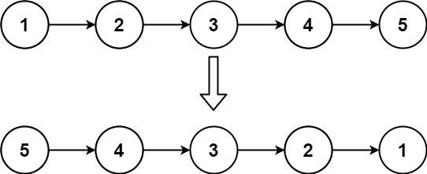

# LeetCode 刷题复习笔记

## 目录

| 题号 | 题目 | 中文题名 | 模式 | 难度 |
| --- | --- | --- | --- | --- |
| 1 | [Two Sum](#two-sum) | 两数之和 | 哈希表 | 简单 |
| 242 | [Valid Anagram](#valid-anagram) | 有效的字母异位词 | 计数直方图 | 简单 |
| 26 | [Remove Duplicates from Sorted Array](#26-remove-duplicates-from-sorted-array) | 删除有序数组中的重复项 | 快慢双指针 | 简单 |
| 125 | [Valid Palindrome](#valid-palindrome) | 验证回文串 | 对向双指针 | 简单 |
| 283 | [Move Zeroes](#move-zeroes) | 移动零 | 快慢双指针 | 简单 |
| 11 | [Container with Most Water](#container-with-most-water) | 盛最多水的容器 | 对向双指针 | 中等 |
| 3 | [Longest Substring Without Repeating Characters](#longest-substring) | 无重复字符的最长子串 | 滑动窗口 | 中等 |
| 56 | [Merge Intervals](#merge-intervals) | 合并区间 | 排序 + 区间扫描 | 中等 |
| 206 | [Reverse Linked List](#reverse-linked-list) | 反转链表 | 链表三指针 | 简单 |
| 104 | [Maximum Depth of Binary Tree](#maximum-depth-of-binary-tree) | 二叉树的最大深度 | 二叉树 DFS | 简单 |
| 226 | [Invert Binary Tree](#invert-binary-tree) | 翻转二叉树 | 二叉树 DFS | 简单 |
| 199 | [Binary Tree Right Side View](#binary-tree-right-side-view) | 二叉树的右视图 | 二叉树层序 BFS | 中等 |
| 112 | [Path Sum](#path-sum) | 路径总和 | 二叉树 DFS | 简单 |
| 739 | [Daily Temperatures](#daily-temperatures) | 每日温度 | 单调栈 | 中等 |
| 503 | [Next Greater Element II](#next-greater-element-ii) | 下一个更大元素 II | 单调栈（环形） | 中等 |
| 84 | [Largest Rectangle in Histogram](#largest-rectangle-in-histogram) | 柱状图中最大的矩形 | 单调栈 | 困难 |
| 42 | [Trapping Rain Water](#trapping-rain-water) | 接雨水 | 双指针（双向灌水） | 困难 |
| 704 | [Binary Search](#binary-search) | 二分查找 | 二分（审讯模型：闭区间 + <= + ±1） | 简单 |
| 35 | [Search Insert Position](#search-insert-position) | 搜索插入位置 | 二分（同 704 三件套，只动 return） | 简单 |

---

# Two Sum

## 题目

**LeetCode 1 · 两数之和（Two Sum）· 简单**

给定整数数组 `nums` 和整数 `target`，在数组中找出 **和为 target 的两个整数**，返回它们的 **下标**。

- 每个输入 **恰好只有一个答案**；
- 同一个元素不能用两次（两个下标不能相同）；
- 可以按任意顺序返回答案。

```text
nums = [2, 7, 11, 15], target = 9  ->  [0, 1]
nums = [3, 2, 4],      target = 6  ->  [1, 2]
nums = [3, 3],         target = 6  ->  [0, 1]
```

示例 2 返回 `[1, 2]` 而不是 `[0, 1]`（`3 + 2 = 5 != 6`）；示例 3 说明值可以重复、下标不能重复。

**数据范围**：`2 <= nums.size() <= 10^4`，`-10^9 <= nums[i] <= 10^9`，`-10^9 <= target <= 10^9`，保证唯一解。
进阶要求：给出时间复杂度低于 `O(n^2)` 的解法（就是下面那份哈希表写法）。

## 图示

```text
      +----+----+----+----+
index | 0  | 1  | 2  | 3  |
      +----+----+----+----+
nums  | 2  | 7  | 11 | 15 |
      +----+----+----+----+
target = 9

i  need = target - nums[i]  map before  what happens
-  -----------------------  ----------  -----------------------------
0  9 - 2 = 7                {}          miss  ->  save  key 2 : idx 0
1  9 - 7 = 2                {2:0}       hit   ->  return [0, 1]
```

哈希表要存成 **值 -> 下标**：查询方向是「已知想要的值，换回它的下标」。
必须 **先查后存**，否则 `nums = [3, 3]` 这类用例会把当前下标当成自己的配对手。

## 思路
 - 双层循环遍历数组，符合要求提前跳出循环。
## 复杂度
 - 空间 O(1)，时间 O(n^2)

## 哈希表优化
 - 空间复杂度 O(n), 时间复杂度 O(n)
 - 哈希键值是用来查询的，因此键值是数组的元素，需要查询到满足要求的数组下标，哈希表的值是数组下标。
```cpp

std::vector<int> twoSum(std::vector<int>& nums, int target) {
    int count = nums.size();
    for (int i = 0; i < count - 1; i++) {
        for (int j = i + 1; j < count; j ++) {
            if (nums[i] + nums[j] == target) {
                return {i, j};
            }
        }
    }
    return {};
}


std::vector<int> twoSum_hash(std::vector<int>& nums, int target) {
    std::unordered_map<int, int> num_map;

    for (int i = 0; i < nums.size(); i++) {
        auto it = num_map.find(target - nums[i]);
        if (it != num_map.end()) {
            return {i, it->second};
        } else {
            num_map[nums[i]] = i;
        }
    }
    return {};
}

std::vector<int> twoSum_count(std::vector<int>& nums, int target) {
    std::unordered_map<int, int> num_map;

    for (int i = 0; i < nums.size(); i++) {
        int v = target - nums[i];
        if (num_map.count(v)) {
            return {i, num_map[v]};
        } else {
            num_map[nums[i]] = i;
        }
    }
    return {};
}

```

# Valid Anagram

## 题目

**LeetCode 242 · 有效的字母异位词（Valid Anagram）· 简单**

给定两个字符串 `s` 和 `t`，判断 `t` 是否是 `s` **重新排列**后得到的字符串 —— 即两者 **每个字符出现的次数完全相同**，顺序可以不同。

```text
s = "anagram", t = "nagaram"  ->  true
s = "rat", t = "car"          ->  false
s = "a", t = "ab"             ->  false
```

第三例长度就不等：开头 `s.size() != t.size()` 判一次即可直接返回 false。

**数据范围**：`1 <= s.size(), t.size() <= 5 * 10^4`，`s` 和 `t` 仅由 **小写字母** 组成。
题目追问：若输入含 Unicode 字符，`int src[26]` 就不够用，要换成 `unordered_map<char, int>`。

## 图示

直方图：遍历 `s` 把 `src[c - 'a']` 加一，遍历 `t` 把它减一，最后必须全为 0。

```text
s = "anagram"      t = "nagaram"
a | ###   3        a | ###   3
g | #     1        g | #     1
m | #     1        m | #     1
n | #     1        n | #     1
r | #     1        r | #     1

s = "rat"      t = "car"
a | #   1      a | #   1
r | #   1      c | #   1
t | #   1      r | #   1

t = "car" scanned against src built from "rat":
  a : src[a] 1 -> 0
  c : src[c] == 0, nothing to decrement (skipped)
  r : src[r] 1 -> 0
final src[t] == 1 != 0  ->  false
```

本实现「只在计数非 0 时才减」，计数不会被减成负数；又因为开头已判过长度相等，
最后只需检查 `src[26]` 是否全 0，不会漏掉不匹配的情况。

## 思路
 - 暴力解法，两层循环，内层循环如果找不到，直接返回 false
 - 内层循环找到了，外层循环递进。但上一轮找到的重复字符如何处理？
 - 提示说用数组表示 s 和 t，可以理解为遍历 s 一轮可以构造一个直方图，重复字符的 bin 数值大于 1。如果在 t 中找到一次就减一次。遍历结束后，s 直方图全为 0，就可以返回 true.


## 复杂度
 - 暴力解法：时间 O(n^2)，空间 O(1)，可以不额外分配数组空间，直接遍历输入数组。
 - 直方图解法: 时间 O(n)，空间 O(1) 直方图解法分配了固定的数组大小，不随 n 动态变化，因此是 O(1)

``` cpp
bool validAnagram(std::string& s, std::string& t) {
    if (s.size() != t.size()) {
        return false;
    }

    int src[26] = {0};
    for (char c: s) {
        src[c - 'a'] ++;
    }
    for (char c: t) {
        if (src[c - 'a'] != 0) {
            src[c - 'a'] --;
        }
    }
    for (int i = 0; i < 26; i++) {
        if (src[i] != 0) {
            return false;
        }
    }
    return true;
}

```

# 26. Remove Duplicates from Sorted Array

**LeetCode 26 · 删除有序数组中的重复项（Remove Duplicates from Sorted Array）· 简单**

**数据范围**：数组已按 **非递减** 顺序排列，`1 <= nums.size() <= 3 * 10^4`，`-100 <= nums[i] <= 100`。
判题只读取前 `k` 个元素，`k` 之后的值是什么都不管 —— 这正是「原地覆盖」能成立的原因。

给一个非严格递增排序的整数数组 nums，请你原地删除重复出现的元素，使每个元素只出现一次，并返回删除后数组的新长度 k。
要求：
- 不要使用额外数组空间，必须在原数组上修改。
- 删除后，nums 的前 k 个位置应当保存的是唯一的那些元素（顺序与原数组一致）。
- 最终返回 k。

输入: nums = [0,0,1,1,1,2,2,3,3,4]
输出: k = 5，且 nums 前 5 位为 [0,1,2,3,4]

## 图示

一格一元素。`front` 是已去重段的最后一个下标，`end` 只向右扫，遇到不同值就写进 `front + 1`。

（图例：F = front，E = end；每个快照是那一轮结束后的状态）

```text
     +----+----+----+----+----+----+----+----+----+----+
nums | 0  | 0  | 1  | 1  | 1  | 2  | 2  | 3  | 3  | 4  |
     +----+----+----+----+----+----+----+----+----+----+
        F    E
note: end=1   0 == 0    nothing happens

     +----+----+----+----+----+----+----+----+----+----+
nums | 0  | 1  | 1  | 1  | 1  | 2  | 2  | 3  | 3  | 4  |
     +----+----+----+----+----+----+----+----+----+----+
             F                   E
note: end=5   2 != 1    nums[++front] = 2

     +----+----+----+----+----+----+----+----+----+----+
nums | 0  | 1  | 2  | 1  | 1  | 2  | 2  | 3  | 3  | 4  |
     +----+----+----+----+----+----+----+----+----+----+
                  F                        E
note: end=7   3 != 2    nums[++front] = 3

     +----+----+----+----+----+----+----+----+----+----+
nums | 0  | 1  | 2  | 3  | 1  | 2  | 2  | 3  | 3  | 4  |
     +----+----+----+----+----+----+----+----+----+----+
                       F                             E
note: end=9   4 != 3    nums[++front] = 4

     +----+----+----+----+----+----+----+----+----+----+
nums | 0  | 1  | 2  | 3  | 4  | 2  | 2  | 3  | 3  | 4  |
     +----+----+----+----+----+----+----+----+----+----+
                            F
note: end hits the tail, return front + 1 = 5

cells behind front are never cleaned - the judge only reads the first k cells
```

对照「修正」小节：被覆盖掉的旧值不需要整段搬移，`end` 每轮照常 +1。

## 思路
 - 使用 front / end 两个指针，一次遍历数组
 - 移动 end 指针，与 front 指针对比，相同继续移动 end 指针，直到不同，把 end 指针之后的所有数组都整体移动到 front 指针之后。
 - end 指针遍历完成，任务结束。

## 修正
 - 不需要把 end 指针之后的所有元素都整体搬移，只需要复制当前 end 指针的一个元素到 front 之后，同时移动 front 指针。end 指针的位置不往前移动。

## 复杂度
 空间复杂度：O(1) 原位操作。时间复杂度：end 指针一次遍历 O(n)

```cpp
int removeDuplicates(std::vector<int>& nums) {
    if (nums.empty()) {
        return 0;
    }
    int front = 0;
    int end = front + 1;

    for (; end < nums.size(); end++) {
        if (nums[end] != nums[front]) {
            nums[++front] = nums[end];
        }
    }
    return front + 1;
}

```

# Valid Palindrome

**LeetCode 125 · 验证回文串（Valid Palindrome）· 简单**

**数据范围**：`1 <= s.size() <= 2 * 10^5`，`s` 由英文字母、数字、空格和标点符号组成。
注意：**过滤后为空串也算合法回文**（例如 `s = " "` 应返回 true），所以循环条件里的 `head < tail` 不能写成 `<=`。

给定一个字符串 s，判断它是否是回文串。规则：
 - 只考虑字母和数字，忽略其他字符（标点、空格等）。
 - 忽略大小写（A 和 a 视为相同）。
 - 如果是回文返回 true，否则返回 false。

## 图示

一格一字符，两个指针从两头向中间，各自跳过非字母数字之后再比较。

（图例：H = head，T = tail，HT = 两针重合）

```text
      +-----+-----+-----+-----+-----+
char  | 'A' | ',' | ' ' | 'b' | 'a' |
      +-----+-----+-----+-----+-----+
         H                       T
round 1 :  both pass isalnum,  tolower('A') == tolower('a')   OK

                          HT
round 2 :  head skips ',' then ' ', both land on 'b'        OK

then head = 4 > tail = 2  ->  loop ends  ->  true

counterexample  s = "race a car"
  r == r  OK    a == a  OK    head = c  vs  tail = e   ->  false
```

两个内层 `while` 都要带 `head < tail` 保护，否则遇到全标点串或单字符会走过头。

## 思路
 - 双指针，初始化一头 head，一尾 tail，一次遍历，相向移动。
 - while 循环跳过空格，标点，只比较字母和数字。其它特殊字符如何处理？
 - 比对出现不同立即跳出遍历，返回 false。

## 复杂度
  空间复杂度：没有额外引入空间分配 O(1)。
  时间复杂度：一次遍历 O(n).

```cpp

bool validPalindrome(std::string& s) {
    int head = 0;
    int tail = s.size() - 1;

    while (head < tail) {
        while (head < tail && !isalnum(s[head])) {
            head ++;
        }
        while (head < tail && !isalnum(s[tail])) {
            tail --;
        }
        if (tolower(s[head]) != tolower(s[tail])) {
            return false;
        }
        head ++;
        tail --;
    }

    return true;
}


```

# Move Zeroes

## 题目

**LeetCode 283 · 移动零（Move Zeroes）· 简单**

给定数组 `nums`，把所有 `0` 移动到数组 **末尾**，同时 **保持非零元素的相对顺序不变**。
必须 **原地** 操作，不能复制数组；函数无返回值，直接改原数组。

```text
input :  nums = [0, 1, 0, 3, 12]
output:  nums = [1, 3, 12, 0, 0]
```

**数据范围**：`1 <= nums.size() <= 10^4`，`-2^31 <= nums[i] <= 2^31 - 1`。
进阶：尽量减少操作次数 —— `head != tail` 时才 swap，就是为了省掉自己和自己换的无效写入。

## 图示

（图例：H = head（下一个非零位），T = tail（扫描针）；快照是那一轮结束后的状态）

```text
     +----+----+----+----+----+
nums | 0  | 1  | 0  | 3  | 12 |
     +----+----+----+----+----+
       HT
note: tail = 0   nums[0] == 0   no swap

     +----+----+----+----+----+
nums | 1  | 0  | 0  | 3  | 12 |
     +----+----+----+----+----+
            HT
note: tail = 1   swap(head, tail), head++

     +----+----+----+----+----+
nums | 1  | 0  | 0  | 3  | 12 |
     +----+----+----+----+----+
             H    T
note: tail = 2   nums[2] == 0   no swap

     +----+----+----+----+----+
nums | 1  | 3  | 0  | 0  | 12 |
     +----+----+----+----+----+
                  H    T
note: tail = 3   swap(head, tail), head++

     +----+----+----+----+----+
nums | 1  | 3  | 12 | 0  | 0  |
     +----+----+----+----+----+
                       H    T
note: tail = 4   swap(head, tail), head++

invariant :  [0, head)  non-zero values in original order
             [head, tail)  all zeros
```

不变式一直成立，循环结束时非零元素的相对顺序自然保持不变。

## 思路
 - 把数组中的非零数字向数组头部移动。
 - 两个指针，一个指针指向非零数填满的位置，另一个指针遍历数组。

## 复杂度
 - 空间复杂度，无需额外引入存储空间。O(1)
 - 时间复杂度，遍历一次数组。O(n)

```cpp

void moveZeroes(std::vector<int>& nums) {
    int head = 0;
    int tail = head;

    while (tail < nums.size()) {
        while (tail < nums.size() && nums[tail] == 0) {
            tail ++;
        }
        if (tail < nums.size()) {
            std::swap(nums[head], nums[tail]);
            head ++;
            tail ++;
        }

    }
}

void moveZeroes_for(std::vector<int>& nums) {
    int head = 0;

    for (int tail = 0; tail < nums.size(); tail++) {
        if (nums[tail] !=0) {
            if (head != tail) {
                std::swap(nums[head], nums[tail]);
            }
            head ++;
        }
    }
}


```

# Container with Most Water

## 题目

**LeetCode 11 · 盛最多水的容器（Container With Most Water）· 中等**

给定长度为 `n` 的整数数组 `height`，第 `i` 条垂直线的两个端点是 `(i, 0)` 和 `(i, height[i])`。
找出 **其中的两条线**，使它们与 `x` 轴共同构成的容器能容纳最多的水，返回最大蓄水量。

- 容器 **不能倾斜**；
- 水量 = 两条线的下标距离（宽） x 两条线中较矮的那条（高），即 `min(height[l], height[r]) * (r - l)`；
- 返回的是面积数值，不是那两条线的下标。

```text
height = [1, 8, 6, 2, 5, 4, 8, 3, 7]  ->  49
height = [1, 1]                       ->  1
height = [4, 3, 2, 1, 4]              ->  16
```

第一例由下标 1（高 8）和下标 8（高 7）围成：`min(8, 7) * (8 - 1) = 49`。

**数据范围**：`2 <= height.size() <= 10^5`，`0 <= height[i] <= 10^4`。

## 图示

一列一根柱子，一行一个高度单位。

```text
 8 |    #              #
 7 |    #              #     #
 6 |    #  #           #     #
 5 |    #  #     #     #     #
 4 |    #  #     #  #  #     #
 3 |    #  #     #  #  #  #  #
 2 |    #  #  #  #  #  #  #  #
 1 | #  #  #  #  #  #  #  #  #
   + 0  1  2  3  4  5  6  7  8
        ^l                   ^r

water = min(height[1], height[8]) * (8 - 1) = min(8, 7) * 7 = 49
```

为什么只能动矮边：指针往中间走，宽度必然变小。
- 动矮边：高有机会变大（矮的那条被换掉），面积可能超过当前值；
- 动高边：新的 `min` 一定不超过原来那条矮边，宽度又更小 → 面积必然更差，整批可以排除。
所以双指针一次遍历 `O(n)`；暴力 `O(n^2)` 里绝大多数组合就是被「动高边必输」这条理由省掉的。

## 思路
 - 按照矩形面积计算，暴力解法两层循环，算出所有 “上底”，“下底” 与 “高” 的组合。


## 复杂度
 - 暴力法：时间 O(n^2)，空间未引入新分配空间 O(1)


```cpp

int mostWater(std::vector<int>& height) {

    int max = 0;
    for (int left = 0; left < height.size() - 1; left ++) {
        for (int right = left + 1; right < height.size(); right++) {
            int water = std::min(height[right], height[left]) * (right - left);
            if (water > max) max = water;
        }
    }
    return max;
}

int mostWater_opt(std::vector<int>& height) {
    int left = 0;
    int right = height.size() - 1;
    int max = std::min(height[left], height[right]) * (right- left);

    while (left < right) {
        if (height[left] < height[right]) {
            left ++;
        } else {
            right --;
        }
        int water = std::min(height[left], height[right]) * (right- left);
        if (water > max) max = water;
    }
    return max;
}

```

# longest substring

## 题目

**LeetCode 3 · 无重复字符的最长子串（Longest Substring Without Repeating Characters）· 中等**

给定字符串 `s`，找出其中 **不含重复字符的最长子串的长度**（只返回长度）。

- **子串** 必须是连续的一段；**子序列** 才允许跳着取，两者别混；
- 字符集不限：字母、数字、符号、空格都可能出现，所以 `seen[128]` 比 `seen[26]` 安全。

```text
s = "abcabcbb"  ->  3     the substring is "abc"
s = "bbbbb"     ->  1     the substring is "b"
s = "pwwkew"    ->  3     the substring is "wke";  "pwke" is a subsequence
s = ""          ->  0
```

**数据范围**：`0 <= s.size() <= 5 * 10^4`。

## 图示

滑动窗口：窗口 `[l, r]` 内始终无重复；右端加一个字符，冲突就缩左端。

```text
index    0  1  2  3  4  5  6  7
char     a  b  c  a  b  c  b  b

         a  b  c  a  b  c  b  b
        +-------+                     window = "abc"   best = 3
         l     r

         a  b  c  a  b  c  b  b
           +-------+                  r = 3 'a' hits a duplicate -> pop s[l]
            l     r

         a  b  c  a  b  c  b  b
              +-------+               r = 4 'b' hits a duplicate -> pop s[l]
               l     r

         a  b  c  a  b  c  b  b
                 +-------+            r = 5 'c' hits a duplicate -> pop s[l]
                  l     r

         a  b  c  a  b  c  b  b
                          +----+      r = 6, 7 both 'b' -> window shrinks to one 'b'
                           l  r

answer = 3

invariant :  seen[] counts the chars inside [l, r]
after adding s[r] :  while seen[s[r]] > 1  ->  seen[s[l]]-- and l++
r walks n steps, l walks at most n steps in total  ->  O(n)
```

不变式：窗口内的字符计数永远合法（无重复），所以每个 `r` 只摊到 `O(1)`；
暴力法每个 `l` 都要重建一次 `seen[]` → `O(n^2)`。

## 思路
 - 暴力法：两个指针，left 和 right，双层循环遍历字符串。指针之间没有重复字符。记下最大字符数量。
 - 暴力法的难度在于如何标记右指针遍历过的字符？所有字母都用一个 bool 变量来标记。这里用一个 bool seen[128] 来做这个标记。128 长度足够英文字符。
 - 滑动窗口：不用双层遍历，left 和 right 指针之间始终保持没有重复字符，记下最大字符数量。

## 复杂度
 - 暴力法：空间复杂度，没有额外存储分配， O(1)。时间复杂度 O(n^2)
 - 滑动窗口：空间复杂度，无额外存储分配，O(1)。时间复杂度，一次遍历 O(n)。

```cpp

int longestSubstring(std::string& s) {
    int max = 0;
    int n = (int)s.size();

    for (int left = 0; left < n; left++) {
        bool seen[128] = { false };

        for (int right = left; right < n; right++) {
            if (seen[s[right]]) break;

            seen[s[right]] = true;
            max = std::max(max, right - left + 1);
        }
    }
    return max;
}


int longestSubstring_opt(std::string& s) {
    int max = 0;
    int n = (int)s.size();
    int left = 0;
    int seen[128] = { 0 };

    for (int right = left; right < n; right++) {
        char c = s[right];
        seen[c]++;
        while (seen[c] > 1) {
            seen[s[left]]--;
            left++;
        }
        max = std::max(max, right - left + 1);
    }
    return max;
}

```

# Merge Intervals

## 题目

**LeetCode 56 · 合并区间（Merge Intervals）· 中等**

用数组 `intervals` 表示若干区间，其中 `intervals[i] = [start_i, end_i]`。
请 **合并所有重叠的区间**，返回一个 **互不重叠** 的区间数组，它必须恰好覆盖输入里的所有区间。

```text
intervals = [[1,3],[2,6],[8,10],[15,18]]  ->  [[1,6],[8,10],[15,18]]
intervals = [[1,4],[4,5]]                 ->  [[1,5]]
```

第二例的端点相接（`4 == 4`）也算重叠。输入 **没有预排序**，所以「先按左端点排序」是第一步，不能省。

**数据范围**：`1 <= intervals.size() <= 10^4`，`intervals[i].length == 2`，`0 <= start_i <= end_i <= 10^4`。

## 图示

数轴一格半格都对齐，`=` 是区间本身（刻度每 5 一格，1 单位 = 2 字符）。

```text
sorted by left end:
          0         5        10        15        20
          |---------|---------|---------|---------|
[1,3]       =====
[2,6]         =========
[8,10]                    =====
[15,18]                                 =======

merged result:
          0         5        10        15        20
          |---------|---------|---------|---------|
[1,6]       ===========
[8,10]                    =====
[15,18]                                 =======

compare            test     action
-----------------  -------  ---------------------------------------
[1,3]  vs [2,6]    2 <= 3   overlap  ->  [1, max(3, 6)] = [1,6]
[1,6]  vs [8,10]   8 > 6    cut      ->  emit [1,6], cur = [8,10]
[8,10] vs [15,18]  15 > 10  cut      ->  emit [8,10], cur = [15,18]

after the loop, [15,18] is still open and must be emitted one more time
```

收尾那一段最容易漏：循环结束时当前合并段还没交出，要在循环外补一次。

> **本题笔记与官方题的差异（复习时先看这里）**
> - 官方要求返回 **全部** 合并后的区间（二维数组）；本笔记的 `mergeIntervals` 求的是「被合并次数最多的那一段」，只返回一个 `pair`，属于同一模板的变体问法。
> - 要改成官方版本：断开时 `res.push_back(temp)`，再 `temp = intervals[i]` 开新段，循环 **结束后再 push 一次** 收尾段。
> - 现有代码 `if (intervals.empty()) return {0, 0}` 少了分号，编译不过。

## 思路
 - 首先用二元组的第一个元素 l 对二元组排序，intervals = [[l0, r0], [l1, r1], ...]
 - 比较当前二元组的 c_r 与下一个二元组的 n_l 和 n_r，若 n_l 大，则移到下一个二元组，merge count 归零。若 n_l 小或者相等，比较 c_r 与 n_r，c_r = max(c_r, n_r)。 merge count 加 1。记录 max merge count，同时更新合并 interval

## 复杂度
 - 空间：不额外分配空间 O(1)
 - 时间：排序加一次遍历，一个指针指向当前二元组，另一个指针指向后面的对比二元组。O(n*logn)

 ```cpp

std::pair<int, int> mergeIntervals(std::vector<std::pair<int, int>>& intervals) {
    if (intervals.empty()) return {0, 0}

    int max_merged = 0;
    int count = 0;

    std::sort(intervals.begin(), intervals.end());
    std::pair<int, int> merged = intervals[0];
    std::pair<int, int> temp = merged;

    for (int cur = 0; cur < intervals.size() - 1; cur++) {

        if (temp.second >= intervals[cur + 1].first) {
            temp.second = std::max(temp.second, intervals[cur + 1].second);
            count ++;
            if (count > max_merged) {
                merged = temp;
            }
            max_merged = std::max(max_merged, count);
        } else {
            temp = intervals[cur + 1];
            count = 0;
        }
    }
    return merged;
}

 ```

# Reverse Linked List

## 题目

**LeetCode 206 · 反转链表（Reverse Linked List）· 简单**

给定单链表的头节点 `head`，**反转整个链表**，返回反转后的头节点（也就是原来的最后一个节点）。
原地改指针即可，不需要新建节点。

```text
input :  [1]->[2]->[3]->[4]->[5]->NULL
output:  [5]->[4]->[3]->[2]->[1]->NULL

input :  []
output:  []

input :  [7]->NULL
output:  [7]->NULL
```

**数据范围**：节点数 `[0, 5000]`，`-5000 <= Node.val <= 5000`。
进阶：迭代和递归两种写法都要能默写；反转不需要 dummy 哨兵节点。

## 图示

[](https://raw.githubusercontent.com/zongwave/leetcode/main/linkedlist/diagram/reverselinked-list.jpg)

一格一节点，`[*]` 里的星号是 `next` 指针；`^prev` / `^cur` / `^temp` 标在各自指到的节点下方。

```text
S0  initial
NULL    [1]--->[2]--->[3]--->NULL
^prev    ^cur

S1  temp = cur->next        (save the tail before cutting)
NULL    [1]--->[2]--->[3]--->NULL
^prev    ^cur   ^temp

S2  cur->next = prev        (flip one arrow, link to node 2 is cut)
NULL<---[1]    [2]--->[3]--->NULL
^prev    ^cur

S3  prev = cur, cur = temp  (advance both, nothing else changes)
NULL<---[1]    [2]--->[3]--->NULL
         ^prev  ^cur  ^temp

after the loop (rounds 2 and 3 do the same thing)
NULL<---[1]<---[2]<---[3]
                       ^prev

return prev        cur == NULL here, so the new head can only be prev
```

顺序不能换：`temp` 必须先保存后继，否则 `cur->next = prev` 一改，后半条链就永远丢了。
循环退出时 `cur` 是 `NULL`，新头节点只能是 `prev`。

 ## 思路
  - 整个反转操作在原链表上进行。
  - 需要一个当前节点遍历链表，一个前节点用来保存链接换位，一个临时节点进行周转。

## 复杂度
  - 空间：O(1) 原链表执行
  - 时间：O(n) 一次遍历

```cpp
struct linkedList {
    int value;
    linkedList* next;

    linkedList(int v) {
        value = v;
        next = nullptr;
    }
};

linkedList* reverseLinkedList(linkedList* list) {
    if (list == nullptr || list->next == nullptr) return list;

    linkedList* cur = list;
    linkedList* prev = nullptr;

    while (cur) {
        linkedList* temp = cur->next;
        cur->next = prev;
        prev = cur;
        cur = temp;
    }

    return prev;
}

```

# Maximum Depth of Binary Tree

## 题目

**LeetCode 104 · 二叉树的最大深度（Maximum Depth of Binary Tree）· 简单**

给定二叉树的根节点 `root`，返回它的 **最大深度** —— 从根节点到 **最远叶子节点** 的最长路径上的 **节点个数**。

- 根节点自身算第 1 层，所以单节点树深度为 1；
- **空树深度为 0**（这就是递归入口 `if (node == nullptr) return 0;` 的含义）。

```text
root = [3, 9, 20, null, null, 15, 7]  ->  3
root = [1, null, 2]                   ->  2
root = []                             ->  0
```

层序数组写法：按层从左到右列出节点值，`null` 表示该位置没有节点，末尾连续的 `null` 省略。

**数据范围**：节点数 `[0, 10^4]`。

## 图示

```text
      3            depth 1
    /   \
  9      20        depth 2
        /  \
      15    7      depth 3  <- deepest leaves

depth(node) = 1 + max(depth(left), depth(right)),  depth(NULL) = 0
```

[](https://raw.githubusercontent.com/zongwave/leetcode/main/top75/diagram/bfs-tree.jpg)

空节点返回 0 是让「单边孩子」的树也能自然算对：单边时另一边返回 0，不参与 max。

## 思路
 - 递归方法，入口检查如果是空叶子，返回 0.
 - 左右平等递归统计。每层有效递归，左与右大数层数累加 1.

## 复杂度
 - 空间 O(n) 递归调用栈的最大深度
 - 时间 O(n) 一次遍历

```cpp

struct TreeNode {
    int val;
    TreeNode* left;
    TreeNode* right;
    TreeNode(int x) : val(x), left(nullptr), right(nullptr) {}
};


int maximumDepth(TreeNode* tree) {
    if (tree == nullptr) return 0;
    int left = maximumDepth(tree->left);
    int right = maximumDepth(tree->right);

    return 1 + std::max(left, right);
}

```

# Invert Binary Tree

## 题目

**LeetCode 226 · 翻转二叉树（Invert Binary Tree）· 简单**

给定二叉树的根节点 `root`，把这棵树 **左右翻转**（每个节点的左右子树互相交换，整棵树呈镜像），返回 **同一棵树的根节点**。

```text
input :  root = [4, 2, 7, 1, 3, 6, 9]  ->  [4, 7, 2, 9, 6, 3, 1]
input :  root = [2, 1, 3]              ->  [2, 3, 1]
input :  root = []                     ->  []
```

**数据范围**：节点数 `[0, 100]`，`-100 <= Node.val <= 100`。只改指针，不需要新建节点。

## 图示

```text
input  root = [4,2,7,1,3,6,9]      after  swap every node
        4                                  4
      /   \                              /   \
    2       7                          7       2
    / \     / \                        / \     / \
  1   3   6   9                      9   6   3   1

at every node:  swap(node->left, node->right)
```

「交换自己」和「递归孩子」的先后顺序不影响结果：先 swap 再往下递归（本笔记写法）、
或先递归再 swap（后序写法）都正确。空节点直接返回，单边孩子的情况被递归自然覆盖。

## 思路
 - 需要向左右方向对称递归遍历树。
 - 原树遍历。

## 复杂度
 - 空间：需要全树递归遍历，O(n)
 - 时间：递归遍历一次，O(n)

```cpp
void invertBinaryTree(TreeNode* tree) {
    if (tree == nullptr) return;

    std::swap(tree->left, tree->right);
    invertBinaryTree(tree->left);
    invertBinaryTree(tree->right);
}

```

# Binary Tree Right Side View

## 题目

**LeetCode 199 · 二叉树的右视图（Binary Tree Right Side View）· 中等**

给定二叉树的根节点 `root`，想象自己 **站在树的右侧** 往左看，按 **从上到下** 的顺序返回能看到的节点值。

关键理解：看到的是 **每一层最右边的那个节点**，不是「一路沿右孩子走」。
某一层没有右子树时，左子树一样会从右边露出来（比如 `[1, 2]` 要返回 `[1, 2]`），所以必须真正逐层遍历。

```text
root = [1, 2, 3, null, 5, null, 4]  ->  [1, 3, 4]
root = [1, null, 3]                 ->  [1, 3]
root = [1, 2]                       ->  [1, 2]
root = []                           ->  []
```

**数据范围**：节点数 `[0, 100]`，`-100 <= Node.val <= 100`。

## 图示

```text
    1        seen: 1
    / \
  2   3      seen: 3   <- rightmost of this layer
  |   |
  5   4      seen: 4

level  queue before for  pop order  push next  kept
-----  ----------------  ---------  ---------  ----
1      [1]               1          2 3        1
2      [2, 3]            2 -> 3     5 4        3
3      [5, 4]            5 -> 4     none       4

answer = [1, 3, 4]
```

`n = q.size()` 必须在进 for **之前**取，这样一轮 for 恰好吃掉一层；
`rightMost` 在 for 里被反复覆盖，出 for 时正好是本层最后一个；
处理完的节点不及时 `pop`，`q.size()` 就会混层，for 的边界 `n` 也就失去意义。

## 思路
 - 按照提示，用层序遍历 (BFS) 右边节点是本层最右边的节点，但是如何找出同一层最右节点？用一个层号？
 - 按照提示把同一层的所有节点按序入队列
 - 层遍历不知怎么写。这道题直觉是先查找右侧叶子，如果右侧叶子不存在，左侧叶子也能从右边观察到，所以也必须从右往左检查。必须要用队列吗？
 - 层序遍历 (BFS) 两层循环，外层检查队列中是否还有节点，内层遍历当前层全部的节点。第一层 root 在 while 循环外加入队列。之后在 for 循环中处理当前层时可以把下一层的节点加入队列 push。因为 for 循环遍历的节点个数 n 是在进入循环之前通过检查队列大小得到的，因此可以保证每个 for 循环只遍历一层中的节点数。注意在每个 for 循环中，处理完的节点 front 应当及时 pop 从队列中清除。只有这样才能保证下一个 for 循环能够正确处理一整层的节点。

## 复杂度
 - 时间：按层遍历，n 层，O(n)
 - 空间：队列里加入节点

```cpp

std::vector<int> rightSideView(TreeNode* root) {
    std::vector<int> res;
    if (root == nullptr) return res;

    std::queue<TreeNode*> q;
    q.push(root);

    while (!q.empty()) {
        int n = static_cast<int>(q.size());
        int rightMost = 0;
        
        for (int i = 0; i < n; i++) {
            TreeNode* node = q.front();
            q.pop();
            rightMost = node->val;

           if (node->left) q.push(node->left);
           if (node->right) q.push(node->right);
        }
        res.push_back(rightMost);
    }
    return res;
}

```

# Path Sum

## 题目

**LeetCode 112 · 路径总和（Path Sum）· 简单**

给定二叉树根节点 `root` 和整数 `targetSum`，判断树中是否存在一条 **从根节点到叶子节点** 的路径，路径上所有节点值相加恰好等于 `targetSum`。存在返回 `true`，否则返回 `false`。

- **叶子节点** = 左右孩子都为空的节点；和必须在 **叶子上** 判定，中途凑够 target 不算；
- 节点值 **可以为负数**，所以「当前和已经超过 target 就剪枝」是错的；
- 空树没有任何路径，返回 `false`（哪怕 `targetSum == 0`）。

```text
root = [5,4,8,11,null,13,4,7,2,null,null,null,1], targetSum = 22  ->  true
root = [1,2,3],                                   targetSum = 5   ->  false
root = [1,2],                                     targetSum = 0   ->  false
```

第一例的路径是 `5 -> 4 -> 11 -> 2`，和为 22，且终点 2 是叶子。

**数据范围**：节点数 `[0, 5000]`，`-1000 <= Node.val <= 1000`，`-1000 <= targetSum <= 1000`。

> 别拿错模板：112 是「根到叶是否存在，返回 bool」；top75 笔记里的 **437 Path Sum III** 是「从任意节点往下累加，统计路径条数，返回 int」，要前缀和 + 哈希表。

## 图示

```text
        5
      /   \
    4       8
    |      /  \
   11    13   4
   / \        |
  7   2       1

dfs call     remain after minus node  leaf?  result
-----------  -----------------------  -----  --------------------------
dfs(5, 22)   22 - 5  = 17             no     keep going
dfs(4, 17)   17 - 4  = 13             no     keep going
dfs(11, 13)  13 - 11 = 2              no     keep going
dfs(2, 2)    2 - 2 = 0                yes    remain == 0  ->  TRUE
dfs(7, 2)    2 - 7 = -5               yes    remain != 0  ->  false
dfs(8, 17)   17 - 8  = 9              no     keep going (right subtree)
dfs(13, 9)   9 - 13 = -4              yes    false
dfs(1, 5)    5 - 1 = 4                yes    false
```

只有「左右孩子都为空」的那个分支才有资格判定 `== 0`，所以主函数只查 `root` 是否为空不够，
递归里每层都要先查 `node == nullptr`；传值让每层各拿一份 `target_val` 副本，
回溯时不必手工把值加回去（传引用就得在分岔处做分身处理）。

## 思路
 - 采用二叉树的 DFS （深度遍历）
 - 遍历过程中累加数值，检查是否最终累加到尾部的和是否等于 target
 - 遍历过程用 target 减去当前值的方式更加简洁。
 - 主函数检查 root nullptr 还不够，需要在 dfs 递归函数中每次调用都检查。因为在 dfs 中只是对 left && right 同时为 nullptr 进行了处理，只有一方为 nullptr 的情况并没有处理。
 - 递归函数调用栈会对传入的参数在各自的调用栈独立处理，不会被混淆。因此值传递是安全的。如果传递引用，逻辑会变复杂，需要在每个调用栈分岔处对数值变量进行分身处理。

## 复杂度
 - 空间，如果用递归，那么最坏情况需要 n 层调用栈 O(n)
 - 时间，n 层递归 O(n)

 ```cpp

bool dfs(TreeNode* node, int target_val) {
    if (node == nullptr) return false;
    target_val -= node->val;

    if (node->left == nullptr && node->right == nullptr) {
        return target_val == 0;
    }
    return dfs(node->left, target_val) || dfs(node->right, target_val);
}

bool pathSum(TreeNode* root, int target_val) {
    if (root == nullptr) {
        return false;
    }
    return dfs(root, target_val);
}

 ```
---

# Daily Temperatures

## 题目

**LeetCode 739 · 每日温度（Daily Temperatures）· 中等**

给定一个整数数组 `temperatures`，表示每天的气温。对于每一天，返回 **要等多少天之后才会升温**。如果之后不会升温，则对应位置填 `0`。

- 返回的新数组 `answer[i]` 表示：从第 `i` 天起，需要等待多少天才遇到比 `temperatures[i]` 更高的温度；
- 如果之后没有更高的温度，则 `answer[i] = 0`。

```text
temperatures = [73, 74, 75, 71, 69, 72, 76, 73]
answer       = [ 1,  1,  4,  2,  1,  1,  0,  0]

第 0 天 73 -> 第 1 天 74，升温，等 1 天
第 2 天 75 -> 第 6 天 76，升温，等 4 天
第 6 天 76 -> 之后没有更高温度，记 0
```

**数据范围**：`1 <= temperatures.size() <= 10^5`，`30 <= temperatures[i] <= 100`。
进阶要求：用时间复杂度优于暴力 `O(n^2)` 的解法（就是下面这份单调栈写法）。

## 图示

```text
  index   0   1   2   3   4   5   6   7
temperature  73  74  75  71  69  72  76  73

单调递减栈（自底向上单调递减，存下标）：
stack:  保存还没有找到「右边更大温度」的下标

扫描到 index 6 (76) 时：
之前压入的下标依次弹出：5(72) 、4(69) 、3(71) 、2(75)
每个弹出的下标 i，answer[i] = 6 - i
所以 answer[2] = 4、answer[3] = 3、answer[4] = 2、answer[5] = 1

最后剩下的 6(76) 和 7(73) 之后没有更高温度 -> 0
```

```text
  为什么是单调"递减"的栈？
  +--------+  栈顶是最小的、最"新"还没匹配到更高温度的天
  |  75(2) |  因为一旦遇到更高的温度，栈顶先被弹出并得到答案，
  |  74(1) |  所以栈里只会留下"越来越小"的温度（下标递增、温度递减）
  |  73(0) |
  +--------+
```

## 思路
 - 典型「下一个更大元素」问题，方向是向右找比当前大的第一个位置，用单调栈。
 - 栈里存 **下标** 而不是温度值，因为计算答案需要下标差。
 - 从右向左或从左向右都可以；这里用从左向右扫描：
   - 维护一个 **单调递减栈**（自底向上温度递减）；
   - 遇到比栈顶温度更高的日子，就把栈顶弹出，用当前下标减栈顶下标得到等待天数；
   - 弹出的下标都找到了右侧更高的温度，之后不用再管。
 - 一个下标只会进栈、出栈各一次，所以整体是 `O(n)`，比暴力 `O(n^2)` 好。
 - 记忆点：**从左往右时，栈里留的是"还没等到升温的下标"，一旦出现更高的，就结算一批。**

## 解题心得
 - std::vector 当作栈来使用，即后进先出，只从队尾操作，先 push_back 的排在队伍最前面，用 front 查看。后 push_back 的排在队伍最后面，用 back 查看。
 - 采用 while 循环从 vector 栈的最后排查看 back，如果队伍最后的气温比当前气温低，就用 pop_back 弹出，直到队伍最后一个气温不满足要求，即队伍最后的气温不低于当前比较值，就可以安全的跳出 while 循环比较，因为队伍前面的气温必然也不低于当前比较值。经过以上的操作， vector 栈内能够留下的气温记录必然是后面的比前面的气温低，这也是`单调栈`这个名称的由来。
 - answer / 记录比较索引 保存的是日期索引，返回值记录的是日期的差值，不能和输入气温数组混淆。

## 复杂度
 - 时间：每个下标最多进栈一次、出栈一次，总体 `O(n)`
 - 空间：最坏情况（温度一路递减）栈里存下全部下标，`O(n)`

```cpp
 
std::vector<int> dailyTemperatures(const std::vector<int>& temp) {
    int count = static_cast<int>(temp.size());

    std::vector<int> answer(count, 0);

    for (int i = 0; i < count - 1; i++) {
        for (int j = i + 1; j < count; j++) {
            if (temp[j] > temp[i]) {
                answer[i] = j - i;
                break;
            }
        }
    }
    return answer;
}


std::vector<int> dailyTemperatures_opt(const std::vector<int>& temp) {
    int count = static_cast<int>(temp.size());

    std::vector<int> answer(count, 0);
    std::vector<int> stack;
    for (int i = 0; i < count; i++) {
        while (!stack.empty() && temp[stack.back()] < temp[i]) {
            int day = stack.back();
            answer[day] = i - day;
            stack.pop_back();
        }
        stack.push_back(i);
    }
    return answer;
}

```

---

# Next Greater Element II

## 题目

**LeetCode 503 · 下一个更大元素 II（Next Greater Element II）· 中等**

给定一个 **循环数组** `nums`（`nums[n - 1]` 的下一个元素是 `nums[0]`），对每个元素，找出它的 **下一个更大元素**：

- 「下一个更大元素」指从该位置出发**沿数组方向向后走**（可以绕回开头继续找），遇到的**第一个严格更大**的值；
- 找一圈都没有更大的，对应位置填 `-1`。

```text
nums  = [1, 2, 1]
answer = [2, -1, 2]

第 0 个 1 -> 右边第一个更大的是 2
第 1 个 2 -> 绕一圈回来也没有比 2 更大的，填 -1
第 2 个 1 -> 向右到头没有，绕回开头，第一个是 1（相等不算大），第二个 2 才是 -> 填 2
```

**数据范围**：`1 <= nums.length <= 10^4`，`-10^9 <= nums[i] <= 10^9`。

和 739 的两处不同，先看清再动手：

| | 739 每日温度 | 503 本题 |
| --- | --- | --- |
| 答案记录 | 等待的**天数**（下标差） | 更大的**值**本身 |
| 数组形状 | 直线，走到头为止 | **环形**，可以绕回开头接着找 |
| 找不到时 | 填 `0` | 填 `-1` |

## 图示

```text
        +---+---+---+
nums =  | 1 | 2 | 1 |        环形：下标 2 的下一个是下标 0
        +---+---+---+
          0   1   2
              ^   |
              |   v
              +---+   （尾部绕回头部）

下标 2 的 1 寻找更大元素的路径：
    下标 2 -> 下标 0（值 1，相等不算）-> 下标 1（值 2，更大！）-> answer[2] = 2
```

## 思路
 - 采用单调栈，同样用数组尾部操作模拟。
 - 因为是环形检查，绕一圈追到后面，循环次数必须是 2*n-1
 - 但是加入单调栈的数字不能重复，只能是 0~n-1，因此很自然，需要判定 for 循环索引小于 count 才加入栈。
 - 用单调栈数值从输入数组索引数值，也必须对 for 循环索引做 count 取余操作。

## 解题心得
 - 暴力法从输入数值索引数值时忘记对 j 下标做取余操作。
 - 解题用到两个 “轴” 索引，一个是扫描轴 i: 0 ~ 2n-2，另一个是数组索引 0 ~ n-1
 - 索引数组必须取余，栈内的索引已被限位到 0 ~ n-1

## 复杂度
 - 暴力法
   空间：使用了一个长度为 n 的数值，O(n)
   时间：双侧循环 O(n^2)
 - 单调栈
   空间：O(n)
   时间：需要查询 2*n-1 O(n)

```cpp
std::vector<int> nextGreaterElement(const std::vector<int>& nums) {
    int count = static_cast<int>(nums.size());
    std::vector<int> answer(count, -1);

    for (int i = 0; i < count; i++) {
        for (int j = i + 1; (j % count) != i; j++) {
            if (nums[j % count] > nums[i]) {
                answer[i] = nums[j % count];
                break;
            }
        }
    }
    return answer;
}


std::vector<int> nextGreaterElement_opt(const std::vector<int>& nums) {
    int count = static_cast<int>(nums.size());
    std::vector<int> answer(count, -1);
    std::vector<int> stack;

    for (int i = 0; i < 2 * count - 1; i++) {
        while (!stack.empty() && nums[stack.back()] < nums[i % count]) {
            answer[stack.back()] = nums[i % count];
            stack.pop_back();
        }
        if (i < count) stack.push_back(i);
    }
    return answer;
}

```

---

# Largest Rectangle in Histogram

## 题目

**LeetCode 84 · 柱状图中最大的矩形（Largest Rectangle in Histogram）· 困难**

给定 `n` 个非负整数 `heights`，表示柱状图中各柱子的高度，每个柱子**宽度为 1**。求它整体能勾勒出的**最大矩形**的面积。

```text
示例 1：heights = [2, 1, 5, 6, 2, 3]   输出 10
示例 2：heights = [2, 4]               输出 4
```

**数据范围**：`1 <= heights.length <= 10^5`，`0 <= heights[i] <= 10^4`。

## 图示

```text
heights = [2, 1, 5, 6, 2, 3]

 6 |           ██
 5 |        ██ ██
 4 |        ██ ██
 3 |        ██ ██    ██
 2 |  ██    ██ ██ ██ ██
 1 |  ██ ██ ██ ██ ██ ██
     --------------------
       0  1  2  3  4  5

答案 10：高 5 × 宽 2，由下标 2、3 两根柱子并肩顶出。
```

单调栈扫描过程（base 从 0 到 5，栈：底 ────────→ 顶，写 `下标(高)`；
弹出条件「栈顶高 ≥ 来柱高」；弹出即结案：面积 = 被弹柱的高 × `i − 新栈顶 − 1`，栈空时左界记 −1）：

```text
记号：弹X 的面积 = X自己高 × 宽；  宽 = 右拦路 - 左拦路 - 1（两头拦路柱不属于矩形）
      右拦路 = 触发弹出的新柱 i；左拦路 = 弹完后新栈顶（栈空记 -1）

i=0 (h2)  栈空，无弹                              压0   栈 [ 0(2) ]
i=1 (h1)  弹0: 高2  宽 = 1-(-1)-1 = 1 → 2×1 =  2  压1   栈 [ 1(1) ]
i=2 (h5)  顶1<5，停                                压2   栈 [ 1(1) 2(5) ]
i=3 (h6)  顶5<6，停                                压3   栈 [ 1(1) 2(5) 3(6) ]
i=4 (h2)  弹3: 高6  宽 = 4-2-1   = 1 → 6×1 =  6
          弹2: 高5  宽 = 4-1-1   = 2 → 5×2 = 10 ★max
          顶1<2，停                                压4   栈 [ 1(1) 4(2) ]
i=5 (h3)  顶2<3，停                                压5   栈 [ 1(1) 4(2) 5(3) ]

扫描结束，幸存者集体结案（它们右边到数组尾没人拦，右拦路统一 = count = 6）：

          弹5: 高3  宽 = 6-4-1   = 1 → 3×1 =  3
          弹4: 高2  宽 = 6-1-1   = 4 → 2×4 =  8
          弹1: 高1  宽 = 6-(-1)-1= 6 → 1×6 =  6

                                    max = 10 ✓
```

三笔对账：每根柱恰好结案一次，共 6 笔 = 6 根柱（暴力锚表换了执行顺序，不是换了答案）；高 2 横 4 的「8」没失踪，在尾结算里；★那笔 10 就是答案。

先别急着写代码，盯着图回答三个问题（答案就是你的 思路）：

1. 最大矩形一定「**顶天**」于某根柱子——即矩形的高等于某根柱子的全高。固定下标 `i` 这根柱子当高，它的矩形左右最多伸到哪？卡住它的是哪两根柱子？用一句话描述这对左右边界。
2. 拿下标 `2`（高 5）演一遍：它的左右边界各是哪个下标？`宽 = 右边界 - 左边界 - 1`，算出来对不对？
3. 「找左右**第一个比它矮**的柱子」——这个句式眼熟吗？739 里你找的是什么？把方向反过来，栈该在什么条件下弹人？

## 与 739 / 503 的关系

| | 739 每日温度 | 503 下一个更大 II | 84 本题 |
| --- | --- | --- | --- |
| 栈里等的是 | 还没等到更高温的日子 | 还没等到更大值的下标 | 还没等到**更矮**柱子的……？ |
| 结算触发 | 来了**更高**的 | 来了**更大**的 | 来了**更矮**的 |
| 结算记录 | 天数差 | 更大的值 | 以被弹柱子为高的矩形面积 |
| 难点 | 弹栈时机 | 环形双轴 | **左右边界从哪来** |

最后一格是本关 BOSS：弹栈那一刻，被弹柱子的**右边界**是谁？**左边界**又藏在哪儿？（提示：弹完之后看一眼栈顶。）

还有个收尾问题：扫描结束时栈里剩的柱子，右矮柱在数组外——不想写特判的话，常见手法是**哨兵**：在数组两头各补一个什么值、补在哪？

## 思路
 - 暴力法：
   外层 base 指针从左向右遍历，左右两个指针从 base 为中心分别朝左右两个方向遍历直方图。内层左指针 left 从 base-1 ~ 0，内层右指针 right = base+1 ~ n-1
   一旦遇到左右指针直方图高度下降，结束循环。计算左右指针圈定的矩形面积。
   只从一个方向计算（从左向右）会漏掉真正的最大面积，例如 [5,4] 得出 max=5. 实际需要也从右向左遍历，真正的最大 max=4*2
 - 单调栈：
   单调栈栈顶对应的柱子高度是递增的。栈顶高，栈底低。
   矩形的面积遇到相对短的柱子时矩形面积计算将定型。
   矩形的右边界是栈顶的值，左边界是单调栈弹出后的值（新的栈顶），虽然在单调栈中这个高度是变小的，但对应的矩形宽度增加，因此有必要计算这个矩形面积作为候选。
   矩形的高度是栈顶值去直方图索引。矩形的宽度是左右边界距离。
   当遍历到短柱（比栈顶矮），就开始从栈中弹出，并按照以上规则计算矩形面积。
   对于本身就是单调递增的直方图，可以从逻辑上在直方图最后增加一个“最小”值，启动单调栈弹出，按序计算面积。

## 解题心得
 - 暴力法容易理解。但单向统计有漏洞。
 - 在内层增加一个 while 循环，增加一个 base 指针。left / base / right 三个指针，两个方向计算统计。
 - 单独统计 left 与 right 框出的矩形，并没有合并两个方向的面积。既然已经有了 base 指针了，外层循环固定 base，内层 while 循环向左右两个方向分别探索。用左右指针的距离计算矩形面积。
 - 提示很形象，两只手分别向左右伸出去，包围的面积。不能只算半只手。

## 复杂度
 - 暴力法
   空间：无额外分配 O(1)
   时间：双指针嵌套循环遍历 O(n^2)

 - 单调栈
   空间：栈（数组）分配 O(n)
   时间：入栈出栈 n+n  O(n)

```cpp

int largestRectHist(const std::vector<int>& hist) {
    int count = static_cast<int>(hist.size());
    int maxRect = 0;

    for (int base = 0; base < count; base++) {
        int right = base + 1;
        int left = base - 1;
        while (right < count && hist[base] <= hist[right]) {
            right++;
        }
        while (left >= 0 && hist[base] <= hist[left]) {
            left--;
        }
        int rect = hist[base] * (right - left - 1);
        maxRect = std::max(maxRect, rect);
    }
    return maxRect;
}

int largestRectHist_opt(const std::vector<int>& hist) {
    int count = static_cast<int>(hist.size());
    int maxRect = 0;
    std::vector<int> stack;

    for (int base = 0; base <= count; base++) {

        while (!stack.empty() && hist[stack.back()] >= ((base == count) ? -1 : hist[base])) {
            int height = hist[stack.back()];
            int width = 1;
            stack.pop_back();
            if (!stack.empty()) {
                width = (base - stack.back() - 1);
            } else {
                width = base;
            }
            maxRect = std::max(maxRect, height * width);
        }

        if (base < count) stack.push_back(base);
    }
    return maxRect;
}
```

---

# Trapping Rain Water

## 题目

**LeetCode 42 · 接雨水（Trapping Rain Water）· 困难**

给定 `n` 个非负整数 `height`，依次表示每根宽度为 1 的柱子的高度。求下雨之后，这幅柱状图能**接住多少单位体积的雨水**。

```text
示例：height = [0,1,0,2,1,0,1,3,2,1,2,1]   输出 6
```

**数据范围**：`1 <= height.length <= 2 * 10^4`，`0 <= height[i] <= 10^5`。

## 图示

```text
height = [0,1,0,2,1,0,1,3,2,1,2,1]         ≈ 代表水，答案 6

  3 |                             ██
  2 |             ██  ≈≈  ≈≈  ≈≈  ██ ██  ≈≈  ██
  1 |     ██  ≈≈  ██  ██  ≈≈  ██  ██ ██  ██  ██  ██
      +---+---+---+---+---+---+---+---+---+---+---+---+
        0  1  2   3   4   5    6  7   8   9  10  11

逐列验算（水深 = min(左max,右max) − h）：
下标 2:1  4:1  5:2  6:1  9:1，合计 6 ✓（其余列水深 0）
```

关键视角：不去想「整个水槽多大」，而是问「第 i 根柱子头顶积了多深的水」，逐列累加。

左右楼梯（双指针的几何图像，配合下方「双指针」一节看）：

```text
左楼梯 = 前缀max（从左往右走，只升不降）
  3 |                      ██ ██ ██ ██ ██
  2 |          ██ ██ ██ ██ ██ ██ ██ ██ ██
  1 |    ██ ██ ██ ██ ██ ██ ██ ██ ██ ██ ██
    +---+---+---+---+---+---+---+---+---+---+---+---+
     0  1  2  3  4  5  6  7  8  9  10 11

右楼梯 = 后缀max（从右往左走，只升不降）
  3 | ██ ██ ██ ██ ██ ██ ██ ██
  2 | ██ ██ ██ ██ ██ ██ ██ ██ ██ ██ ██
  1 | ██ ██ ██ ██ ██ ██ ██ ██ ██ ██ ██ ██
    +---+---+---+---+---+---+---+---+---+---+---+---+
     0  1  2  3  4  5  6  7  8  9  10 11

水面线 = 逐列 min(左楼梯, 右楼梯)，即两条楼梯的下轮廓
  3 |                      ██
  2 |          ██ ██ ██ ██ ██ ██ ██ ██
  1 |    ██ ██ ██ ██ ██ ██ ██ ██ ██ ██ ██
    +---+---+---+---+---+---+---+---+---+---+---+---+
     0  1  2  3  4  5  6  7  8  9  10 11

左楼梯只升、右楼梯只降 ⇒ 两楼梯恰好相交一次，交点在全局最高柱 idx7。
水面线在交点左边贴左楼梯、右边贴右楼梯；交点处柱高=水面，该列水深 0。
水深 = 水面线 − 柱高：1+1+2+1+1 = 6 ✓（与上面逐列验算一致）
```

## 主解法：逐列定高（推荐，热身首选）

盯着一根柱子 `i`，它头顶的水位由谁说了算？三个事实：

1. 水不会漫过它**左边最高**的柱，也不会漫过**右边最高**的柱——水位 = `min(左边最高, 右边最高)`；
2. 水深 = `水位 - 自己高`，若为负就是 0（柱子本身露在水面外）；
3. 每列水深加起来就是答案。

$$水_i = \min(\text{leftMax}_i,\ \text{rightMax}_i) - height_i$$

**难点只剩一个**：`leftMax_i`（i 及其左边的最高柱）和 `rightMax_i` 怎么**不重复劳动**地拿到。这正好是你在暴力法里练过的「每次从头扫一遍」→ 想想能不能**一边扫一边顺手记一个滚动最大值**，把 O(n²) 降到 O(n)。

先写最朴素的：每列各扫左右求两个 max（O(n²)，一定对，先拿分）。再想怎么预存成数组、一趟搞定。

## 与 84 的分野

| | 84 最大矩形 | 42 接雨水 |
| --- | --- | --- |
| 枚举对象 | 每根柱子当**矩形高** | 每根柱子头顶的**水深** |
| 关心的邻居 | 左右第一个**更矮**（边界） | 左右**最高**（水位上限） |
| 累加量 | 面积取 **max** | 水量取 **sum** |
| 单调栈 | 核心解法 | 评估后**不采用**，双指针更直白 |

一句话：84 在比大小，42 在做加法；方向也从「找更矮的」变成「找最高的」，别把肌肉记忆用反。

## 思路
 - 暴力法
  * 左右端点的柱子存不住水，用 for 循环遍历从 1~n-2 即可
  * 每次只考虑当前柱子顶上能存多少水，也即是它的左右是否有能拦得住水的高柱子
  * 最终水位由左右两边矮的柱子决定
  * 从当前柱子 cur 向左 left 和 向右 right 分别查找最高位
  * 当前柱子 cur 高于 左和右，则水位为 0


## 解题心得
 - 不是找当前柱子左边和右边的相邻的第一根更高的柱子
 - 找到左右两侧最高的柱子的矮的那个高度
 - 用找到的高度与当前高度对比，高出来的高度是存的水


## 复杂度
 - 暴力法
  * 空间 无需额外分配内存， O(1)
  * 时间 外层遍历 n-2 内层两次最大 n-3 遍历， O(n^2)
 - 双指针
  * 空间 只有左右指针和两个滚动 max， O(1)
  * 时间 两指针合计最多走 n-1 步，每步 O(1)， O(n)


```cpp
int trappingWater(const std::vector<int>& bins) {
    int count = static_cast<int>(bins.size());
    int water = 0;

    for (int cur = 1; cur < count - 1; cur++) {
        int leftMax = 0;
        int rightMax = 0;
        for (int left = cur - 1; left >= 0; left--) {
            leftMax = std::max(leftMax, bins[left]);
        }
        for (int right = cur + 1; right < count; right++) {
            rightMax = std::max(rightMax, bins[right]);
        }
        int w = std::min(leftMax, rightMax)- bins[cur];
        water += (w > 0) ? w : 0;
    }
    return water;
}
```

## 双指针

起点还是逐列定高，但注意 **min 只关心矮的那一边**——高的一边具体多高不重要，只要确认它不矮于另一边。于是问题从「每列求两个 max」降级为「每列什么时候能确认瓶颈是哪边」。

`left`、`right` 从两端向中间走，各带一个滚动 max。每轮比较两个指针脚下的柱子：

 - `bins[left] < bins[right]` ⇒ 右边已有一根严格高于左柱的墙托底，left 列水位由 leftMax 封顶 ⇒ 结算 left 列，`left++`；对称地结算 right 列
 - 不变式：leftMax 里滚进来的柱子都是当年在左支「输给过右边某根墙」的，那根墙至今仍站在 left 右边 ⇒ tracked leftMax 永不虚高过真正的右 max，min 取左max 的前提永远成立
 - 一轮循环 = 结算一列 = 某根指针走一步，共 n-1 步，单层 while 无嵌套；相遇列是边界、水深必为 0，不结算也安全
 - 先 `leftMax = max(...)` 再 `water += leftMax - bins[left]`，差值天然 ≥ 0，钳位可以删掉（对比暴力法需要钳位）

直观图像（双向灌水版；「图示」节的楼梯图正是灌出来的水面的定格照片）：

 - 左指针相当于**从左边灌水**：水面滚到当前左边最高（`leftMax`），每前进一步就给脚下这列铺一层水、顺手把这根柱子自己减掉。右指针对称，从右边灌。
 - **坝是全局最高柱**：前缀 max 只升不降，升到全局最高柱封顶，所以它左侧每一列的水都有这根墙在右边兜底，左灌的水面全是真水面；它右侧真水面更低，左灌的水会「漫回去」——**水流不过去的那边，就不归这边统计**。右灌对称。两边以全局最高柱为界，恰好把每列分工一次、不重叠。
 - 于是**总水量 = 左灌面积 + 右灌面积 −（每根柱子恰好减一次）**。注意别误读成两边各扫全程再相加（那会把每列灌两次）；`bins[left] < bins[right]` 的分支判断，本质就是每步问一句「这列该轮到哪边灌」，两边交接的那列恰好落在全局最高柱上。
 - 相遇列（全局最高柱自己）两边都不灌也不减：柱高 = 水面，头顶没水，加 0 减 0，账仍然平。

三版谱系（同一个逐列模型，差别只在「另一个 max 什么时候才需要知道」）：

```text
暴力   ：每列现扫两个 max                     O(n²) / O(1)
前后缀 ：先把两个 max 都存好再逐列算           O(n)  / O(n)
双指针 ：只存"已确认"的 max，一边够高就当场结算  O(n)  / O(1)
```

## 思路
- 主要的几段逻辑： left=0  right= count-1 while (left < right)  左右向中间遍历，相遇停止。

  * if  (bins[left] < bins[right])  左侧灌水条件，向右方向 left++ 还未遇到最高柱子挡住水流
  * else 右侧灌水条件，向左方向 right-- 还未遇到最高柱子挡住水流

  * leftMax=std::max(leftMax, bins[left]) 当前的最高水位，显然是由左侧最高柱子挡住。  rightMax 同理

  * water += leftMax - bins[left]  水位是踩着柱子的，累加水量时应当减去柱子体积。 右侧同理。

```cpp
int trappingWater_opt(const std::vector<int>& bins) {
    int count = static_cast<int>(bins.size());
    int water = 0;
    int left = 0;
    int right = count - 1;
    int leftMax = 0;
    int rightMax = 0;

    while (left < right) {
        if (bins[left] < bins[right]) {
            leftMax = std::max(leftMax, bins[left]);
            water += leftMax - bins[left];
            left++;
        } else {
            rightMax = std::max(rightMax, bins[right]);
            water += rightMax - bins[right];
            right--;
        }
    }
    return water;
}

```

---

# Binary Search

## 题目

**LeetCode 704 · 二分查找（Binary Search）· 简单**

给定升序整数数组 `nums`（元素互不相同）和整数 `target`，若 `target` 存在返回其**下标**，否则返回 `-1`。

要求：`O(log n)`。

```text
示例 1：nums = [-1,0,3,5,9,12], target = 9   输出 4
示例 2：nums = [-1,0,3,5,9,12], target = 2   输出 -1
```

**数据范围**：`1 <= nums.length <= 10^4`，`-10^4 < nums[i], target < 10^4`，无重复元素。

## 图示

```text
nums = [-1, 0, 3, 5, 9, 12]        target = 9

每一步：量 mid，三种判决 —— 命中 / 答案在左半 / 答案在右半

  [-1  0  3  5  9  12]             left=0      right=5
   L        M              R       mid=2, nums[2]=3 < 9  → 去右半
        [3  5  9  12]              left=3      right=5
              M                    mid=4, nums[4]=9 == 9 → 命中，返回 4
              LR
```

**写法只有一种（审讯模型）**：搜索区间 = 候选名单，闭区间 `[left, right]`。

```text
三路比较让 mid 当场结案：命中 return，没命中即拿到「≠ target」判决
⇒ mid 必须离开名单（left=mid+1 / right=mid-1，不跨 = 原地死循环）
while (left <= right) = 「名单上还有人」
⇒ 审到空为止；等号专为最后 1 个候选（去掉穷举漏检 484 例）
退出时 left > right，人人有判决 ⇒ return -1 理直气壮
```

本题 mid 不可能留作候选（不是答案就是命中），所以不存在别的组合。
左闭右开 / 留住 mid / ceil 中点那套属于 34 类"找第一个/最后一个"的边界查找，遇到再看，此处不预支。

## 思路
 - 二分法，从中间开始找，大于目标值，下一步需向左查找，即右边界左移。
 - 小于目标值，下一步需要向右查找，即左边界右移。
 - 查找点用左右边界计算。

## 解题心得
 - 查找点是绝对索引，不是长度！应当 left + (right - left) / 2
 - 移动左和右边界跨过上一轮的查找点。因为 mid 点已经检查过了，所以 left/right mid +-1 跳过。 
 - while (left <= right) 循环 左右边界条件判定有关，为何？直觉是什么？“闭区间非空” 等号保证不会漏过检查点。
 - 

## 复杂度
 - 空间：无额外存储分配 O(1)
 - 时间：二分遍历 O(logn)

```cpp

int binarySearch(const std::vector<int>& nums, const int target) {
    int count = static_cast<int>(nums.size());
    int left = 0;
    int right = count - 1;

    while (left <= right) {
        int mid = left + (right - left) / 2;
        if (target < nums[mid]) {
            right = mid - 1;
        } else if (target > nums[mid]) {
            left = mid + 1;
        } else {
            return mid;
        }
    }
    return -1;
}

```

---

# Search Insert Position

## 题目

**LeetCode 35 · 搜索插入位置（Search Insert Position）· 简单**

给定升序数组 `nums`（**无重复**）和目标值 `target`，若存在返回其下标；否则返回它**按序插入时的下标**（即第一个 `≥ target` 的元素位置）。

要求：`O(log n)`。

```text
示例 1：nums = [1,3,5,6], target = 5   输出 2   （命中）
示例 2：nums = [1,3,5,6], target = 2   输出 1   （插在 3 前面）
示例 3：nums = [1,3,5,6], target = 7   输出 4   （插在最后）
```

**数据范围**：`1 <= nums.length <= 10^4`，`0 <= nums[i] < 10^4`，无重复。

## 图示

```text
示例 2：nums = [1,3,5,6], target = 2

审讯全程（三件套与 704 完全相同，一字不改）：
[left=0, right=3]  mid=1, 3>2 → right=0
[left=0, right=0]  mid=0, 1<2 → left=1
[left=1, right=0]  名单清空，散会

所有人都有判决。此时 left=1 —— 它指着谁？这个位置对 target 而言意味着什么？
（想清楚这个「？？」，本题就是改一个 return 的事；别查答案，用 [704退出时人人有判决] 推）
```

## 思路

## 解题心得

## 复杂度

```cpp
int searchInsertPos(const std::vector<int>& nums, const int target) {
    int count = static_cast<int>(nums.size());
    int left = 0;
    int right = count - 1;

    while (left <= right) {
        int mid = left + (right - left) / 2;
        if (nums[mid] < target) {
            left = mid + 1;
        } else if (nums[mid] > target) {
            right = mid - 1;
        } else {
            return mid;
        }
    }
    return left;
}
```
