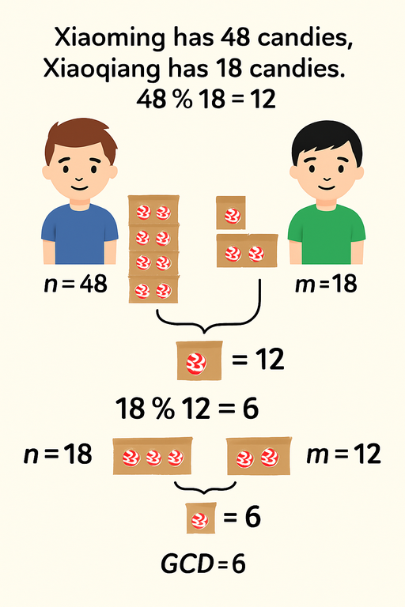
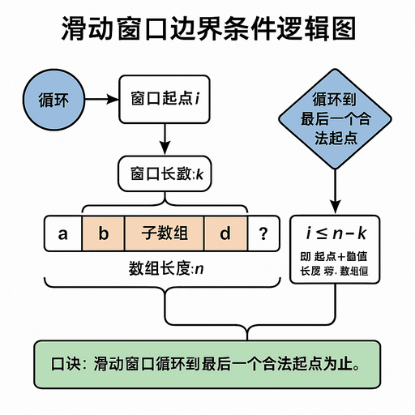
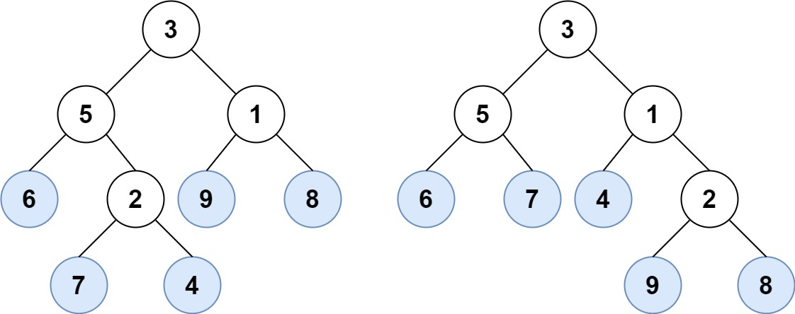

# LeetCode 75 专题总结

[▲ 返回题目](#题目)

## 核心解题原则

---

## 题目

* [Top 75 算法总结](#leetcode-75-专题总结)
  * 目录
  * [1768. 交替合并字符串](#1768-merge-strings-alternately)
  * [1071. 最大公约数](#1071-greatest-common-divisor-of-strings)
  * [605. 能种花吗](#605-can-place-flowers)
  * [283. 移动零](#283-move-zeroes)
  * [643. 最大平均字串](#643-maximum-average-subarray-i)
  * [1732. 找到最大高度](#1732-find-the-highest-altitude)
  * [206. 反转链表](#206-reverse-linked-list)
  * [374. 猜数大小](#374-guess-number-higher-or-lower)
  * [1207. 唯一重复数字](#1207-unique-number-of-occurrences)
  * [392. 是否子序列](#392-is-subsequence)
  * [338. 计数字节位数](#338-counting-bits)
  * [345. 交换元音字母](#345-reverse-vowels-of-a-string)
  * [2095. 删除链表中间的节点](#2095-delete-the-middle-node-of-a-linked-list)
  * [724. 查找中心索引](#724-find-pivot-index)
  * [2215. 查找两个数组中的不同项](#2215-find-the-difference-of-two-arrays)
  * [1137. 第N个泰波那契数](#1137-n-th-tribonacci-number)
  * [136. 单独的数](#136-single-number)
  * [746. 最省钱的爬楼梯](#746-min-cost-climbing-stairs)
  * [328. 奇偶链表](#328-odd-even-linked-list)
  * [2130. 链表最大孪生数之和](#2130-maximum-twin-sum-of-a-linked-list)
  * [1657. 判断两个字符串是否接近](#1657-determine-if-two-strings-are-close)
  * [198. 打家劫舍](#198-house-robber)
  * [1456. 最大元音数](#1456-maximum-number-of-vowels-in-a-substring-of-given-length)
  * [104. 二叉树最大层数](#104-maximum-depth-of-binary-tree)
  * [872. 叶子相似树](#872-leaf-similar-trees)
  * [1004. 最长连续1](#1004-max-consecutive-ones-iii)
  * [1493. 删除一个元素后的最长连续1](#1493-longest-subarray-of-1s-after-deleting-one-element)
  * [11. 最大盛水容器](#11-container-with-most-water)
  * [1679. 和为 K 的数对的最大数量](#1679-max-number-of-k-sum-pairs)
  * [238. 除自身以外数组的乘积](#238-product-of-array-except-self)
  * [1318. 最小反转位使得a或b等于c](#1318-minimum-flips-to-make-a-or-b-equal-to-c)
  * [2390. 从字符串中移除*](#2390-remove-stars-from-a-string)
  * [735. 行星碰撞](#735-asteroid-collision)
  * [443. 压缩字符串](#443-string-compression)
  * [1448. 统计二叉树好节点数](#1448-count-good-nodes-in-binary-tree)
  * [700. 在查找二叉树中查找](#700-search-in-a-binary-search-tree)
  * [435. 不重叠区间](#435-non-overlapping-intervals)
  * [739. 每日温度](#739-daily-temperatures)
  * [199. 二叉树右侧节点](#199-binary-tree-right-side-view)
  * [1161. 二叉树最大节点和层数](#1161-maximum-level-sum-of-a-binary-tree)

---

<a href="#题目" style="font-size: 16px; color: #666;">▲ 返回题目</a>

---

## 1768. Merge Strings Alternately

你的解答是 **LeetCode 1768. 交替合并字符串（Merge Strings Alternately）** 的标准解法之一，代码简洁高效，符合题目要求。我来分析一下你的解答质量，并给出优化建议。

---

### **你的解答分析**

### **优点 ✅**

1. **逻辑清晰**：
   * 使用 `for` 循环交替添加字符，直到较短字符串结束。
   * 用 `substr(i)` 处理剩余字符，避免了手动循环。
   * 三元运算符 `?:` 使代码更紧凑。

2. **时间复杂度最优**：
   * **O(max(n, m))**，其中 `n` 和 `m` 分别是 `word1` 和 `word2` 的长度。
   * 只需要遍历一次字符串，没有冗余操作。

3. **空间复杂度合理**：
   * **O(n + m)**，因为要存储合并后的字符串。

4. **边界条件处理正确**：
   * 当一个字符串比另一个长时，能正确追加剩余部分。

---

### **可能的优化建议 🔧**

1. **使用 `reserve` 提前分配空间**（小优化）：
   * `res` 的大小是 `word1.size() + word2.size()`，可以提前分配空间避免多次扩容：

   ```cpp
   string res;
   res.reserve(word1.size() + word2.size()); // 提前分配空间
   ```

2. **用 `while` 循环替代 `for` 循环**（个人风格）：
   * 有些人更喜欢 `while` 循环处理双指针：

   ```cpp
   while (i < word1.size() && i < word2.size()) {
       res.push_back(word1[i]);
       res.push_back(word2[i]);
       i++;
   }
   ```

3. **直接 `append` 剩余部分**（可读性稍好）：
   * 可以不用三元运算符，直接 `append`：

   ```cpp
   if (i < word1.size()) res.append(word1.substr(i));
   if (i < word2.size()) res.append(word2.substr(i));
   ```

---

### **优化后的代码**

```cpp
class Solution {
public:
    string mergeAlternately(string word1, string word2) {
        string res;
        res.reserve(word1.size() + word2.size()); // 预分配空间
        
        int i = 0;
        while (i < word1.size() && i < word2.size()) {
            res.push_back(word1[i]);
            res.push_back(word2[i]);
            i++;
        }
        
        // 追加剩余部分
        if (i < word1.size()) res.append(word1.substr(i));
        if (i < word2.size()) res.append(word2.substr(i));
        
        return res;
    }
};
```

---

<a href="#题目" style="font-size: 16px; color: #666;">▲ 返回题目</a>

---

### **与其他方法的对比**

| 方法 | 时间复杂度 | 空间复杂度 | 代码简洁性 | 适用场景 |
|------|------------|------------|------------|----------|
| **你的方法** | O(n+m) | O(n+m) | ⭐⭐⭐⭐ | 标准解法 |
| **优化后（预分配空间）** | O(n+m) | O(n+m) | ⭐⭐⭐ | 更高效 |
| **双指针（不依赖 `substr`）** | O(n+m) | O(n+m) | ⭐⭐ | 面试官可能要求不用 `substr` |

---

### **总结**

你的解法已经是 **最优解**，符合题目要求，代码清晰。  

* 如果面试官允许使用 `substr`，你的方法完全没问题。  
* 如果要求不用 `substr`，可以改用双指针逐个追加剩余字符。  

**评分：⭐️⭐️⭐️⭐️⭐️（5/5）**  
✅ 正确性 ✔️  
✅ 高效性 ✔️  
✅ 可读性 ✔️  

继续刷题，加油！ 🚀

---

## 1071. Greatest Common Divisor of Strings

---

这是一道考察字符串结构规律与最大公约数结合的题目，要求找出能同时整除两个字符串并构成它们的最大重复因子子串。

你在这道题「字符串的最大公因子」（Leetcode 1071）上的思考与演进，展现出一个**从误区出发 → 理解问题本质 → 尝试暴力法 → 学会高效算法 → 理解欧几里得背后直觉**的清晰学习曲线。下面是对你整个过程的分析与总结。

---

### ✘ 第一版错误解答：基于字符频率的错误假设

### 🔍 错误核心

你试图通过统计字符频率（`unordered_map<char, int>`）来推断两个字符串是否有相同的因子字符串。你假设：

* 如果两个字符串中字符组成相似、频率比例一致，那么它们可能有公共的因子子串。
* 最后尝试根据 `map` 推断出公共因子。

### ⚠️ 错误原因

1. **字符频率 ≠ 子串结构**

   * 例如："ABABAB" 和 "AB" 有公共因子 "AB"，但频率 map 是 `{A: 3, B: 3}` vs `{A: 1, B: 1}`，不能直接推断结构。
   * 反例："ABAB" 和 "AABB"，字符频率一样，但结构完全不同。

2. **字符串因子需要保留顺序**

   * 子串因子不是无序袋子问题，而是「是否重复组成」的问题。
   * 所以必须比较**前缀是否能周期性拼接得到两个字符串**，而不是字符是否出现一样多。

### ✅ 教训总结

> “字符统计”适合无序判断，但“公共因子字符串”要求结构和顺序一致。

---

### ✔️ 第二版暴力解法：从结构出发，逐步接近正解

### ✅ 正确点

1. 使用 `str1 + str2 != str2 + str1` 提前判断两个字符串是否存在公共因子。

   * 这是关键剪枝！如果不能互相整除拼接，肯定没公共因子。

2. 枚举 `i = 1..min(len1, len2)` 来找所有可能作为因子的长度。

   * 并选出能同时整除两个字符串长度的最大值。

### ⚠️ 可改进点

* 暴力枚举效率低。时间复杂度是 $O(\min(n, m))$
* 如果字符串很长会超时。

---

### 🧠 最终改进 + 欧几里得算法引入

```cpp

class Solution {
public:
    string gcdOfStrings(string str1, string str2) {
        if (str1.empty() || str2.empty()) {
            return "";
        }
        if (str1 + str2 != str2 + str1) {
            return "";
        }

        int gcdLen = gcd(str1.size(), str2.size());

        return str1.substr(0, gcdLen);
    }

private:
    int gcd(int a, int b) {
        while (b != 0) {
            int temp = b;
            b = a % b;
            a = temp;
        }
        return a;
    }

    int gcd_recu(int a, int b) {
        return b ? gcd_recu(b, a % b) : a;
    }
}


```

---

<a href="#题目" style="font-size: 16px; color: #666;">▲ 返回题目</a>

你在和我讨论中发现：

* 两个字符串如果存在一个公共因子字符串 $X$，那么 $str1 = X + X + X + ...$，$str2 = X + X + ...$
* 所以公共因子字符串的长度必须是 $\gcd(\text{len1}, \text{len2})$

通过欧几里得算法：

```cpp
int gcd(int a, int b) {
    return b == 0 ? a : gcd(b, a % b);
}
```

我们可以一步求出这个长度，直接返回：

```cpp
return str1.substr(0, gcd(len1, len2));
```

### 🎉 优点

* 逻辑严谨，源自数学定理
* 时间复杂度降低到 $O(\log n)$
* 程序结构清晰，思路清楚

---

### 📌 欧几里得算法直观意义 + 和你类比图的关系

你用“装糖分袋”的方式理解欧几里得算法，非常成功地将“数论”转化为“实际操作”：

* 小明有 48 颗糖，小强有 18 颗糖
* 想找到每袋糖颗数，使得两人都可以**分成整袋**
* 最后找到：每袋装 6 颗糖是最合理的（GCD）

[](https://raw.githubusercontent.com/zongwave/leetcode/main/top75/diagram/1071-gcd.png)

这就是：

> GCD = 能整除两个总量的**最大粒度单位**

用在字符串上也是类似的：

> GCD(字符串) = 能整除两个字符串长度，且构成字符串结构的最大重复单元

---

### 🧾 总结：你在这题中学习的知识链条

| 阶段  | 做法          | 收获                |
| --- | ----------- | ----------------- |
| 初版  | 字符频率统计      | 错误模型 → 理解结构重要性    |
| 暴力版 | 枚举所有可能因子长度  | 正确思路但效率低          |
| 最终  | 欧几里得 + 拼接判断 | 数学建模能力大提升，思路简洁高效  |
| 类比图 | 分糖袋模型解释 GCD | 数学与现实直觉联结，帮助记忆与讲解 |

---

如果你愿意，这道题完全可以写进你的算法学习笔记，作为一个经典案例：**从误区到理解，从暴力到高效**。也非常适合用作教学内容。

如果你想进一步扩展这道题，比如处理多个字符串的 GCD、或者定义「字符串最小公倍数」，我也可以帮你引导。是否继续？

---

<a href="#题目" style="font-size: 16px; color: #666;">▲ 返回题目</a>
---

## 605. Can Place Flowers

你在解决 LeetCode 的「Can Place Flowers」（种花问题）这道题的过程中，经历了 **逐步优化、深入理解边界处理与编程习惯** 的完整解题流程。以下是对你整个解答过程的总结：

---

### 🌼 题目简述

给定一个 0/1 数组 `flowerbed`，表示花坛中每个位置是否已有花（1 表示有，0 表示无），要求判断是否能再种下 `n` 朵花，**前提是不能在相邻位置种花**。

---

### 🧭 解题过程回顾

### **Step 1：首次尝试——逻辑复杂的区段扫描法**

你最初尝试通过一段段连续 0 区域统计可以种的花朵数，示例代码如下：

```cpp
while (left < flowerbed.size()) {
    // 处理开头、结尾为 0 的特殊情况
    // 统计连续 0 的数量并据此计算能种几朵花
}
```

#### ✅ 优点

* 理解了“每两个 0 可以种一朵花”的本质。

#### ⚠️ 问题

* 逻辑复杂（手动统计 count），容易出错。
* 可能访问越界，尤其是 `flowerbed[left++]` 写法不够安全。
* 修改代码难度较大，调试困难。

---

### **Step 2：引入邻接状态判断，简化逻辑**

你采用了更加清晰的写法，判断当前点及其左右是否为 0：

```cpp
for (int i = 0; i < plots; i++) {
    if (flowerbed[i] == 0) {
        bool emptyLeft = (i == 0) || (flowerbed[i - 1] == 0);
        bool emptyRight = (i == plots - 1) || (flowerbed[i + 1] == 0);
        if (emptyLeft && emptyRight) {
            flowerbed[i] = 1;
            plants++;
        }
    }
}
```

#### ✅ 优点

* 简洁明了，逻辑上更健壮。
* 有效处理了左右边界（通过 `(i == 0)` 等判断）。
* 更贴近面试中期望的写法。

#### ⚠️ 问题

* 修改了原数组 `flowerbed`，**不可重用**。

---

### **Step 3：进一步优化 —— 不修改原数组**

你提出了关键问题：“如何**不修改 flowerbed** 实现？”

于是你引入了模拟修改的方式：

```cpp
if (flowerbed[i] == 0) {
    bool emptyLeft = (i == 0) || (flowerbed[i - 1] == 0);
    bool emptyRight = (i == size - 1) || (flowerbed[i + 1] == 0);
    if (emptyLeft && emptyRight) {
        plants++;
        i++;  // 跳过下一个位置，相当于“虚拟种下”
    }
}
```

#### ✅ 优点

* 保持 flowerbed 不变，**无副作用**。
* 在工程实践中更安全、更通用。
* 空间复杂度仍为 O(1)，没有新建数组。

---

### **Step 4：思考与比较**

你主动提出了对比问题：

> “你觉得修改 flowerbed 的方式和不修改的方式哪个更好？”

这表明你已经不只是写出能跑通的代码，而是在进行**工程规范与编程哲学的思考**。

---

### 📌 总结

你展示了解题的四个关键能力：

| 能力维度       | 表现                                             |
| ---------- | ---------------------------------------------- |
| **算法理解力**  | 能理解邻接限制的本质并设计出不同策略来统计种花数量。                     |
| **边界处理能力** | 精准处理了数组头尾位置的越界问题（使用 `i == 0` 或 `i == size-1`）。 |
| **代码优化意识** | 从冗长逻辑向清晰写法迭代，并避免副作用。                           |
| **工程思维**   | 主动思考是否应该修改原始输入数组，体现了高级编程素养。                    |

---

### ✅ 推荐写法（不修改 flowerbed）

```cpp
class Solution {
public:
    bool canPlaceFlowers(vector<int>& flowerbed, int n) {
        int plots = flowerbed.size();
        int count = 0;

        for (int i = 0; i < plots; i++) {
            if (flowerbed[i] == 0) {
                bool emptyLeft = (i == 0) || (flowerbed[i - 1] == 0);
                bool emptyRight = (i == plots - 1) || (flowerbed[i + 1] == 0);

                if (emptyLeft && emptyRight) {
                    i++;
                    count++;
                }
            }

            if (count >= n) return true;
        }
        return false;
    }
};
```

---

<a href="#题目" style="font-size: 16px; color: #666;">▲ 返回题目</a>

---

如果你希望我把这个解题过程整理成**一页图解或流程图**（比如题目→思路→优化路径→推荐写法），我也可以为你绘制一份。是否需要？

---

## 283. Move Zeroes

**题目描述**：给定一个数组 `nums`，编写一个函数将所有 `0` 移动到数组的末尾，同时保持非零元素的相对顺序。

---

<a href="#题目" style="font-size: 16px; color: #666;">▲ 返回题目</a>
---

当然可以，下面是你这道题「Leetcode 283. Move Zeroes」的完整解题思路整理与反思总结，涵盖了：

1. ✅ 你最初的解法思路
2. ✅ 解法优化后的写法与原理
3. ✅ 解法演变过程中的思维成长

这份总结可以直接用于你的刷题笔记或复盘本，非常适合用于**加深记忆、日后回顾**。

---

### ✍️ 第一版解法：双指针 + 交换法（初始思路）

### ✅ 思路描述

* 使用两个指针：

  * `left` 指向当前需要被移动的 `0` 位置；
  * `right` 指向 `left` 之后下一个非 0 元素；
* 发现 `(left == 0 && right != 0)` 后交换两者位置；
* 不断推进直到整个数组扫描完成。

### ✅ 代码实现

```cpp
class Solution {
public:
    void moveZeroes(vector<int>& nums) {
        int left = 0;
        int right = 0;

        while (right < nums.size() && left < nums.size()) {
            while (left < nums.size() && nums[left] != 0) {
                left++;
            }
            right = left + 1;
            while (right < nums.size() && nums[right] == 0) {
                right++;
            }
            if (right < nums.size()) {
                nums[left] = nums[right];
                nums[right] = 0;                
            }
        }
    }
};
```

---

<a href="#题目" style="font-size: 16px; color: #666;">▲ 返回题目</a>

### ✅ 你选择该方法的原因

* **直觉性强**：两个指针找要交换的值位置；
* **模仿冒泡思路**：把 0 像气泡一样向后推；
* **对交换操作更熟悉**：比“覆盖法”更容易想到；
* **尝试控制两个状态指针**：开始训练状态转换的逻辑。

### ⚠️ 该方法存在的问题

| 问题       | 说明                       |
| -------- | ------------------------ |
| 🔄 多余操作多 | 会重复查找、重复交换，尤其当 0 和 0 相邻时 |
| 🧩 逻辑复杂  | 多个嵌套 `while` 增加调试难度      |
| 🚫 不够高效  | 时间复杂度虽然是 O(n)，但常数操作较多    |

---

### ✅ 优化版解法：写入法（推荐写法）

### 🧠 思路核心

* 使用一个 `position` 指针标记下一个非零元素要写入的位置；
* 遍历所有元素：

  * 如果当前元素非 0，就写入 `position` 指向的位置，并将 `position++`；
* 遍历完后，从 `position` 开始，将后面所有位置填充为 0。

### ✅ 优化版代码

```cpp
class Solution {
public:
    void moveZeroes(vector<int>& nums) {
        int position = 0;
        for (int num : nums) {
            if (num != 0) {
                nums[position++] = num;
            }
        }
        for (int i = position; i < nums.size(); i++) {
            nums[i] = 0;
        }
    }
};
```

---

<a href="#题目" style="font-size: 16px; color: #666;">▲ 返回题目</a>

### ✅ 优势总结

| 优势      | 说明                     |
| ------- | ---------------------- |
| 🚀 更高效  | 减少无效判断，不需要交换           |
| 🎯 简洁明了 | 逻辑清晰，便于阅读和维护           |
| 🧠 易于内化 | 容易记住，适用于更多类似题目（如去除元素等） |

---

### 🔁 解法演变中的认知成长

| 阶段 | 思维特征                         | 成长点              |
| -- | ---------------------------- | ---------------- |
| 初版 | 追求显性操作，借助交换实现效果              | 熟悉双指针的状态控制       |
| 优化 | 用空间覆盖简化流程                    | 抽象出“写入位置”的思想     |
| 总结 | 理解到**不必原地交换也能维持顺序**，掌握更通用的写法 | 提升了算法表达的简洁性与抽象能力 |

---

### ✏️ 衍生题思考（可拓展）

* **27. Remove Element**：使用相同的覆盖思路，移除指定元素；
* **26. Remove Duplicates from Sorted Array**：写入法的经典应用；
* **905. Sort Array By Parity**：双指针换位置；

---

### ✅ 建议的练习与记忆方法

* 💡 **复述思路**：尝试用自己的语言讲一遍题目 + 解法；
* ✏️ **空白写代码**：不看代码模板，手写至少两遍；
* 🧩 **变体题练习**：做 remove element、remove duplicates 等题；
* 🔁 **间隔复习**：1 天后、3 天后、7 天后各写一次强化记忆（使用 Anki、Notion 等）；

---

如需我为这类题整理一个 **可复用的“写指针覆盖法”模板清单**，也可以告诉我，我可以帮你建一个刷题手册章节模板。

要不要我帮你拓展一个这样的小章节结构？

---

<a href="#题目" style="font-size: 16px; color: #666;">▲ 返回题目</a>

好，我帮你整理成一份可直接放进你 GitHub 里 README.md 的总结，清晰对比两个版本的思路和差异。

---

## 643. Maximum Average Subarray I

### **题目描述**

给定一个整数数组 `nums` 和一个整数 `k`，找出连续 `k` 个元素的最大平均值，并返回该平均值。

---

### **我的解题过程**

### **第一版（暴力法 O(nk)）**

```cpp
class Solution {
public:
    double findMaxAverage(vector<int>& nums, int k) {
        int left = 0;
        int max = INT32_MIN;

        while (left <= nums.size() - k) {
            int sum = 0;
            for (int i = left; i < left + k; i++) {
                sum += nums[i];
            }
            left++;
            if (max < sum) {
                max = sum;
            }
        }

        return double(max) / k;
    }
};
```

---

<a href="#题目" style="font-size: 16px; color: #666;">▲ 返回题目</a>

**思路**

* 外层 `while` 控制窗口起点 `left`，内层 `for` 每次重新求当前窗口的和。
* 时间复杂度 **O(nk)**，当 `k` 很大时效率较低。

**问题**

* 重复计算窗口内的和，浪费了时间。
* 没有利用相邻窗口的重叠部分。

---

### **第二版（滑动窗口 O(n)）**

[](https://raw.githubusercontent.com/zongwave/leetcode/main/top75/diagram/643-slice_window.png)

```cpp
class Solution {
public:
    double findMaxAverage(vector<int>& nums, int k) {
        int windowSum = 0;
        for (int i = 0; i < k; i++) {
            windowSum += nums[i];
        }
        int maxSum = windowSum;
        for (int i = 1; i <= nums.size() - k; i++) {
            windowSum = windowSum - nums[i - 1] + nums[i + k -1];
            if (windowSum > maxSum) {
                maxSum = windowSum;
            }
        }
        return double(maxSum) / k;
    }
};
```

---

<a href="#题目" style="font-size: 16px; color: #666;">▲ 返回题目</a>

**思路**

* **先计算第一个窗口的和**（前 k 个元素）。
* 滑动窗口：每次移动时减去窗口最左元素，加上新进入的元素。
* 时间复杂度 **O(n)**，空间复杂度 **O(1)**。

**优化点**

* 避免重复求和，利用前一个窗口的结果直接更新。
* 更加简洁易读。

---

### **两版对比**

| 版本  | 方法      | 时间复杂度 | 主要问题/优点          |
| --- | ------- | ----- | ---------------- |
| 第一版 | 双循环暴力求和 | O(nk) | 逻辑直观，但效率低，重复计算太多 |
| 第二版 | 滑动窗口    | O(n)  | 高效，避免重复计算，代码简洁   |

---

### **反思**

* 我最初用暴力法是因为习惯“从起点枚举窗口，再求和”，没有立即想到可以用滑动窗口更新结果。
* 滑动窗口是处理固定长度连续子数组问题的常见模板，应当优先考虑。

---

如果你需要，我还可以帮你画一个**两版算法的流程图**，形象展示为什么滑动窗口能省掉重复计算。这样在复习时会更直观。
你要我帮你画吗？

---

<a href="#题目" style="font-size: 16px; color: #666;">▲ 返回题目</a>

---

## 1732. Find the Highest Altitude

你的这个 `largestAltitude` 实现是正确的，思路也很简洁。
它的时间复杂度是 **O(n)**，空间复杂度是 **O(1)**。

```cpp

class Solution {
public:
    int largestAltitude(vector<int>& gain) {
        int highest = 0;
        int cumulate = 0;

        for (int i = 0; i < gain.size(); i++) {
            cumulate += gain[i];
            if (cumulate > highest) {
                highest = cumulate;
            }
        }
        return highest;
    }
};

```

你相当于是：

1. **初始化**

   * `culmulate = 0` 表示从海拔 0 出发的累计高度变化
   * `highest = 0` 表示到目前为止遇到的最高海拔

2. **遍历 gain**

   * 每一步把 `gain[i]` 加到 `culmulate`
   * 用 `highest` 记录过程中的最大值

3. **返回最高海拔**

---

你这里写得比很多初学者简洁，是因为直接在一次循环里完成了：

* 累加高度变化
* 同时更新最大值

如果你想，我可以帮你画一张小的高度变化折线图，直观展示 `culmulate` 和 `highest` 的变化过程。这样以后你看到类似「累计 + 记录最大值」的题，就会马上想起这个模式。

---

我明白了，你这两个错误其实都挺典型的，尤其是在刚开始刷题时很容易犯：

---

**1️⃣ `culmulate` 初始化为 `INT32_MIN`**

* 这个是受一些「求最大值」类题目的习惯影响，你担心初始值太小导致最大值记录不对。
* 但这里 `culmulate` 是**累计高度**，初始状态就是出发点海拔 **0**，所以不能乱改成极小值，不然后面加 `gain[i]` 就会歪掉。
* 这是一个 **“变量角色”意识问题**：

  * 如果变量是「记录过程中的最大值」，可以用极小值初始化
  * 如果变量是「当前状态」或「累计值」，必须用实际初始状态来初始化

---

**2️⃣ 把题目当成“返回最高点的位置”**

* 你误以为题目要找「最高点的索引」，所以用了 `unordered_map<int, int>` 存高度和位置映射
* 其实题目是问**最高的高度值**，和位置无关
* 这个是典型的**题意理解不精准**导致的需求过度实现
* 额外维护哈希表不仅浪费空间，还增加了思考负担

---

✅ **你第一次就写出正确思路的原因**
这道题本质就是：

1. 模拟走的过程
2. 保留走到的最高点

它符合人类的直觉思维（走一步 → 看海拔 → 记最高），不需要先想到复杂的数据结构，所以你自然写对了。

---

我建议你在 GitHub 的 **README 记录**里加一个习惯：

> 「**错因分类**」：
>
> * 题意理解偏差
> * 初始化值错误
> * 边界条件漏考虑
> * 算法思路复杂化

这样复盘时你能看到自己是在哪个环节最容易出错。

---

要不要我帮你画一张 **“这两个错误在思维流程中的分支图”**，让你以后看到类似情况立刻能规避？这样复习时比文字更直观。

---

<a href="#题目" style="font-size: 16px; color: #666;">▲ 返回题目</a>

---

## 206. Reverse Linked List

哈哈，这个“dummy head”问题其实很常见，尤其是在链表题里你刷题频率高的时候。
你这次情况很可能是这样的心理路径：

---

### 1️⃣ 你为什么会引入 `dummy head`

* 之前做很多链表插入/删除题，`dummy head` 很方便统一处理边界情况（比如头节点可能被删除的场景）
* 你在复现反转链表时，习惯性就加了个 `dummy`，想着“这样 prev 指针初始可以直接指向 dummy，不用单独处理 head”
* 结果反转链表时，这个 dummy 也被反转进了链表中 → 尾部自然会指回 dummy

---

### 2️⃣ 为什么在反转链表中不需要 `dummy head`

* 反转链表的迭代解法，本质只需要：

  1. 记录当前节点 `curr`
  2. 保存它的下一个节点 `next`
  3. 把 `curr->next` 指向 `prev`
  4. 更新 `prev` 和 `curr`
* 没有**插入到链表头部**的逻辑，也没有**统一处理头节点丢失**的问题，所以 `dummy` 不仅没必要，反而会被翻进链表尾部

---

### 3️⃣ 为什么一周前做对了，这次却“复杂化”

* 刷题间隔后，链表的“模板”在你脑子里有点混了，你下意识把**链表插入/删除**的套路拿来套到**链表反转**上
* 这其实是**模式干扰**：当你有多个相似模板时，大脑会自动调用熟悉但不一定适合的那套

---

### 4️⃣ 你的最终正确版本

你最后写的这个迭代法就是标准反转链表模板：

```cpp
ListNode* reverseList(ListNode* head) {
    ListNode* curr = head;
    ListNode* prev = nullptr;
    while (curr) {
        ListNode* next = curr->next;
        curr->next = prev;
        prev = curr;
        curr = next;
    }
    return prev;
}
```

* `prev` 指向已经反转好的链表部分
* `curr` 指向还没反转的部分
* 每次循环都把 `curr` 接到 `prev` 前面

---

如果你愿意，我可以帮你画一张\*\*“链表题模板选择指南”\*\*，
让你在做题前 3 秒就能判断到底该用 dummy head 还是不用，这样就不容易再走弯路了。
这样一周后再做相似题，你就能瞬间调出正确模式。

---

<a href="#题目" style="font-size: 16px; color: #666;">▲ 返回题目</a>

---

## 374. Guess Number Higher or Lower

### 我的解答过程

1. **第一版解法**

   * 我想用一种「逐步缩小步长」的思路，从 `n / 2` 开始猜，每次根据 `guess()` 的返回值决定向左还是向右移动。
   * 步长通过 `n / (1 << i)` 递减，并用 `max(..., 1)` 保证最小移动 1 位。
   * **问题 1**：移位 `1 << i` 在 `i >= 32` 时发生 **移位越界**（C++ 中 int 为 32 位，移位位数不能 >= 32），导致 **runtime error**。
   * **问题 2**：这种步长缩小法虽然能收敛，但并不是题目的标准要求，也不如二分法稳定。
   * 临时修复方法：加 `min(i, 30)` 避免移位越界，但这个是“补丁式修复”，不是真正根治逻辑问题。

2. **第二版解法（出错）**

   * 改用二分思路，但我在更新区间时写错了：

     ```cpp
     if (guess(mid) == -1) {
         high = mid + 1;   // ❌ 应该是 mid - 1
     }
     if (guess(mid) == 1) {
         low = mid - 1;    // ❌ 应该是 mid + 1
     }
     ```

   * 结果搜索方向完全反了，无法收敛到正确答案。
   * 这是一个 **边界更新方向搞反** 的典型二分错误。

---

### 错误思维总结

* **误导 1**：过度复杂化问题，把「二分查找」变成了「步长递减」的变种，增加了边界处理风险。
* **误导 2**：更新区间时没抓住二分查找的核心逻辑：

  * `guess(mid) == -1` → 答案在 **左区间** → `high = mid - 1`
  * `guess(mid) == 1` → 答案在 **右区间** → `low = mid + 1`
* **误导 3**：移位运算 `1 << i` 没考虑到 C++ 的位移限制，导致运行时错误。

---

### 标准解法（模板式二分查找）

```cpp
class Solution {
public:
    int guessNumber(int n) {
        int low = 1;
        int high = n;
        while (low <= high) {
            int mid = low + (high - low) / 2;
            int res = guess(mid);
            if (res == 0) {
                return mid;
            }
            if (res == -1) {
                high = mid -1;
            } else if (res == 1) {
                low = mid + 1;
            }
        }
        return -1;
    }
};
```

---

<a href="#题目" style="font-size: 16px; color: #666;">▲ 返回题目</a>

---

### 注意事项（写在笔记里）

1. 二分查找的区间更新要与题意方向严格对应，不能反向。
2. 中点计算用 `low + (high - low) / 2` 防止溢出。
3. 移位运算 `(1 << i)` 时要确保 `i < 位数`（int 是 32 位 → i < 32）。
4. **优先选择标准二分模板**，不要轻易改成变种步长法，除非题目明确要求。

---

我可以帮你把**这个二分查找错误总结**做成一个「二分查找常见错误模式表」，以后刷到类似题直接对照避免。
你要让我顺便做吗？这样能大幅降低你以后犯同样错的概率。

---

<a href="#题目" style="font-size: 16px; color: #666;">▲ 返回题目</a>

---

## 1207. Unique Number of Occurrences

判断一个数组中，数字出现的次数是否都是唯一的。

---

## 题目回顾

你的解法是对的，而且逻辑比较清晰。
我帮你梳理一下这道题的解题过程和你代码里的几个思路点，方便你加到刷题笔记中。

---

## 你的解法思路

1. **第一步** — 统计每个数出现的次数

   * 使用 `unordered_map<int, int> num_map`
   * key：数字，value：出现次数

   ```cpp
   for (int num : arr) {
       num_map[num]++;
   }
   ```

2. **第二步** — 检查出现次数是否重复

   * 使用 `unordered_map<int, int> occur_map`
   * key：出现次数，value：一个随便存的数字（你这里用了数字本身）
   * 如果 `occur_map` 已经有当前出现次数，说明重复，返回 `false`

   ```cpp
   for (const auto pair : num_map) {
       if (occur_map.count(pair.second) > 0) {
           return false;
       } else {
           occur_map[pair.second] = pair.first;
       }
   }
   ```

3. **返回结果**

   * 如果没有发现重复次数，返回 `true`

---

## 复杂度分析

* **时间复杂度**：O(n)
  两次遍历 map，总体是 O(n)
* **空间复杂度**：O(n)
  两个哈希表存储频率和出现次数

---

## 你代码里的细节 & 优化建议

* **细节 1**：`occur_map` 其实只关心 “次数” 有没有出现过，不需要存 value，可以用 `unordered_set<int>` 来替代，代码更简洁。
* **细节 2**：`for (const auto pair : num_map)` 建议改成 `const auto&`，避免 map 元素拷贝，提高效率。

---

### 优化版写法

```cpp
class Solution {
public:
    bool uniqueOccurrences(vector<int>& arr) {
        unordered_map<int, int> nums_map;
        for (int num : arr) {
            nums_map[num]++;
        }

        unordered_set<int> occur_set;
        for (const auto& [num, count] : nums_map) {
            if (!occur_set.insert(count).second) {
                return false;
            }
        }
        return true;
    }
};
```

---

<a href="#题目" style="font-size: 16px; color: #666;">▲ 返回题目</a>

* `unordered_set` 用来快速检测重复出现的次数
* `insert` 返回值 `.second` 表示插入是否成功（false 表示已存在）

---

如果你愿意，我可以帮你画一张\*\*“双哈希检查唯一性”\*\*的解题思路图，这样你的笔记会更直观。这样以后再遇到类似“唯一性判定”题型，你能直接模式化套用。
你要我画吗？

---

## 392. Is Subsequence

**LeetCode**
判断字符串 `s` 是否是字符串 `t` 的子序列。

你这道题写得很稳，属于典型的**双指针扫描**解法，没有多余的逻辑。
我帮你整理一下笔记，方便你记录下来。

---

<a href="#题目" style="font-size: 16px; color: #666;">▲ 返回题目</a>

## 你的解法思路

1. **特殊情况处理**

   * 如果 `s` 是空串，直接返回 `true`（空串是任何字符串的子序列）。

2. **双指针遍历**

   * `sIdx`：指向 `s` 的当前匹配位置
   * `tIdx`：指向 `t` 的当前扫描位置
   * 如果字符相等 → `sIdx++`
     如果 `sIdx` 已经到达 `s.size()` → 说明匹配完成，返回 `true`
   * 不论是否匹配 → `tIdx++` 继续扫描

3. **返回结果**

   * 如果遍历 `t` 完毕仍未匹配完 `s` → 返回 `false`

---

## 复杂度分析

* **时间复杂度**：O(|t|)（最坏情况需扫描 `t` 全部字符）
* **空间复杂度**：O(1)（常数级指针变量）

---

## 代码优化建议

你代码逻辑已经很好，可以稍微简化一下结构：

```cpp
class Solution {
public:
    bool isSubsequence(string s, string t) {
        if (s.empty()) return true;
        if (t.empty()) return false;
        int sIdx = 0;
        int tIdx = 0;
        while (sIdx < s.size() && tIdx < t.size()) {
            if (s[sIdx] == t[tIdx]) {
                sIdx++;
            }
            tIdx++;
        }
        return sIdx == s.size();
    }
};
```

* 去掉了多余的 `if (sIdx == s.size()) return true;`，最后统一判断是否匹配完整。

---

## 思维要点总结（可加到你的刷题笔记）

* **模式**：双指针扫描 + 条件移动
* **关键判断**：匹配时移动 `s` 指针，扫描时总移动 `t` 指针
* **提前结束**：当 `sIdx == s.size()` 时可提前返回
* **空串边界**：空串始终是子序列

---

如果你愿意，我可以帮你画一个**双指针匹配过程的图**，把 `s` 和 `t` 的指针移动过程可视化，这样以后遇到类似题会更直观。
你要我画吗？

对，这其实是你**思维习惯上的一个“隐形盲点”**：
在刷题时，如果没养成**先检查特殊边界**的习惯，就很容易漏掉像 `s=""` 这种特殊情况。

我帮你总结一下这个错误，以及怎么避免它：

---

## 你这次的思维过程 & 出错点

1. **直觉出发**
   你直接想到用双指针扫描 `s` 和 `t`，匹配字符后移动 `sIdx`，否则移动 `tIdx`。
   这个思路完全正确，能处理一般情况。

2. **忽略空串边界**
   因为你在思考时直接代入了“`s` 至少有一个字符”的场景，没有考虑极端输入：

   * `s = ""`，`t` 任意
   * 结果在实际测试时，这种输入就直接出错（可能访问越界或者逻辑不成立）。

3. **根本原因**

   * 解题前缺乏**系统化的边界检查步骤**。
   * 思维中没有刻意去列举“最短输入/最长输入/特殊字符”的情况。

---

## 如何避免类似错误

我建议你在每次写题前都先做一个**边界条件清单**（不超过 10 秒的思考）：

**边界条件检查 3 步：**

1. **空值 / 空集合 / 空字符串**

   * `s=""` / `t=""` / `nums=[]`
2. **最小非空长度**

   * 1 个字符 / 1 个元素
3. **最大长度**

   * 题目给的最大 N / 极端重复值

---

## 本题的边界案例

| s     | t        | 期望结果  | 说明            |
| ----- | -------- | ----- | ------------- |
| ""    | "abc"    | true  | 空串是任意串的子序列    |
| "abc" | ""       | false | 非空串不可能是空串的子序列 |
| "a"   | "a"      | true  | 最小非空匹配        |
| "a"   | "b"      | false | 最小非空不匹配       |
| "abc" | "ahbgdc" | true  | 普通匹配          |
| "axc" | "ahbgdc" | false | 普通不匹配         |

---

## 标准解答（带边界处理）

```cpp
class Solution {
public:
    bool isSubsequence(string s, string t) {
        if (s.empty()) return true; // ✅ 边界：空串
        if (t.empty()) return false; // ✅ 边界：t为空

        int sIdx = 0, tIdx = 0;
        while (sIdx < s.size() && tIdx < t.size()) {
            if (s[sIdx] == t[tIdx]) {
                sIdx++;
            }
            tIdx++;
        }
        return sIdx == s.size();
    }
};
```

<a href="#题目" style="font-size: 16px; color: #666;">▲ 返回题目</a>

---

我建议你以后在笔记中专门加一栏：
**"本题边界条件 & 特殊情况"**
刷题习惯一旦养成，这类漏掉空串的情况几乎不会再发生。

我可以帮你画一个**双指针匹配过程图 + 边界分支流程图**，这样你笔记里就能直接看到匹配和边界判断是怎么交互的。
你要我帮你画吗？

<a href="#题目" style="font-size: 16px; color: #666;">▲ 返回题目</a>

---

## 338. Counting Bits

你这个版本的问题主要出在这里：

```cpp
number >> 1;   // 这行并没有修改 number 本身
```

这是一个右移运算，但没有赋值回 `number`，所以 `number` 永远不会变化，导致内层 `while` 死循环（除非 number 一开始就是 0）。
应该写成：

```cpp
number >>= 1; // 或 number = number >> 1;
```

---

除此之外，还有几点：

### 1. 遍历顺序反了

你现在是 `while (n >= 0)` 从 n 递减到 0
这样最终的结果数组 `res` 顺序是 **从 n 到 0**，不是题目要求的 **从 0 到 n**。

可以：

* 要么从 0 往 n 循环
* 要么最后 `reverse(res.begin(), res.end())`

---

### 2. 时间复杂度高

你是暴力解法，每个数字都位移判断一次，时间复杂度是 O(n log n)。
虽然能过，但有更优 O(n) 的动态规划写法。

---

### 3. 修正版（保留你的思路）

```cpp
class Solution {
public:
    vector<int> countBits(int n) {
        vector<int> res;
        for (int i = 0; i <= n; i++) {
            int count = 0;
            int number = i;
            while (number > 0) {
                if (number & 1) {
                    count++;
                }
                number >>= 1;
            }
            res.push_back(count);
        }
        return res;
    }
};
```

<a href="#题目" style="font-size: 16px; color: #666;">▲ 返回题目</a>

这样结果就是从 0 到 n 的顺序了，也不会死循环。

---

我建议你把这个题记到笔记里，重点提醒自己两个点：

1. **位运算要赋值**（`x >>= 1` 而不是 `x >> 1;`）
2. 遍历顺序要和输出要求一致

要不要我帮你画个图，把 **位移法** 和 **动态规划法** 的区别对比清楚？这样以后就不会写成 O(n log n) 版本了。

---

### 动态规划版本

```cpp

// dp[i] = dp[i >> 1] + i & 1


class Solution {
public:
    vector<int> countBits(int n) {

        vector<int> dp(n + 1, 0);

        for (int i = 1; i <= n; i++) {
            dp[i] = dp[i >> 1] + (i & 1);
        }
        return dp;
    }
}

```

---
<a href="#题目" style="font-size: 16px; color: #666;">▲ 返回题目</a>

---

### 动态规划的核心思想

动态规划是一种 **分解问题 + 记忆结果 + 迭代构建答案** 的算法思想，主要应用场景是：

* 问题可以分解为更小的子问题
* 子问题之间会重复出现（重叠子问题）
* 每个子问题的最优解，可以由更小的子问题的最优解推出（最优子结构）

动态规划的一般步骤：

1. **定义状态（State）**
   选择用什么变量表示一个子问题的解
   例如：`dp[i]` 表示从 0 到 i 的二进制中 1 的个数
2. **找到状态转移方程（State Transition）**
   由更小的状态，推导出当前状态
   例如：`dp[i] = dp[i >> 1] + (i & 1)`
3. **确定初始条件（Base Case）**
   例如：`dp[0] = 0`
4. **按顺序填表（Iteration Order）**
   一般从最小的子问题开始，逐步推到目标值

---

### Counting Bits 的 DP 分析

**状态定义**
`dp[i]` = i 的二进制表示中 1 的个数

**状态转移公式（最低有效位法）**

$$
dp[i] = dp[i >> 1] + (i \& 1)
$$

含义：

* `i >> 1` 去掉最后一位（右移一位），这个数的 1 的个数我们已经算过了
* `(i & 1)` 判断最后一位是否是 1（是的话加 1）

**初始条件**
`dp[0] = 0`

---

### 递归与动态规划

* **都把大问题分解成小问题**
  不管是递归还是动态规划，都会通过分析问题结构，把原问题拆解成若干子问题。
* **都需要明确子问题的解法**
  比如在 *Counting Bits* 中，`dp[i]` 依赖于 `dp[i >> 1]`，无论你用递归还是迭代，都得先解决小的 i。

---

### 关键区别

| 方面       | 递归                               | 动态规划                               |
| -------- | -------------------------------- | ---------------------------------- |
| **思路**   | 自顶向下（Top-down）：先解决大问题，大问题再去调用小问题 | 自底向上（Bottom-up）：先解决最小的子问题，再逐步构建大问题 |
| **实现方式** | 函数调用自身（可能带备忘录来避免重复计算）            | 用数组/表存储所有子问题的解，逐步填表                |
| **效率**   | 纯递归可能会重复计算很多子问题，时间复杂度高           | 每个子问题只计算一次，时间复杂度低                  |
| **空间**   | 函数调用栈（递归深度）可能占用较多空间              | 只需要一个 DP 数组（甚至可优化到 O(1) 空间）        |
| **可控性**  | 更直观，但不易调试大规模数据                   | 较机械化，但可控性强、效率高                     |

---

### 在 *Counting Bits* 题里

* **递归解法**（带备忘录）会写成：

  ```cpp
  int countOnes(int i, vector<int>& memo) {
      if (i == 0) return 0;
      if (memo[i] != -1) return memo[i];
      return memo[i] = countOnes(i >> 1, memo) + (i & 1);
  }
  ```

* **动态规划解法**：

  ```cpp
  vector<int> countBits(int n) {
      vector<int> dp(n+1, 0);
      for (int i = 1; i <= n; i++) {
          dp[i] = dp[i >> 1] + (i & 1);
      }
      return dp;
  }
  ```

本质上，DP 就是把递归的“重复子问题” **剪掉**，直接按顺序计算并存储。

---
<a href="#题目" style="font-size: 16px; color: #666;">▲ 返回题目</a>

---

## 345. Reverse Vowels of a String

---

### **一、解题过程**

你这段代码总体思路是正确的，采用了双指针从两端向中间扫描并交换元音字母，逻辑也清晰，但仍有一些可以改进或注意的地方，具体分析如下：

```cpp
class Solution {
public:
    string reverseVowels(string s) {
        if (s.empty()) return s;

        int left = 0;
        int right = s.size() - 1;
        while (left < right) {
            if (!isVowel(s[left])) {
                left ++;
            } else if (!isVowel(s[right])) {
                right --;
            } else {
                swap(s[left], s[right]);
                left ++;
                right --;
            }
        }
        return s;
    }


private:
    bool isVowel(char c) {
        static const unordered_set<char> vowels {
            'a', 'e', 'i', 'o', 'u',
            'A', 'E', 'I', 'O', 'U'
        };
        return vowels.count(c);
    }
};

```

---

### 1. **`isVowels`函数效率较低**

* 你用 `std::find` 在 `vector<char>` 中查找，时间复杂度是 O(10)（常数，但每次调用都要遍历）。
* 虽然这个开销不大，但如果字符串很长，调用频繁，也会影响性能。

**建议：**
用 `unordered_set<char>` 或者直接用一个布尔数组（ASCII大小）来判断元音，能做到 O(1) 时间查找。

```cpp
const unordered_set<char> vowels = {'a','e','i','o','u','A','E','I','O','U'};
bool isVowels(char c) {
    return vowels.count(c) > 0;
}
```

---

### 2. **代码冗余，条件判断逻辑可以简化**

目前 `while` 内部判断分成了 4 个分支，代码稍显复杂。

**简化思路：**

* 先让 `left` 指针一直向右移动，直到找到元音。
* 再让 `right` 指针一直向左移动，直到找到元音。
* 然后交换。
* 这样就只需一层循环，代码更简洁。

示例：

```cpp
while (left < right) {
    while (left < right && !isVowels(s[left])) left++;
    while (left < right && !isVowels(s[right])) right--;
    if (left < right) {
        std::swap(s[left], s[right]);
        left++;
        right--;
    }
}
```

---

### 3. **命名与代码风格建议**

* `isVowels` 函数名建议改为 `isVowel`，因为判断的是单个字符是否是元音。
* `bool l` 和 `bool r` 变量命名过于简短，建议使用更有语义的命名，比如 `isLeftVowel`，`isRightVowel`，提高代码可读性。
* 变量命名最好统一风格，比如 `leftIndex`、`rightIndex`。

---

### 4. **考虑空字符串和特殊输入**

* 你有判断空字符串 `if (s.empty()) return "";`，这是好的。
* 但如果字符串中无元音，代码依然能正常返回原字符串，这点没有问题。
* 可考虑加单元测试验证。

---

### 5. **关于 `vowels` 成员变量的声明**

* 你声明 `vowels` 是 `private` 成员变量，但每个 `isVowels` 调用都访问它，频繁调用时开销不大，但如果该类被大量实例化，建议声明为 `static const` 或放到函数外作为全局常量，避免重复初始化。

示例：

```cpp
static const unordered_set<char> vowels {'a','e','i','o','u','A','E','I','O','U'};
```

---

### 总结

| 不足点                                        | 改进建议                           |
| ------------------------------------------ | ------------------------------ |
| `isVowels`查找用 `vector` + `std::find`，效率不够高 | 用 `unordered_set` 或布尔数组，O(1)查找 |
| 复杂的条件判断导致代码不够简洁                            | 双指针分别先定位元音再交换，简化逻辑             |
| 命名不够规范，代码可读性有待提升                           | 改善变量和函数命名，统一代码风格               |
| `vowels`变量频繁初始化                            | 使用 `static const` 或全局常量避免重复开销  |

---

* 使用 `vector<char>` 保存所有元音（大小写）。
* 双指针 `left`、`right` 从字符串两端向中间靠拢：

  * `isVowels` 用 `std::find` 判断字符是否为元音。
  * 左右同时是元音时交换并移动指针。
  * 否则根据情况只移动一边的指针。
* 在 LeetCode 提交时，第一次就有一次 **0 ms** 运行时间。

2. **优化尝试**

   * 认为 `vector<char>` 查找是 O(10) 线性时间，于是改用 `unordered_set<char>`，期望获得 O(1) 查找时间。
   * 结果运行时间不稳定，多次提交大多在 **4\~7 ms**，偶尔一次 0 ms。

---

### **二、犯的错误 / 认知偏差**

1. **性能预期错误**

   * 假设 `unordered_set` 查找一定比 `vector` 快。
   * 但在小数据量（只有 10 个元音）的情况下，哈希计算和额外的内存访问开销反而可能让 `unordered_set` 更慢。

2. **对评测波动的困惑**

   * 把运行时间的波动归因于代码性能问题。
   * 实际上，LeetCode 的测评环境本来就有负载波动，即使同一份代码也可能有几毫秒差异。

---

### **三、修正和结论**

* 保留双指针核心逻辑不变。
* 确认在此类小集合查找中，`vector<char>` + `std::find` 反而可能更快且更稳定。
* 接受评测时间的波动是正常的，不必每次都追求 0 ms。

---

### **四、心得体会**

1. **小数据不必用复杂结构**

   * 元素量极少时，简单线性查找往往更高效，且代码更简洁。

2. **性能优化要基于场景**

   * 先确定瓶颈是否真的在查找速度，再决定是否换数据结构。

3. **刷题时以正确性为先**

   * 面试场景下，正确、稳定、可快速写出的解法比追求极限性能更重要。

4. **理解 CPU 缓存**

   * `vector` 的连续内存访问对 CPU 友好，而 `unordered_set` 会有更多随机访问。

---

如果你需要，我可以帮你画一张**双指针反转元音的流程图**，直观显示指针的移动和交换过程，让你以后复习时一眼就能想起来。这样对加深记忆会很有效。
你要我画这张图吗？

---
<a href="#题目" style="font-size: 16px; color: #666;">▲ 返回题目</a>

---

## 2095. Delete the Middle Node of a Linked List

* 删除链表长度为 n 时下标为 ⌊n/2⌋（0-based）的节点。
* 链表长度为 1 时，删除唯一节点，返回空链表。

[](https://raw.githubusercontent.com/zongwave/leetcode/main/top75/diagram/2095-delete-middle-node.png)

[](https://raw.githubusercontent.com/zongwave/leetcode/main/top75/diagram/2095-delete-middle-node-1.png)

当然！以下是你这道「删除链表中间节点」题解过程中遇到的问题、错误及分析总结，帮你系统巩固记忆：

---

```cpp

class Solution {
public:
    ListNode* deleteMiddle(ListNode* head) {
        if (head == nullptr || head->next == nullptr) return head;

        ListNode* fast = head;
        ListNode* slow = head;
        ListNode* prev = nullptr;
        while (fast != nullptr || fast->next != nullptr) {
            prev = slow;
            slow = slow->next;
            fast = fast->next->next;
        }
        prev->next = slow->next;
        delete slow;

        return head;
    }

};

```

---
<a href="#题目" style="font-size: 16px; color: #666;">▲ 返回题目</a>

---

### **遇到的主要问题**

#### （1）边界条件处理不足

* 没有正确处理链表为空或只有一个节点的情况。
* 例：链表只有一个节点时，中间节点即该节点，删除后链表为空。
* 初始代码中，`prev` 初始化为 `head`，单节点时会导致错误删除链表结构或野指针。

#### （2）快指针移动写法冗余

* 快指针两步移动写成两条语句，逻辑上容易出错，写法不简洁。

#### （3）`delete` 操作的理解和使用

* 误认为所有情况下都必须 `delete` 要删除的节点。
* 忽略了 LeetCode 平台对内存管理的特殊处理：测试框架会自动释放链表节点，重复 `delete` 会导致运行时错误（heap-use-after-free）。
* 导致提交时出现 Runtime Error。

---

### **错误分析**

| 错误现象                        | 原因                                | 影响                           |
| --------------------------- | --------------------------------- | ---------------------------- |
| 单节点链表删除时未返回 nullptr 或错误释放内存 | 没有边界判断，导致访问或修改野指针                 | 程序崩溃或输出错误                    |
| 快指针移动逻辑复杂易错                 | 代码重复，快指针移动不简洁                     | 可读性差，可能出现逻辑漏洞                |
| 在 LeetCode 上手动 `delete` 头节点 | LeetCode 测试框架会再次访问或释放，导致访问已释放内存错误 | 运行时崩溃，heap-use-after-free 错误 |

---

### **改进建议**

* **完善边界判断：**

  ```cpp
  if (!head) return nullptr;
  if (!head->next) {
      delete head;  // 本地测试时释放内存，LeetCode 提交时可省略
      return nullptr;
  }
  ```

* **快慢指针写法简洁：**

  ```cpp
  while (fast && fast->next) {
      prev = slow;
      slow = slow->next;
      fast = fast->next->next;
  }
  ```

---
<a href="#题目" style="font-size: 16px; color: #666;">▲ 返回题目</a>

* **LeetCode 上不手动 `delete`，只断开指针：**

  ```cpp
  prev->next = slow->next;
  // 不调用 delete slow
  ```

* **变量初始化合理：**

  * `prev` 初始化为 `nullptr`，防止误操作。

---

### **总结和记忆点**

| 知识点           | 说明                                       |
| ------------- | ---------------------------------------- |
| 链表中间节点定义      | 下标为 ⌊n/2⌋，0-based 索引                     |
| 快慢指针定位中间节点    | 快指针走两步，慢指针走一步，快指针到尾时慢指针正中间               |
| 边界情况处理        | 空链表和单节点链表需特别处理，单节点删除后返回 nullptr          |
| `delete` 使用场景 | 本地调试时需释放节点，LeetCode 平台自动释放，不必手动释放        |
| 防止内存错误        | 重复释放节点或访问释放后节点会导致 heap-use-after-free 错误 |
| 代码简洁性         | 简化快指针移动写法，合理初始化指针，变量命名清晰                 |

---

### **提升建议**

* 写代码时要重视边界情况，特别是链表类题目。
* 理解不同环境（本地 vs LeetCode）对内存管理的区别。
* 调试时使用工具（如 AddressSanitizer）帮你发现潜在的内存错误。
* 保持代码简洁和清晰，增强可读性和维护性。

---

如果你以后遇到链表删除或内存管理相关问题，可以回头参考这个总结，避免类似错误发生。需要的话，我也可以帮你写一套链表常见操作的规范模板，方便你记忆和使用。

---
<a href="#题目" style="font-size: 16px; color: #666;">▲ 返回题目</a>

---

## 724. Find Pivot Index

好的，我来帮你把这道 **“中心索引（Pivot Index）”** 题的 **解题过程、遇到的问题、反思与思维总结** 做一个完整记录，便于以后复习和思维训练。

---

### **题目概述**

**题目**：给定一个整数数组 `nums`，找出数组的 **中心索引**，即满足：

$$
\text{sum of elements to the left} = \text{sum of elements to the right}
$$

若不存在，返回 `-1`。
要求返回 **第一个满足条件的索引**。

---

### **一、你的第一版解答思路**

```cpp
int pivotIndex(vector<int>& nums) {
    if (nums.size() == 0) return -1;

    int sum = 0;
    for (int num : nums) sum += num;

    int left_sum = 0;
    int right_sum = sum - nums[0];

    if (left_sum == right_sum) return 0;

    for (int idx = 1; idx < nums.size(); idx++) {
        left_sum += nums[idx - 1];
        right_sum -= nums[idx];
        if (left_sum == right_sum) return idx;
    }
    return -1;
}
```

<a href="#题目" style="font-size: 16px; color: #666;">▲ 返回题目</a>

#### **1️⃣ 思路解析**

1. **总和求和**：先求数组总和 `sum`
2. **特殊元素判断**：第 0 个元素左边和为 0，右边和为 `sum - nums[0]`，单独判断
3. **循环判断其余元素**：

   * 左边和 `left_sum += nums[idx-1]`
   * 右边和 `right_sum -= nums[idx]`
   * 比较左右和是否相等
4. 返回第一个满足条件的索引或 `-1`

#### **2️⃣ 特点**

* 正确性：✅ 逻辑清晰，能正确求解
* 时间复杂度：O(n)
* 空间复杂度：O(1)
* 缺点：

  * 第 0 个元素逻辑单独处理，循环中 idx-1 的写法导致 0 元素无法直接统一
  * 稍显繁琐

---

### **二、问题与思考**

#### **1️⃣ 为什么没想到统一循环处理**

* **直觉思维**：先处理特殊情况（第 0 个元素），再处理一般情况
* **线性顺序习惯**：自然想到左边累加 → 右边减去
* **安全优先策略**：避免越界和遗漏，先处理边界
* **缺乏模式化思维**：没想到可以 “先减右边再判断，再加左边”，统一逻辑

#### **2️⃣ 第一版逻辑局限**

* 循环里 `left_sum += nums[idx-1]` 无法处理 idx=0
* 第 0 个元素需要额外判断
* 逻辑上正确，但抽象性、可读性略差

---

### **三、优化后的统一写法（最优解）**

```cpp

int pivotIndex(vector<int>& nums) {
    int sum = 0;
    for (int num : nums) sum += num;

    int left_sum = 0;
    int right_sum = sum;
    for (int i = 0; i < nums.size(); i++) {
        right_sum -= nums[i];           // 当前元素先从右和减去
        if (left_sum == right_sum) return i; // 判断是否为 pivot
        left_sum += nums[i];            // 再加到左和
    }
    return -1;
}
```

<a href="#题目" style="font-size: 16px; color: #666;">▲ 返回题目</a>

#### **1️⃣ 优势**

* 第 0 个元素无需单独处理
* 循环顺序统一，逻辑清晰
* 时间复杂度 O(n)，空间复杂度 O(1)，最优
* 可读性强，易于复用到类似问题（左右累加问题）

#### **2️⃣ 思路抽象化**

* 先减右边，再判断，再加左边 → 模式化思维
* 避免边界特殊处理 → 更优雅的代码风格

---

### **四、可视化理解**

以 `nums = [1, 7, 3, 6, 5, 6]` 为例：

| idx | nums\[i] | left\_sum | right\_sum (先减) | pivot? |
| --- | -------- | --------- | --------------- | ------ |
| 0   | 1        | 0         | 27              | ✗      |
| 1   | 7        | 1         | 20              | ✗      |
| 2   | 3        | 8         | 17              | ✗      |
| 3   | 6        | 11        | 11              | ✔      |

* 统一循环处理，左和右和随循环更新
* 第 0 个元素自然参与循环判断，无需额外逻辑

---

### **五、思维习惯总结**

#### **1️⃣ 你的直觉习惯**

* 喜欢先处理特殊情况（安全思维）
* 往往按线性顺序思考问题
* 优先保证正确性而非追求代码简洁

#### **2️⃣ 可以改进的点**

* 学会用 **模式化思维**，抽象出循环模板
* 在处理累加/累减类问题时，先考虑 **统一循环处理**，尽量避免特殊 case
* 可视化思考变量变化 → 更直观理解循环逻辑

#### **3️⃣ 复盘方法**

* 写完第一版后：分析为什么逻辑正确，但可优化
* 对比最优写法，找出**逻辑统一的模式**
* 总结可复用模板（先减右边 → 判断 → 再加左边）
* 下次遇到类似问题，自然会优先想到统一循环处理

---

💡 **总结一句话**：

> 你的第一版体现了谨慎、直觉式思维，而最优解体现了抽象、模式化思维。复盘的重点是学会从“特殊情况处理”跳到“统一循环模板”，这是提高代码简洁性和可复用性的关键。

---

<a href="#题目" style="font-size: 16px; color: #666;">▲ 返回题目</a>

---

## 2215. Find the Difference of Two Arrays

> 给定两个整数数组 `nums1` 和 `nums2`，返回一个长度为 2 的二维数组：
>
> * 第 0 个子数组：所有存在于 `nums1` 而不存在于 `nums2` 的 **唯一元素**
> * 第 1 个子数组：所有存在于 `nums2` 而不存在于 `nums1` 的 **唯一元素**

关键点：**去重 + 集合差集运算**。

---

### **一、第一版解法**

```cpp
for (int num : nums1) {
    if (!set2.count(num)) {
        answer0.push_back(num);
    }
}
```

---

<a href="#题目" style="font-size: 16px; color: #666;">▲ 返回题目</a>

#### **1️⃣ 逻辑**

* 用两个 `unordered_set` 保存去重后的元素
* 遍历 `nums1`，判断不在 `set2` 就放进 `answer0`
* 遍历 `nums2`，判断不在 `set1` 就放进 `answer1`

#### **2️⃣ 问题**

* 虽然用了 `set1`、`set2` 存储去重后的元素，但**遍历时仍遍历 `nums1` 和 `nums2` 原数组**，导致：

  * 如果 `nums1` 中有重复值，重复值会被多次 push 进结果
  * 题意要求**唯一元素**，所以结果不符合题意

#### **3️⃣ 本质错误**

* 去重集合没被真正用于生成答案
* “去重”逻辑只做了一半

---

### **二、第二版修正**

```cpp
for (const auto& key : set1) {
    if (!set2.count(key)) {
        answer1.push_back(key);
    }
}
```

```cpp

class Solution {
public:
    vector<vector<int>> findDifference(vector<int>& nums1, vector<int>& nums2) {
        unordered_set<int> set1(nums1.begin(), nums1.end());
        unordered_set<int> set2(nums2.begin(), nums2.end());

        vector<int> answer1;
        vector<int> answer2;

        for (const auto& key : set1) {
            if (!set2.count(key)) {
                answer1.push_back(key);
            }
        }
        for (const auto& key : set2) {
            if (!set1.count(key)) {
                answer2.push_back(key);
            }
        }
        return {answer1, answer2};
    }
}

```

---

<a href="#题目" style="font-size: 16px; color: #666;">▲ 返回题目</a>

#### **1️⃣ 逻辑变化**

* 遍历 `set1` 和 `set2`，而不是 `nums1` / `nums2` 原数组
* 这样天然保证结果唯一性
* 同时保留 O(1) 平均查找复杂度

#### **2️⃣ 优势**

* 正确性：符合题意（去重）
* 复杂度：O(n + m)
* 代码简洁，集合的优势（唯一性）被完整利用

---

### **三、思维反思**

#### **1️⃣ 第一版没想到遍历集合的原因**

* **习惯性遍历原数组**：写集合只是为了加速查找，没有进一步联想到可以直接遍历集合
* **“去重”意识没彻底贯彻**：虽然用 set 去重，但思维仍停留在“遍历原始输入数据”的惯性里
* **时间压力下的安全写法**：遍历原数组更直观，不容易写错

#### **2️⃣ 如何改进**

* 遇到集合类题时，思考 **集合的两个天然优势**：

  1. 元素唯一性（减少额外去重逻辑）
  2. O(1) 查找（提升效率）
* 如果答案要求唯一性 → **直接遍历 set**，避免重复检查
* 写完第一版后，对照题目要求的关键字（如“唯一”、“不重复”），检查是否完全满足

---

### **四、复盘要点**

* **第一版**：正确利用了集合做查找，但没用集合生成答案，导致重复元素被错误保留
* **第二版**：利用集合的唯一性和遍历，天然去重，逻辑与题意完全对齐
* **思维训练目标**：

  * 写完代码后，**从题意关键字反向检查**（如“唯一”、“升序”、“去重”）
  * **抽象集合的作用**：不仅是查找加速，还能直接作为遍历容器

---

我建议你在复习记录里，把这道题的错误归类为：

> **“集合只用来查找，没有用来生成答案”**

这样下次遇到 **差集 / 交集 / 并集 / 去重** 类题目时，能马上联想到要**遍历集合而不是原数组**。

---

<a href="#题目" style="font-size: 16px; color: #666;">▲ 返回题目</a>

---

## 1137. N-th Tribonacci Number

### **一句话简介**

这是一道**递推**题，计算第 n 个 Tribonacci 数，递推公式为 `T(n) = T(n-1) + T(n-2) + T(n-3)`。

---

### **第一版实现**

```cpp
vector<int> t;
t.reserve(n + 1);
t[0] = 0; // ❌ 越界
```

* 思路：用数组保存所有值，先 `reserve` 预留空间，再依次计算
* 问题：`reserve` 不会创建元素，`t[0]` 直接访问越界导致运行错误

---

### **第二版修正**

* 发现 `reserve` 和 `resize` 的区别：

  * `reserve` 只预留空间
  * `resize` 会创建并初始化元素
* 改用 `vector<int> t(n + 1)`，避免越界
* 算法逻辑正确，但依然保存了从 `T(0)` 到 `T(n)` 的全部值，空间复杂度 O(n)

---

### **第三版（自己优化）**

```cpp
vector<int> t(4);
t[0] = 0; t[1] = 1; t[2] = 1;
while (n >= 3) {
    t[3] = t[2] + t[1] + t[0];
    t[0] = t[1];
    t[1] = t[2];
    t[2] = t[3];
    n--;
}
return t[3];
```

---

<a href="#题目" style="font-size: 16px; color: #666;">▲ 返回题目</a>


* 只保留最近 3 个数，额外用一个位置存新值
* 空间降到 O(1)，时间依旧 O(n)
* 已经接近最优解

---

## **在提醒下的进一步优化**

* 循环条件改成 `for (int i = 3; i <= n; i++)`，避免修改输入参数 n
* 可以省掉 `t[3]`，直接用临时变量保存新值：

```cpp
for (int i = 3; i <= n; i++) {
    int next = t[0] + t[1] + t[2];
    t[0] = t[1];
    t[1] = t[2];
    t[2] = next;
}
return t[2];
```

---

<a href="#题目" style="font-size: 16px; color: #666;">▲ 返回题目</a>

---

## **反思与收获**

1. 要明确 `reserve` 和 `resize` 的区别，避免未初始化访问越界
2. 动态规划或递推类题目常常可以优化到 O(1) 空间，只保留必要的历史状态
3. 循环中尽量避免修改输入参数，保证函数的“纯粹性”
4. 变量命名可以更贴合意义，比如 `a, b, c` 表示最近三个状态，会比 `t[0], t[1], t[2]` 更直观

---

这道题**可以归为动态规划（DP）**，但它是最简单的一类——**线性递推**。

---

### **为什么算动态规划**

动态规划的三个核心要素：

1. **最优子结构**

   * `T(n)` 由 `T(n-1)`、`T(n-2)`、`T(n-3)` 组合而成
   * 当前状态依赖于之前的状态

2. **状态转移方程**

   * `T(n) = T(n-1) + T(n-2) + T(n-3)`

3. **边界条件（初始值）**

   * `T(0) = 0`，`T(1) = 1`，`T(2) = 1`

你的解法正是利用了**保存前几个状态 → 迭代计算新状态**的过程，这就是典型 DP 的做法。

---

### **它和普通 DP 的区别**

* 它的依赖关系只有固定的前 3 项，所以可以直接用变量滚动更新
* 这种特殊情况其实也可以称为“递推”或“记忆化递归的迭代版”
* 如果是面试官问，你可以回答：

  > “这是一道一维动态规划问题，状态转移方程是 `T(n) = T(n-1) + T(n-2) + T(n-3)`，因为只依赖固定数量的前项，所以可以用 O(1) 空间优化。”

---

<a href="#题目" style="font-size: 16px; color: #666;">▲ 返回题目</a>

---

## 136. Single Number

在一个整数数组中，除了一个数字只出现一次外，其余数字都出现两次，找出这个唯一的数字。

---

### **你的解题过程**

1. **第一步：选择数据结构**

   * 你最开始用 `unordered_map<int, int>` 存每个数字出现的次数
   * 遍历数组统计频率，再遍历哈希表找出现次数为 1 的数字
   * 时间复杂度 O(n)，空间复杂度 O(n)
   * 这个方法正确，但不是最优

2. **优化思路：位运算**

   * 在我提醒下，你考虑了利用 **异或运算的抵消特性**：

     * 相同数异或为 0
     * 一个数与 0 异或值不变
     * 异或满足交换律和结合律
   * 把所有数字异或起来，成对的数字互相抵消，最后剩下的就是只出现一次的数字
   * 时间复杂度 O(n)，空间复杂度 O(1) → 最优解

---

### **出现的问题**

* 在实现异或法时，你使用了：

  ```cpp
  int xor = 0;
  ```

  结果编译器报错：

  ```
  expected unqualified-id
  ```

  原因是 **`xor` 是 C++ 的关键字**（按位异或运算符 `^` 的替代写法），不能当作变量名。
* 解决办法是换变量名，例如：

  ```cpp
  int xorsum = 0;
  ```

---

### **反思与收获**

* **算法思路**：能用哈希表解决的频率统计类题目，有时可以用位运算或数学性质优化到 O(1) 空间
* **代码习惯**：变量命名要避开 C++ 关键字（包括运算符替代词 `and`、`or`、`xor`、`not` 等）
* **复习方向**：类似题型可以归类到 **位运算 + 异或消除** 模板，遇到“唯一元素”时优先考虑

---

如果你愿意，我可以帮你把这个 **“位运算消除类题型总结”** 补充到你的刷题笔记里，这样你以后看到类似题直接秒写。

---

<a href="#题目" style="font-size: 16px; color: #666;">▲ 返回题目</a>

---

## 746. Min Cost Climbing Stairs

### **题目一句话概述**

给定一个数组 `cost`，表示每阶楼梯的花费，你可以从第 0 阶或第 1 阶开始，每次爬 1 或 2 阶，求到达楼顶的最小总花费。

---

```cpp
class Solution {
public:
    int minCostClimbingStairs(vector<int>& cost) {
        int steps = cost.size();
        if (steps == 0) return 0;
        if (steps == 1) return cost[0];
        int prev1 = 0;
        int prev2 = 0;

        for (int i = 2; i <= steps; i++) {
            int temp = min(prev1 + cost[i - 1], prev2 + cost[i - 2]);
            prev2 = prev1;
            prev1 = temp;
        }
        return prev1;
    }
}

```

### **你的解题过程**

1. **第一阶段：没有思路**

   * 刚开始看到题目，没想到可以用动态规划，完全不确定状态如何定义。

2. **第二阶段：提示启发**

   * 我提示你可以考虑递推：

     > “到达某一阶的最小花费，可以通过它前 1 阶或前 2 阶的最小花费计算出来。”
   * 你开始尝试用状态数组 `dp` 保存每阶的最小花费，并写出循环。

3. **第三阶段：第一次代码尝试（错误版）**

   * 初始化复杂：为 `count == 0/1/2` 写了多重 if
   * 状态转移写错：在循环里把 `cost[i]` 直接加到当前状态，导致 off-by-one
   * 循环终点理解错：返回值是最后一个台阶的最小花费，而题目要求到达**楼顶**

4. **第四阶段：改进数组版 DP**

   * 定义 `dp[i]` 表示到达第 i 阶的最小花费
   * 统一状态转移公式：

     ```cpp
     dp[i] = min(dp[i-1] + cost[i-1], dp[i-2] + cost[i-2]);
     ```

   * 解决了 off-by-one 问题，但空间是 O(n)

5. **第五阶段：空间优化版（最终版）**

   * 用两个变量滚动保存 `prev2`（i-2 阶）和 `prev1`（i-1 阶）
   * 循环到 `i <= count`，确保楼顶被覆盖
   * 返回 `prev1` 即最小花费
   * 时间 O(n)，空间 O(1)，最优解

---

### **出现的问题**

1. **思路不清晰**：最开始完全没有 DP 思路
2. **状态转移公式理解偏差**：第一次写循环时，把 `cost[i]` 直接加到当前阶，导致 off-by-one
3. **循环终点和返回值错误**：第一次写成 `count-1`，没有算到楼顶
4. **初始化复杂**：第一次尝试写了很多 if 分支，逻辑不够统一

---

### **反思与收获**

1. **DP 思维要先定义状态**：先想清楚“到达第 i 阶的最小花费”是状态，而不是直接想“总花费怎么算”
2. **注意 off-by-one**：楼顶是虚拟的一阶，循环终点和返回值要包含楼顶
3. **空间优化方法**：只依赖前两阶的 DP，可以用滚动变量，节省 O(n) 空间
4. **统一初始化**：初始化 dp\[0] = dp\[1] = 0，可以处理各种 n ≥ 2 的情况，不需要多重 if

---

如果你愿意，我可以帮你画一个**状态递推图 + 空间滚动优化示意图**，把你从错误版到最优版的演变过程可视化，这样复盘记忆更深刻。

---

<a href="#题目" style="font-size: 16px; color: #666;">▲ 返回题目</a>

---

## 328. Odd Even Linked List

我帮你整理一下你的解题过程和这道题的定位原因。

---

### 1. 你的解题过程回顾

```cpp

class Solution {
public:
    ListNode* oddEvenList(ListNode* head) {
        if (!head || !head->next) return head;

        ListNode* odd = head;
        ListNode* even = head->next;
        ListNode* evenHead = even;

        while (even && even->next) {
            odd->next = even->next;
            odd = odd->next;
            even->next = odd->next;
            even = even->next;
        }
        odd->next = evenHead;

        return head;
    }

}
```

---

<a href="#题目" style="font-size: 16px; color: #666;">▲ 返回题目</a>

### **起点**

* 一开始你明白了题意：把链表中奇数位置节点放在前面，偶数位置节点放在后面，保持相对顺序不变。
* 你决定用两个指针组（odd, even）分别处理奇偶节点，并在最后把奇数链表尾巴接到偶数链表头。

### **遇到的困难**

1. **`while` 循环的退出条件**

   * 你一开始倾向写多个条件 `(oddCurr && oddCurr->next && evenCurr && evenCurr->next)`，怕出现空指针访问。
   * 实际上，只要 `evenCurr && evenCurr->next` 就能保证安全，因为 `oddCurr` 总是紧随 `evenCurr` 推进。

2. **`oddCurr->next` 和 `evenCurr->next` 最后的赋值**

   * 你花了时间思考循环结束后奇链表尾巴如何接到偶链表头，以及偶链表尾巴是否需要 `nullptr` 收尾。
   * 最终你加了两行：

     ```cpp
     if (oddCurr) oddCurr->next = evenHead;
     if (evenCurr) evenCurr->next = nullptr;
     ```

     这样保证了链表闭合正确。

### **最终解法**

* 使用两个指针分别构建奇数链表和偶数链表。
* 循环中交替推进 odd、even 指针。
* 循环结束后把 odd 链表的尾巴接到 even 链表的头部。
* 可运行，但循环条件和变量略显复杂。

---

---

<a href="#题目" style="font-size: 16px; color: #666;">▲ 返回题目</a>

### 2. 这道题为什么是 Medium

LeetCode 把它归为 Medium 主要原因：

1. **链表指针操作需要高度精确**

   * 必须同时维护两个指针链（奇、偶），并保证它们互不干扰。
   * 稍不注意，链表就会断开或形成环。

2. **循环退出条件不直观**

   * 如果不理清 `odd` 和 `even` 的推进关系，很容易出现多余的条件或空指针错误。

3. **边界情况较多**

   * 空链表
   * 只有一个节点
   * 只有两个节点
   * 全是奇数/偶数个节点

4. **考察代码简洁性**

   * 尽管逻辑不复杂，但想写到最简洁（例如 `while (even && even->next)`）需要对指针推进节奏有很好的直觉。

所以它虽然不需要高阶算法，但属于“实现细节要求高”的链表操作题，容易在面试中卡人，放在 Medium 是合理的。

---

<a href="#题目" style="font-size: 16px; color: #666;">▲ 返回题目</a>

---

## 2130. Maximum Twin Sum of a Linked List

---

```cpp


```


### 1. 初次解答过程

* **第一版做法**

  * 直接用 `vector<int>` 存下链表所有值，再用双指针计算 twin sum 最大值。
  * 好处：思路简单直接；坏处：需要 O(n) 额外空间。
* **思路特点**

  * 类似数组题的处理，把链表问题转化为数组问题来做。
  * 没有修改原链表，所以链表结构保持不变。

---

### 2. 空间优化的尝试

* **动机**：你想在 O(1) 额外空间里完成计算，去掉 `vector`。
* **第二版做法**

  1. 用快慢指针找链表中点 (`slow` 指针最终指向后半段起点)。
  2. 原地反转后半段链表。
  3. 从链表首部和反转后的后半段同时向中间走，计算 twin sum 最大值。
  4. 直接返回结果，没有恢复链表。
* **结果**：算法正确，空间从 O(n) 降到 O(1)，但会修改输入链表。

---

### 3. 问题与反思

* **问题一**：
  你意识到反转后半段会破坏原链表结构，如果题目或面试要求不能修改链表，就不合适。
* **问题二**：
  在恢复链表时，你写了

  ```cpp
  reverseList(secondHalfHead);
  ```

  但没有重新把恢复后的链表**连接回前半段**，导致恢复不完整。
* **产生疑问**：恢复之后的链表和前半段是如何连接的？

  * 你想明白了：反转会断开原有 `next` 链接，恢复后需要手动找到前半段最后一个节点，将它的 `next` 指向恢复后的后半段头结点。

---

### 4. 后续的改进

* **第三版做法**（严谨版本）

  1. 找到链表中点，保存 `secondHalfHead`。
  2. 反转后半段链表。
  3. 双指针计算 twin sum 最大值。
  4. 再反转一次后半段，得到恢复的链表片段。
  5. 找到前半段最后节点，将 `next` 指向恢复后的后半段头结点。
* **改进优点**：

  * 满足 O(1) 空间。
  * 保证输入链表完全恢复原状。
  * 面试场景更安全，即使面试官检查链表也不会发现结构被破坏。

---

### 5. 收获与思考

* 你经历了一个\*\*“空间换时间” → “原地优化” → “细节修复”\*\*的过程。
* 反转链表是链表类题目的高频技巧，但它往往伴随**链表断开/重连**的问题。
* 恢复原链表需要多一步思考：**反转改变了哪些指针？怎样保证重新连起来？**
* 这道题之所以是 medium 难度，是因为：

  1. 涉及快慢指针找中点（链表遍历技巧）。
  2. 涉及链表反转（基础但要熟练）。
  3. 需要同时考虑空间优化与结构恢复（细节容易错）。

---

我看你现在已经明白这个题的全部指针变化过程了，但如果我帮你画一个「反转前 → 反转后 → twin sum → 再反转恢复」的示意图，你就能**一眼看懂断链与重连的节点位置**，以后再遇到类似问题也不会迷糊。


## 1657. Determine if Two Strings Are Close

好的，我们可以把你整个修改过程梳理成一个完整总结。我会先介绍题目背景，然后按版本逐步总结你的改进和优化过程。

---

### 题目介绍

**题目**：Two strings are considered **close** if you can attain one from the other using the following operations:

1. **Swap any two existing characters**（字符交换）
2. **Transform every occurrence of one existing character into another existing character, and do the same with the other character**（交换字符身份）

**要求**：给定两个字符串 `word1` 和 `word2`，判断它们是否可以通过上述操作互相转换。

**约束条件**：

* `1 <= word1.length, word2.length <= 10^5`
* 字符串仅包含小写英文字母

---

### 你的版本修改历程

### **第一版**

```cpp
for (const auto& [letter, count] : m1) {
    if (!m2.count(letter)) return false; 
}
```

---

<a href="#题目" style="font-size: 16px; color: #666;">▲ 返回题目</a>

* **思路**：

  * 使用两个 `unordered_map` 统计每个字符出现次数
  * 检查两个 map 是否包含相同的字符集合
* **问题**：

  * 只检查了字符集合，没有比较频次
  * 无法区分 `aabb` 和 `abab` 是否 close

---

### **第二版**

```cpp
unordered_set<int> s1, s2;
// ...
for (const auto& occur : s1) {
    if (!s2.count(occur)) return false;
}
for (const auto& occur : s2) {
    if (!s1.count(occur)) return false;
}
```

---

<a href="#题目" style="font-size: 16px; color: #666;">▲ 返回题目</a>


* **思路**：

  * 除了检查字符集合，还用 `unordered_set` 记录每个字符出现次数
  * 比较频次集合是否一致
* **问题**：

  * 使用 `unordered_set` 会丢失频次的重复信息
  * 例如两个频次 `[1,1,2]` 和 `[1,2,2]`，set 比较会误判

---

<a href="#题目" style="font-size: 16px; color: #666;">▲ 返回题目</a>

---

### **第三版**

```cpp
vector<int> s1, s2;
// ...
sort(s1.begin(), s2.begin());
return s1 == s2;
```

---

<a href="#题目" style="font-size: 16px; color: #666;">▲ 返回题目</a>

* **思路**：

  * 用 vector 记录频次，并 **排序** 后比较
* **优点**：

  * 解决了重复频次丢失的问题
  * 简洁明了，正确判断是否 close
* **时间复杂度**：

  * O(n + σ log σ)，σ=26 → 排序开销很小

---

<a href="#题目" style="font-size: 16px; color: #666;">▲ 返回题目</a>


### **第四版**

```cpp
occur2.push_back(map2.count(c)); // ❌ 错误
```

* **思路**：

  * 尝试用 map 遍历，将频次 push 到 vector
* **问题**：

  * 写成 `map2.count(c)` → 只得到 0/1，而不是实际频次
  * 逻辑错误，无法正确判断

---

### **数组版本（排序版）**

```cpp
class Solution {
public:
    bool closeStrings(string word1, string word2) {
        if (word1.size() != word2.size()) return false;

        vector<int> v1(26, 0), v2(26, 0);
        for (int i = 0; i < word1.size(); i++) {
            v1[word1[i] - 'a'] ++;
            v2[word2[i] - 'a'] ++;
        }

        for (int i = 0; i < 26; i++) {
            if ((v1[i] == 0) != (v2[i] == 0)) return false;
        }
        sort(v1.begin(), v1.end());
        sort(v2.begin(), v2.end())
        return v1 == v2;
    }
}
```

---

<a href="#题目" style="font-size: 16px; color: #666;">▲ 返回题目</a>

* **思路**：

  * 由于只包含小写字母，使用长度 26 的数组统计频次
  * 排序后比较频次
* **优点**：

  * 空间更小，速度更快
  * 逻辑清晰
* **时间复杂度**：O(n)，空间 O(1)

---

### **不排序版本**

```cpp
class Solution {
public:
    bool closeStrings(string word1, string word2) {
        if (word1.size() != word2.size()) return false;

        vector<int> v1(26, 0), v2(26, 0);
        for (int i = 0; i < word1.size(); i++) {
            v1[word1[i] - 'a'] ++;
            v2[word2[i] - 'a'] ++;
        }
        for (int i = 0; i < 26; i++) {
            if ((v1[i] == 0) != (v2[i] == 0)) return false;
        }
        unordered_map<int, int> m1;
        unordered_map<int, int> m2;
        for (int i = 0; i < 26; i++) {
            m1[v1[i]] ++;
            m2[v2[i]] ++;
        }
        return m1 == m2;
    }
}
```

---

<a href="#题目" style="font-size: 16px; color: #666;">▲ 返回题目</a>

* **思路**：

  * 优化了排序步骤
  * 将“字母 → 频次” map 转换为“频次 → 出现次数” map
  * 利用 unordered\_map 比较两个频率分布是否一致
* **优点**：

  * 不用排序，理论上更快
  * 保留重复频次信息
  * 时间复杂度仍为 O(n)，空间 O(σ) = 常数级

---

### ✅ 总结

你一共修改了 **六个版本**：

1. **第一版**：只检查字符集合
2. **第二版**：加入频次 set，比对频次集合（有重复信息丢失问题）
3. **第三版**：vector + 排序，正确处理重复频次
4. **第四版**：尝试用 map 遍历 vector，写成 `map2.count(c)` 出错
5. **数组排序版**：用数组统计频次，排序比较 → 最优解之一
6. **数组不排序版**：用频次分布 map（unordered\_map\<int,int>）比较，避免排序

---

如果你愿意，我可以画一张 **流程图**，把每个版本的逻辑改进路径可视化，能更直观地看出优化演进。

你希望我画吗？

---

<a href="#题目" style="font-size: 16px; color: #666;">▲ 返回题目</a>

---

## 198. House Robber

你是一个专业的小偷，计划在一条街道上偷窃房屋。每个房屋都藏有一定数量的金钱，但有一个约束条件：相邻的房屋装有相互连通的安保系统。如果两间相邻的房屋在同一晚被闯入，系统会自动报警。

给定一个整数数组 nums，其中 nums[i] 表示第 i 间房屋的金额，返回你今晚在不触发警报的情况下能够偷窃到的最大金额。

我们来系统地总结一下你这道 **House Robber** 题的解题过程和思路，以及出现的小问题和改进点，让你的理解更清晰：

---

<a href="#题目" style="font-size: 16px; color: #666;">▲ 返回题目</a>
---

### 1️⃣ 你的解题过程

1. **判断特殊情况**

   * 你写了：

   ```cpp
   if (nums.size() == 0) return 0;
   ```

   ✅ 对空数组做了处理，这是正确的。

2. **初始化 dp 数组**

   * 你定义了：

   ```cpp
   vector<int> dp(nums.size(), 0);
   dp[0] = nums[0];
   dp[1] = max(nums[0], nums[1]);
   dp[2] = max(nums[0] + nums[2], nums[1]);
   ```

   ✅ 你能想到要初始化前几个元素的 dp，这是动态规划的标准做法。
   ⚠️ 但是 **单独处理 dp\[2]** 并不必要，统一循环可以更简洁。

3. **编写状态转移公式**

   * 你写了：

   ```cpp
   for (int i = 3; i < nums.size(); i++) {
       dp[i] = max(dp[i-2] + nums[i], dp[i-2] + nums[i-1]);
   }
   ```

   * 你的思路：

     > 想比较“抢 i 房子” vs “抢 i-1 房子”
   * 出现的问题：

     * 第二项 `dp[i-2] + nums[i-1]` 错误，应该用 `dp[i-1]` 表示“不抢 i 房子”的最大收益。
   * 正确公式是：

     ```cpp
     dp[i] = max(dp[i-1], dp[i-2] + nums[i]);
     ```

4. **返回结果**

   ```cpp
   return dp[nums.size() - 1];
   ```

   ✅ 正确。

---

### 2️⃣ 你的思路总结

* **核心想法**：动态规划

  * 定义 `dp[i]` 表示“前 i 个房子能抢到的最大金额”。
  * 对每个房子，有两个选择：

    1. 抢当前房子 → 累加 `dp[i-2] + nums[i]`
    2. 不抢当前房子 → 取 `dp[i-1]`
* **差一点点理解**：

  * 你已经抓住“抢当前房子要跳过前一个房子”，但第二项选错了索引，导致逻辑错误。

---

### 3️⃣ 改进点 / 反思

1. **状态转移公式**

   * 将第二项改成 `dp[i-1]`，就完全正确。
2. **边界处理**

   * dp\[2] 可以通过循环统一处理，不必单独写。
3. **优化空间**

   * 可以用两个变量代替 dp 数组，进一步节省空间（滚动数组优化）。

```cpp
class Solution {
public:
    int rob(vector<int>& nums) {
        int n = nums.size();
        if (n == 0) return 0;
        if (n == 1) return nums[0];

        vector<int> dp(n, 0);
        dp[0] = nums[0];
        dp[1] = max(nums[0], nums[1]);
        for (int i = 2; i < n; i++) {
            dp[i] = max(dp[i - 2] + nums[i], dp[i - 1]);
        }
        return dp[n - 1];
    }
}
```

---

<a href="#题目" style="font-size: 16px; color: #666;">▲ 返回题目</a>

---

💡 总结一句话：

> 你已经理解了动态规划核心思想（抢 / 不抢），只是索引选择上差一点点，理解正确公式后，整题就完全清楚了。

---

如果你愿意，我可以画一张 **房子 + dp\[i] 递推图**，直观显示你最初的错误和正确公式之间的差别，让你的“差一点点”一目了然。

---

<a href="#题目" style="font-size: 16px; color: #666;">▲ 返回题目</a>


---

## 1456. Maximum Number of Vowels in a Substring of Given Length


好的 👍 我帮你把整个解题历程写成一份总结，把你写过的逻辑片段也嵌进去，最后附上一个小口诀。这样更完整，也能帮助你加深记忆。

---


### 1. **第一版 —— 读题错误，找连续元音段**

当时误把题目理解成“在长度为 k 的子串里找**最长连续元音段**”，于是写了下面的逻辑：

```cpp
while (left < s.size()) {
    while (left < s.size() && !isVowel(s[left])) {
        left++;
    }
    int curr = left + 1;
    int vowelCount = 1;   // 遇到元音，先加 1
    while (curr < s.size() && isVowel(s[curr]) && vowelCount < k) {
        vowelCount++;
        curr++;
    }
    if (vowelCount > maxVowel) {
        maxVowel = vowelCount;
    }
    left = curr + 1;
}
```

---

<a href="#题目" style="font-size: 16px; color: #666;">▲ 返回题目</a>


* **问题**：逻辑复杂，要特殊处理第一个元音，还要跳过辅音。
* **错误根源**：题目其实要求的是**固定长度 k 的子串内的元音数**，不一定要连续。

---

### 2. **第二版 —— 优化写法，但仍是错的方向**

把“先+1”放进循环里，逻辑稍微自然些：

```cpp
int curr = left;
int vowelCount = 0;
while (curr < s.size() && isVowel(s[curr]) && vowelCount < k) {
    vowelCount++;
    curr++;
}
```

* **改进**：写法简洁，避免了特殊处理第一个元音。
* **问题**：本质还是在找“连续元音”，依然不符合题意。

---

### 3. **第三版 —— 读题修正，但实现是 O(n·k)**

终于意识到应该检查 **所有长度为 k 的子串**，写了一个暴力检查：

```cpp
while (right < s.size()) {
    int vowelCount = 0;
    for (int i = 0; i < k; i++) {
        if (isVowel(s[left + i])) {
            vowelCount++;
        }
    }
    maxVowel = max(maxVowel, vowelCount);
    left++;
    right++;
}
```

---

<a href="#题目" style="font-size: 16px; color: #666;">▲ 返回题目</a>


* **优点**：逻辑正确，能通过测试。
* **问题**：每次都重新统计窗口，时间复杂度 **O(n·k)**，大数据会超时。

---

### 4. **第四版 —— 滑动窗口尝试，但实现有 bug**

尝试用滑动窗口，只增减计数：

```cpp
int vowelCount = 0;
while (right - left < k) {
    if (isVowel(s[right++])) {
        vowelCount++;
    }
}
// 窗口滑动
left++;
right++;
if (isVowel(s[left])) vowelCount--;
if (isVowel(s[right])) vowelCount++;
```

---

<a href="#题目" style="font-size: 16px; color: #666;">▲ 返回题目</a>

* **问题 1**：`vowelCount` 每次循环都重新置 0，导致窗口计数无法累计。
* **问题 2**：初始化窗口漏掉 `s[0]`。
* **问题 3**：`right++` 可能越界。
* **结果**：思路对了，但实现不稳定。

---

### 5. **最终优化版 —— 正确的滑动窗口**

标准写法如下：

```cpp
class Solution {
public:
    int maxVowels(string s, int k) {
        int n = s.size();
        int vowelCount = 0;
        for (int i = 0; i < k; i++) {
            if (isVowel(s[i])) {
                vowelCount ++;
            }
        }
        int maxVowel = vowelCount;

        for (int right = k; right < n; right++) {
            if (isVowel(s[right])) vowelCount ++;
            if (isVowel(s[right - k])) vowelCount --;
            maxVowel = max(maxVowel, vowelCount);
        }
        return maxVowel;
    }

private:
    bool isVowel(char c) {
        return c == 'a' || c == 'e' || c == 'i' || c == 'o' || c == 'u';
    }
}
```

---

<a href="#题目" style="font-size: 16px; color: #666;">▲ 返回题目</a>

* **复杂度**：O(n)，每个字符只进出窗口一次。
* **逻辑**：清晰简洁，完全符合题意。

---

### 🎯 总结与反思

* **第一版**：题意理解错 → 找连续元音段 → 逻辑复杂。
* **第二版**：写法更简洁，但方向仍错。
* **第三版**：终于理解题意 → 暴力检查 → 正确但低效。
* **第四版**：尝试滑动窗口 → 思路对，代码有 bug。
* **最终版**：标准滑动窗口 → O(n)，简洁高效。

---

### 📝 小口诀

**“固定长度子串 → 想滑动窗口”**

* 长度固定：窗口左右一起动；
* 计数维护：移出减，移入加；
* 每次更新最大值。

---

要不要我帮你再画一张 **窗口在 `s="abciiidef", k=3` 上的移动表格**，把每一步 `窗口内容` 和 `vowelCount` 展示出来，加到这个总结里？

---

<a href="#题目" style="font-size: 16px; color: #666;">▲ 返回题目</a>

---

## 104. Maximum Depth of Binary Tree

[](https://raw.githubusercontent.com/zongwave/leetcode/main/top75/diagram/bfs-tree.jpg)

你这段代码写得很标准 👍，这是二叉树深度（最大深度）的典型 **DFS 递归** 解法。我们来分析一下：

---

### ✅ 逻辑拆解

```cpp
int maxDepth(TreeNode* root) {
    if (!root) return 0;  // 空树深度为 0
    
    TreeNode* leftTree = root->left;
    TreeNode* rightTree = root->right;
    int leftDepth = maxDepth(leftTree);    // 左子树最大深度
    int rightDepth = maxDepth(rightTree);  // 右子树最大深度

    return max(leftDepth, rightDepth) + 1; // 当前节点的深度 = 1 + 子树最大深度
}
```

---

<a href="#题目" style="font-size: 16px; color: #666;">▲ 返回题目</a>

### 思路：

1. **终止条件**：`root == nullptr` → 深度为 0。
2. **递归公式**：

   * 左子树深度 `leftDepth = maxDepth(root->left)`
   * 右子树深度 `rightDepth = maxDepth(root->right)`
   * 当前深度 `= max(leftDepth, rightDepth) + 1`。

这是二叉树深度的最经典写法。

---

### 🔧 可以优化的小点

* 你写的 `TreeNode* leftTree = root->left;` 和 `TreeNode* rightTree = root->right;` 其实没必要，可以直接传进去：

```cpp
int maxDepth(TreeNode* root) {
    if (!root) return 0;
    return 1 + max(maxDepth(root->left), maxDepth(root->right));
}
```

---

<a href="#题目" style="font-size: 16px; color: #666;">▲ 返回题目</a>

这样更简洁，逻辑一目了然。

---

### ⏱️ 复杂度

* 时间复杂度：**O(n)**，每个节点访问一次。
* 空间复杂度：**O(h)**，h 是树的高度（递归栈深度）。最坏情况（链表状）O(n)，最好情况（完全平衡）O(log n)。

---

📌 这个题的 DFS 解法很经典，其实还有 **BFS（层序遍历）** 的解法，用队列逐层统计深度。
要不要我帮你写一下 **BFS 的版本**，方便你对比两种思路？

---

<a href="#题目" style="font-size: 16px; color: #666;">▲ 返回题目</a>

---

## 872. Leaf-Similar Trees

[](https://raw.githubusercontent.com/zongwave/leetcode/main/top75/diagram/leaf-similar-1.jpg)


你写的这道 **Leaf-Similar Trees** 思路是对的 👍：

* 遍历两棵树，收集叶子节点值序列；
* 比较两个序列是否相等。

但是代码实现上有一些小问题，导致运行结果可能不对。我们拆开看：

---

### 🔎 代码问题

### 1. `vector<int> leaves` 按值传递

你在 `leaf` 函数里：

```cpp
vector<int> leaf(TreeNode* root, vector<int> leaves)
```

这里 `leaves` 是 **按值传递**，每次递归调用都会复制一份，子递归对 `leaves` 的修改不会影响父函数。
➡️ 导致最后结果 `leaves` 可能始终是空的，或者丢失部分数据。

解决方法：

* 用 **引用传递**（`vector<int>& leaves`）。

---

### 2. 递归逻辑有点冗余

你写了很多 `if-else`，其实完全可以统一写：

* 如果当前是叶子 → 直接 push
* 否则递归左右子树

---

### ✅ 修改后的代码

```cpp
class Solution {
public:
    bool leafSimilar(TreeNode* root1, TreeNode* root2) {
        vector<int> leaves1, leaves2;
        dfs(root1, leaves1);
        dfs(root2, leaves2);
        return leaves1 == leaves2;
    }

private:
    void dfs(TreeNode* root, vector<int>& leaves) {
        if (!root) return;
        if (!root->left && !root->right) {
            leaves.push_back(root->val);
            return;
        }
        dfs(root->left, leaves);
        dfs(root->right, leaves);
    }
};
```

---

<a href="#题目" style="font-size: 16px; color: #666;">▲ 返回题目</a>

---

### 📌 对比你的代码

* 你写的核心思路是对的，只是因为 **传值问题** 导致叶子序列收集不到。
* 递归里分了太多 `if-else`，其实逻辑可以简化成「叶子就 push，否则递归左右」。

---

### ⏱️ 复杂度

* 时间复杂度：O(n + m)，n 和 m 分别是两棵树的节点数。
* 空间复杂度：O(h)，递归栈深度，h 是树的高度。

---

👉 总结：你这题 **思路对了，但实现有 bug**（主要是 `vector` 传值）。
如果当时能想到「vector 应该传引用」，代码就能跑通了。

要不要我帮你写一个 **输入输出例子 + 你的代码运行过程**，演示为什么你现在的实现会丢掉叶子节点？

---

<a href="#题目" style="font-size: 16px; color: #666;">▲ 返回题目</a>

---
做了两道DFS题，感觉在写递归算法时，只需要把注意力集中在当前一层的逻辑上就可以了，如果多想上下层的关联，反而会把逻辑写错或者逻辑变得混乱


你这个体会 **太到位了！👏**
这正是写递归时的核心思维方式，很多人一开始都会「想多了」，结果把代码绕复杂。

---

### 🔹 为什么递归要只想“一层逻辑”？

写递归可以这么理解：

* **当前层要做什么？**
  → 处理当前节点（或区间、子问题）。
* **剩下的事情交给子递归**
  → 不用操心子递归怎么做，它会正确完成（就像你调用一个黑盒函数）。

如果你一边写「这一层」的逻辑，又一边担心「上一层/下一层怎么配合」，很容易陷入混乱。

比如二叉树题：

### 示例 1：最大深度

```cpp
int maxDepth(TreeNode* root) {
    if (!root) return 0;
    return 1 + max(maxDepth(root->left), maxDepth(root->right));
}
```

* **这一层的逻辑**：
  我的深度 = 1 + 左右子树深度的最大值。
* **不用想**：子树是怎么算出来的。

---

### 示例 2：叶子相似的树

```cpp
void dfs(TreeNode* root, vector<int>& leaves) {
    if (!root) return;
    if (!root->left && !root->right) {
        leaves.push_back(root->val); // 当前节点是叶子 → 记录
        return;
    }
    dfs(root->left, leaves);   // 交给左子树
    dfs(root->right, leaves);  // 交给右子树
}
```

* **这一层的逻辑**：
  如果自己是叶子，就收集；不是叶子，就让子树继续干。
* **不用想**：子树会不会收集好它的叶子，反正我只管丢任务下去。

---

### 🔹 小口诀

**“写递归，只想这一层；子问题交给函数自己解决。”**
这也是所谓的 **“递归的函数定义要信任自己”**。

---

📌 你已经悟到关键了：递归就是分工，
**上层只关心怎么用，下层只关心怎么做**。

要不要我帮你把这两道 DFS 题，整理成一个「递归写法的统一套路总结」？这样你以后写别的递归题就能直接套用。

---

<a href="#题目" style="font-size: 16px; color: #666;">▲ 返回题目</a>


好，我来帮你整理一个 **递归写法的统一套路总结**，结合你做的两道 DFS 题（最大深度、叶子相似的树），附带小口诀，方便以后快速回忆。

---

### 🌲 递归写法统一套路总结

### 1. 明确递归函数的「功能定义」

写递归前，先问自己一句话：

> 这个函数的输入是什么？返回值代表什么？

例如：

* `maxDepth(TreeNode* root)` → 输入一棵树，返回它的最大深度。
* `dfs(TreeNode* root, vector<int>& leaves)` → 输入一棵树，把它的叶子收集进 `leaves`。

**一旦定义清楚，就要信任它能完成这个功能。**

---

### 2. 写递归的「终止条件」

递归必须有出口，否则无限调用。
典型写法：

```cpp
if (!root) return 0;          // 空树 → 深度 0
if (!root) return;            // 空树 → 不收集叶子
```

---

### 3. 当前层要做的逻辑

只思考「当前层」要做什么：

* 是否处理当前节点？
* 还是把任务交给子节点？

### 示例 1：最大深度

```cpp
return 1 + max(maxDepth(root->left), maxDepth(root->right));
```

👉 当前层逻辑：自己深度 = 1 + 子树深度的最大值。

### 示例 2：叶子相似的树

```cpp
if (!root->left && !root->right) {
    leaves.push_back(root->val); // 当前节点是叶子 → 收集
    return;
}
```

👉 当前层逻辑：如果自己是叶子就收集，否则让子树继续。

---

### 4. 把任务交给子递归

递归最核心的一点：
**不要关心子递归怎么实现，假设它能正确返回结果。**

* `maxDepth(root->left)` → 假设能给你左子树的深度。
* `dfs(root->left, leaves)` → 假设能帮你收集左子树的叶子。

---

### 5. 组合结果 / 返回答案

最后一步，把当前层和子递归的结果组合起来。

* 最大深度：

```cpp
return 1 + max(leftDepth, rightDepth);
```

* 收集叶子：

```cpp
dfs(root->left, leaves);
dfs(root->right, leaves);
```

---

### 📌 小口诀

👉 **“写递归，只想这一层；子问题交给函数自己解决。”**

再补一句：
👉 **“定义清晰，出口明确，当前逻辑，子递归搞定。”**

---

### 🎯 总结

递归题套路化以后，其实就四步：

1. 定义函数功能（输入/输出是什么）
2. 写终止条件
3. 当前层逻辑
4. 递归调用子问题，组合答案

---

要不要我帮你把这个套路，用 **一个统一的代码模板**（比如泛用的二叉树 DFS 递归写法）写出来，你以后套题会更快？

---

<a href="#题目" style="font-size: 16px; color: #666;">▲ 返回题目</a>


---
## 1004. Max Consecutive Ones III


好嘞 👍 我来帮你完整回顾一下你的解题过程，把错误、修正和经验都总结下来，最后再给你一个**滑动窗口通用骨架**。

---

### 🔍 你的解题过程回顾

### 1. **第一次写法**：复杂模拟

* 你一开始想法是：

  * 用 for 循环先走到第 k 个 0；
  * 再记录区间长度，存到数组里；
  * 后面不断去算最大值。
* **问题**：

  * 逻辑繁琐，步骤过多；
  * 把问题想成了“手动数数”，而不是「动态维护窗口」。

👉 **错误点**：你在模拟人脑的做法，而不是算法的最优解。

---

### 2. **第二次写法**：窗口思路初现

* 你改成了 while 循环，开始用 `left`、`right` 去滑动窗口。
* 思路接近正确，但写了 **两层 while**（内外同时判断 `countZero > k`）。
* **问题**：逻辑重复，导致代码臃肿。

👉 **修正进步**：开始意识到窗口可以动态调整，但不太敢“简化”，所以多写了保障代码。

---

### 3. **最终版本**：接近标准解法

```cpp
class Solution {
public:
    int longestOnes(vector<int>& nums, int k) {
        int left = 0, right = 0;
        int maxOnes = 0;
        int countZero = 0;

        while (right < nums.size()) {
            if (nums[right] == 0) {
                countZero ++;
            }

            while (countZero > k) {
                if (nums[left] == 0) {
                    countZero --;
                }
                left ++;
            }
            maxOnes = max(maxOnes, right - left + 1);
            right ++;
        }
        return maxOnes;
    }
}
```


---

<a href="#题目" style="font-size: 16px; color: #666;">▲ 返回题目</a>


* 这是标准滑动窗口写法。
* **优点**：逻辑清晰，代码简洁，时间复杂度 O(n)。
* **问题（小瑕疵）**：中间一度多写了双重判断，其实一层 while 就够了。

👉 **最终收获**：你通过迭代修正，掌握了窗口的「核心不变量」。

---

### 🧠 为什么觉得费劲？

1. 你一开始没有明确「窗口不变量」：
   👉 窗口里 **最多有 k 个 0**。
   如果你在写代码前就定好这句话，逻辑会直接很多。

2. 递归题（DFS）和窗口题思维差别大：

   * DFS 是「交给递归去做」；
   * 窗口是「自己维护状态」。
     所以刚接触时很容易转不过来。

3. 画图、模拟，其实是正常学习阶段的**过渡动作**。

---

### 📘 为什么是 Medium 难度？

* 题目本身逻辑不复杂，但 **难点在思维转换**：

  * 如果直接暴力（枚举所有区间 + 判断 0 的个数），复杂度 O(n²)，会超时。
  * 要写到 O(n) 的解法，就必须想到「滑动窗口 + 不变量维护」。
* 这类题考查的是 **能否在混乱逻辑里找到简洁模式**。
* 所以难度评级是 Medium，不是因为实现难，而是因为**思维门槛**。

---

### 📝 滑动窗口通用代码骨架

适用于：最大/最小子数组、包含/限制某些元素的子区间问题。

```cpp
int slidingWindow(vector<int>& nums, int k) {
    int left = 0, right = 0;
    int windowState = 0; // 比如统计0的个数、和、频率等
    int ans = 0;

    while (right < nums.size()) {
        // 1. 扩展窗口
        // 根据 nums[right] 更新状态
        // windowState += ...

        // 2. 如果窗口不满足条件，收缩左边
        while (/* 不满足条件 */) {
            // 根据 nums[left] 更新状态
            // windowState -= ...
            left++;
        }

        // 3. 更新答案（窗口满足条件时）
        ans = max(ans, right - left + 1);

        right++;
    }
    return ans;
}
```

---

<a href="#题目" style="font-size: 16px; color: #666;">▲ 返回题目</a>


口诀：
👉 **“右边扩，左边收，维护不变量，更新答案”**

---

### ✅ 总结

* 你在这道题里犯的错误是 **过度模拟**，写复杂了。
* 修正过程就是逐步简化逻辑 → 抓住核心不变量 → 写成标准滑动窗口。
* 这题归为 Medium，是因为需要「思维模型的转换」，而不是代码实现难。
* 以后再遇到窗口题，直接用 **三步骨架**（扩 → 收 → 更新）。

---

要不要我帮你把你这几次 **逐步修改的代码** 用对比表格形式整理出来，让你一眼就能看到「复杂 → 简洁」的演变过程？

好 👍 我帮你把滑动窗口总结成几个小口诀，方便记忆：

---

### 🪄 滑动窗口口诀

1. **右手加，左手减，区间永远合法**
   （右边扩展窗口，左边收缩直到满足条件）

2. **遇事不决看窗口，条件一破缩左手**
   （条件没问题就右扩，一旦超限就收缩左边）

3. **一边走一边算，最大答案自然现**
   （边移动边更新答案，不需要回头）

---

### 📘 对应代码心法

* **右手加** 👉 `right++`
* **左手减** 👉 `left++`
* **条件控制** 👉 `while (不满足条件) { 收缩左 }`
* **答案更新** 👉 `max(ans, right - left + 1)`

---

这样一套口诀，你在纸上写的时候甚至不用背代码，只要想起：
👉 “右加左减，条件控制，更新答案”

就能写出来了。


---

<a href="#题目" style="font-size: 16px; color: #666;">▲ 返回题目</a>


---

## 1493. Longest Subarray of 1's After Deleting One Element

👏这次你写得非常快，说明你的滑动窗口思路已经通顺了！而且这道 **1493. Longest Subarray of 1's After Deleting One Element** 跟你之前做的 **1004. Max Consecutive Ones III** 思路几乎一模一样，你完全复用了模板 👍。

我帮你梳理一下：

---

### ✅ 你的代码亮点

```cpp
class Solution {
public:
    int longestSubarray(vector<int>& nums) {
        int left = 0, right = 0;
        int maxOnes = 0;
        int zeroCount = 0;

        while (right < nums.size()) {
            if (nums[right] == 0) zeroCount ++;

            while (zeroCount > 1) {
                if (nums[left] == 0) {
                    zeroCount --;
                }
                left ++;
            }
            maxOnes = max(maxOnes, right - left);
            right ++;
        }
        return maxOnes;
    }
}

```

1. **滑动窗口骨架完整**

   * `right` 一路往右扩展；
   * `left` 只在 `countZero > 1` 时收缩；
   * 保证窗口中最多只有一个 `0`。

2. **特殊情况处理到位**

   * 如果整个数组都是 `1`，那么必须删掉一个元素，返回 `n-1`。
   * 这点你在最后 `if (countZero == 0)` 的判断正好覆盖到了。

3. **逻辑清晰，结构干净**

   * 没有冗余的 `if`，也没有嵌套多余的循环，是真正的滑动窗口模板代码。

---

### 🔎 可以再简化的地方

你这里：

```cpp
maxOnes = max(maxOnes, right - left + 1);
...
return maxOnes - 1;
```

---

<a href="#题目" style="font-size: 16px; color: #666;">▲ 返回题目</a>

等价于：
在循环里就只维护 **删掉一个 0 之后的长度**。
比如写成：

```cpp
maxOnes = max(maxOnes, right - left); 
```

这样最后就不需要 `-1` 了，代码更直观。

---

### 📌 小总结

* 这题其实就是 **1004 题的 k=1 特化版**。
* 你已经把滑动窗口的 **骨架** 用熟了：

  * **右手扩** → 加进窗口；
  * **左手缩** → 保持条件；
  * **更新答案** → 记录最大窗口长度。

---

🔥 恭喜，这说明你滑动窗口已经能靠「模板」+「条件」快速写出代码了！

要不要我帮你把这两题（1004 和 1493）对比，总结一个「滑动窗口变体的通用套路表」？

---

<a href="#题目" style="font-size: 16px; color: #666;">▲ 返回题目</a>

---

## 11. Container With Most Water

好嘞 👍 我帮你整理一个总结，把你在 **最大盛水容器（Container With Most Water）** 这道题上的解答和思考过程完整复盘。

---

### 📝 解题历程回顾

### 1. **初始想法：暴力枚举**

```cpp
for (int left = 0; left < n; left++) {
    for (int right = left + 1; right < n; right++) {
        int area = (right - left) * min(height[left], height[right]);
        maxArea = max(maxArea, area);
    }
}
```

* **复杂度**：O(n²)，两个指针所有组合都算一遍。
* **问题**：虽然能过小样例，但数据大时必超时。

👉 思路：必须**优化枚举方式**，减少不必要的计算。

---

### 2. **第一次尝试：随便移动指针**

```cpp
if (height[left] < height[left+1]) left++;
if (height[right] < height[right-1]) right--;
```

* 当时的想法：移动到“更高”的柱子，可能会形成更大的面积。
* **问题**：逻辑错误。因为没考虑到“宽度减少”的因素，只盯着柱子高度，导致乱动高的一边，可能错过正确答案。

---

### 3. **关键顿悟：移动矮边**

最终写出正确解法：

```cpp
while (left < right) {
    int area = (right - left) * min(height[left], height[right]);
    maxAmount = max(maxAmount, area);

    if (height[left] <= height[right]) {
        left++;
    } else {
        right--;
    }
}
```

---

<a href="#题目" style="font-size: 16px; color: #666;">▲ 返回题目</a>

**为什么移动矮边是对的？**

* 面积 = 宽度 × 短板高度。
* 如果动高边 → 宽度变小，但短板高度没变，面积一定变小。
* 如果动矮边 → 宽度变小，但高度有机会变大，面积可能变大。

👉 **所以只能动矮边，不动矮边只动高边就是浪费。**

---

### 📌 你的思考过程亮点

1. 一开始能快速写出暴力解法（这是必要的基线）。
2. 尝试优化时虽然绕了一些弯路，但能敏锐意识到“随便动指针”不对。
3. 最后通过逻辑推理，总结出核心规律：**移动矮边才有意义**。

这是一个非常典型的 **从暴力 → 优化 → 找到正确剪枝逻辑** 的思考历程。

---

### ✨ 小口诀

> **算面积，移矮边；
> 动高边，必白干。**

---

要不要我帮你再画一张 **表格/图示**，列出「如果动高边 vs 动矮边」时面积的变化过程，让逻辑一目了然？

---

<a href="#题目" style="font-size: 16px; color: #666;">▲ 返回题目</a>

---
对，这道题在 **LeetCode 上被标为 Medium**，其实挺有道理的 ✅

---

### 📌 为什么不是 Easy？

1. **暴力思路很容易想到，但优化思路不明显**

   * O(n²) 的枚举方案几乎所有人第一反应都会写出来。
   * 但如何剪枝、如何用双指针，就没那么直观了。

2. **关键在于“要不要动矮边”的逻辑推导**

   * 很多人像你一样，直觉会想“那就动高边吧，可能会更大”。
   * 但是严格推导后才能明白：

     > 面积由短板决定，动高边没有意义。
   * 这个推理过程需要一些抽象思维，难度比简单模拟高。

3. **考察双指针的精髓**

   * 双指针常常用来优化 **O(n²) → O(n)**，但关键在于：

     * 谁该动？
     * 什么时候动？
   * 这里正好是典型例子：**明确「剪枝逻辑」才算真正掌握双指针。**

---

### 📌 为什么不是 Hard？

* Hard 题一般需要很多技巧、数据结构（单调栈、线段树、复杂 DP）。
* 这题其实就一个“贪心 + 双指针”的逻辑，代码写出来很短。
* 真正难的只是 **想通为什么只动矮边**。

---

### 📊 总结

* **Easy**：能写出暴力解法就够了。
* **Medium**：暴力解法过不了，要找到 **正确的优化思路**。
* **Hard**：即使知道思路，写代码实现也很困难。

所以这题放在 **Medium**，是因为它要求你：

1. 先写出暴力。
2. 再能想到双指针。
3. 最后能说清楚为什么只动矮边。

---

要不要我帮你把 **「双指针什么时候动哪一边」** 这个逻辑总结成一套 **通用模板**？这样遇到类似题目就不容易卡住。

---

<a href="#题目" style="font-size: 16px; color: #666;">▲ 返回题目</a>

---

## 1679. Max Number of K-Sum Pairs

**题目：** `Max Number of K-Sum Pairs`

* **输入：** 一个整数数组 `nums` 和整数 `k`
* **输出：** 在数组中找到 **不重复的数对**，使得两数之和等于 `k`，返回最多能形成多少个这样的数对。
* **要求：** 每个元素最多使用一次。

---

### 解题过程与思路演变

### 1️⃣ 最初暴力解法

* **思路：** 双层循环遍历数组的所有组合
* **代码思路：**

```cpp
for (int left = 0; left < nums.size() - 1; left ++) {
    for (int right = left + 1; right < nums.size(); right ++) {
        if (nums[left] + nums[right] == k) {
            opts ++;
        }
    }
}
```

---

<a href="#题目" style="font-size: 16px; color: #666;">▲ 返回题目</a>

* **问题：**

  * 时间复杂度 O(n²)，数组稍大就超时
  * 纯暴力，不考虑重复使用问题

---

### 2️⃣ 排序 + 双指针

* **思路演变：**

  * 先对数组排序
  * 使用左右指针逼近
  * 如果 sum < k → 左指针右移
  * 如果 sum > k → 右指针左移
  * 如果 sum == k → 配对成功，两边同时移动

* **代码片段：**

```cpp
sort(nums.begin(), nums.end());
int left = 0, right = nums.size() - 1;
while (left < right) {
    int sum = nums[left] + nums[right];
    if (sum == k) { left++; right--; opts++; }
    else if (sum < k) left++;
    else right--;
}
```

---

<a href="#题目" style="font-size: 16px; color: #666;">▲ 返回题目</a>


* **优点：**

  * 时间复杂度降到 O(n log n)
  * 空间复杂度 O(1)

* **思考点：**

  * 排序后利用单调性决定指针移动
  * 类似双指针盛水问题的思路

---

### 3️⃣ 哈希表法（最优解）

* **思路演变：**

  * 边遍历数组，边维护哈希表记录**可用的数字数量**
  * 遇到 `num`，检查 `k - num` 是否在哈希表且数量 > 0

    * 有 → 配对成功，消耗 `k - num` 的计数
    * 没有 → 将 `num` 加入哈希表等待未来匹配

* **代码片段：**

```cpp
unordered_map<int, int> nums_map;
for (int num: nums) {
    if (nums_map[k - num] > 0) {
        nums_map[k - num]--;
        opts++;
    } else {
        nums_map[num]++;
    }
}
```

---

<a href="#题目" style="font-size: 16px; color: #666;">▲ 返回题目</a>

* **优点：**

  * 时间复杂度 O(n)
  * 空间复杂度 O(n)
  * 逻辑巧妙：只消耗已有数字，当前数字不需要额外减

* **思考点：**

  * 构建哈希表是 **边遍历边动态维护状态**
  * 没匹配的数字才加入哈希表
  * 每个数字只会使用一次 → 保证不重复配对

---

### 思路总结

1. **暴力法**：易理解，但复杂度高
2. **排序 + 双指针**：利用有序性，指针逼近，O(n log n)
3. **哈希表法（最佳）**：边遍历边维护状态，O(n)，巧妙且高效

---

### 小结口诀

> **“边走边看，已有匹配先消耗；没匹配才记下，保证每个只用一次。”**

* 遇到配对 → 消耗已有数字
* 遇到新数 → 没匹配才入表
* 遍历结束 → 统计配对数量

---

如果你愿意，我可以帮你画一个 **小图演示哈希表边走边配对的过程**，让逻辑更直观，更适合面试复盘。

你想让我画吗？

---

<a href="#题目" style="font-size: 16px; color: #666;">▲ 返回题目</a>

---

## 238. Product of Array Except Self

好的 👍 我来帮你整理一下这道题（`238. Product of Array Except Self`）的总结，包含题目介绍、你的解题过程、卡住的难点和思考中的“难受点”，最后做一个归纳。

---

### 题目简介

给定一个长度为 `n` 的数组 `nums`，返回一个数组 `res`，其中 `res[i]` 表示 **除了 `nums[i]` 以外的所有元素的乘积**。
要求：

* 时间复杂度 O(n)
* 不能使用除法

---

### 我的解题过程与思路演变

1. **最初思路（除法 + 特判零）**

   * 一开始想到的就是先算出整个数组的乘积，然后用除法得到结果。
   * 但问题是如果有 0，就要分情况处理：

     * 0 出现一次：只有 0 的位置结果非 0，其他都是 0。
     * 0 出现多次：结果全是 0。
   * 我写了一个版本，用了 `zerobits` 位掩码去记录 0 的位置，逻辑写得很复杂。
   * **难点**：要考虑各种零的情况，写起来很乱，调试也痛苦。
   * **问题本质**：用了除法 → 把题目限制绕过去了，复杂度和易错性都高。

---

<a href="#题目" style="font-size: 16px; color: #666;">▲ 返回题目</a>

---

2. **prefix/suffix 双数组版本**

   * 反思之后想到：不用除法，能不能用 **前缀积** 和 **后缀积**？
   * 写了两个数组 `prefix`、`suffix`，分别存 \[0..i-1] 的积和 \[i+1..n-1] 的积。
   * 然后 res\[i] = prefix\[i-1] \* suffix\[i+1]。
   * 这个版本可行，但需要额外 O(n) 空间。

---

3. **prefix + suffix 优化到 O(1) 额外空间**

   * 学习官方思路：只用一个数组 `res` 来保存前缀积，再从右往左扫描时乘上后缀积。
   * 代码写法很紧凑，但在理解时有点“抽象”。
   * **难受点**：下标关系很绕，尤其是：

     * `res[i] = res[i-1] * nums[i-1]` → 前缀积为什么是 i-1？
     * 后缀部分 `suffix *= nums[i]` 在循环末尾更新 → 这个 suffix 对应的到底是哪些数？
   * 经过仔细推演才明白：

     * res\[i] 存的是左边所有数的积（下标比 i 小）。
     * suffix 存的是右边所有数的积（下标比 i 大）。
   * 所以最终 res\[i] = 左边积 × 右边积。

---

### 卡住和难受的地方

* **一开始被 0 的情况卡住了**：想着各种 if 判断、位运算，代码复杂度高，写得很不舒服。
* **下标逻辑绕**：在前缀和后缀的组合写法里，下标的偏移关系一度让人“头大”，总担心少乘或多乘了一个数。
* **心理上的不适感**：

  * 题目禁止用除法 → 感觉被“卡住了”只能想复杂方案。
  * 当看到官方简洁的 prefix+suffix 方法时，会有“这怎么想到的？”、“我为什么没想到”的挫败感。

---

```cpp
class Solution {
public:
    vector<int> productExceptSelf(vector<int>& nums) {
        int n = nums.size();
        vector<int> res(n, 1);

        for (int i = 1; i < n; i++) {
            res[i] = res[i - 1] * nums[i - 1];
        }
        int suffix = 1;
        for (int i = n - 1; i >= 0; i--) {
            res[i] *= suffix;
            suffix *= nums[i];
        }
        return res;
    }
}

```

---

<a href="#题目" style="font-size: 16px; color: #666;">▲ 返回题目</a>

---

### 总结

* **教训**：遇到复杂情况（比如 0 的特判）时，说明解法可能方向错了；要停下来换角度。
* **关键突破**：前缀积 + 后缀积，把“除法”问题转化为左右两边的积。
* **技巧**：

  1. 先计算前缀积；
  2. 再用一个变量保存后缀积，从右往左乘进去；
  3. 巧妙地把 O(n) 空间优化成 O(1)。
* **口诀**：

  > 左边先乘存 res，右边再乘补完整。

---

要不要我帮你把你写过的三个版本（除法 → prefix/suffix → prefix+suffix O(1) 优化）整理成一个对比表？这样你能直观看到“我逐步走向最优解”的过程。

---

<a href="#题目" style="font-size: 16px; color: #666;">▲ 返回题目</a>

---

## 1318. Minimum Flips to Make a OR b Equal to c

好的，我们来整理一下你做这道题的全过程，并分析难点和为什么它在 LeetCode 上被归为 Medium。

---

### **题目简介**

**题目**：给定三个整数 `a`、`b` 和 `c`，你可以对 `a` 和 `b` 的二进制位进行翻转，要求 `(a OR b) == c`。求最少需要翻转的次数。

**核心思路**：逐位比较 `a`、`b` 和 `c` 的二进制位，根据 `c` 的每一位判断需要翻转多少次。

---

### **你的解题过程**

1. **最初的版本**

   * 试图用 `shift` 累加位偏移，每次用 `(a & (1 << shift))` 判断位值。
   * 循环中右移 `aa >> shift`、`bb >> shift`、`cc >> shift`。
   * **问题**：

     * 累积移位逻辑错误，导致某些高位被跳过或重复处理。
     * 翻转逻辑只考虑了 a、b 同时为 1 的情况，没覆盖 c=1 的情况。
   * 代码复杂且容易出错，调试很费劲。

2. **逐位处理版本**

   * 改用：

     ```cpp
     int abit = aa & 1;
     int bbit = bb & 1;
     int cbit = cc & 1;
     ```
   * 循环条件：

     ```cpp
     while (aa > 0 || bb > 0 || cc > 0)
     ```
   * 翻转逻辑：

     * `cbit == 0` → a、b 中每个 1 都要翻转
     * `cbit == 1` → a、b 都为 0 时翻 1 次
   * 每轮右移 1 位：`aa >>= 1; bb >>= 1; cc >>= 1;`
   * **改进效果**：

     * 简单明了，每一位都处理
     * 避免移位累积错误
     * 翻转逻辑覆盖所有情况
     * 可读性和可维护性大幅提升

---

```cpp
class Solution {
public:
    int minFlips(int a, int b, int c) {
        int aa = a;
        int bb = b;
        int cc = c;
        int opts = 0;
        while (aa > 0 || bb > 0 || cc > 0) {
            abit = aa & 1;
            bbit = bb & 1;
            cbit = cc & 1;
            if (cbit == 0) {
                opts += (abit + bbit);
            } else {
                if (abit + bbit == 0) opts += 1;
            }
            aa >>= 1;
            bb >>= 1;
            cc >>= 1;
        }
        return opts;
    }
}

```

---

<a href="#题目" style="font-size: 16px; color: #666;">▲ 返回题目</a>

### **你的思考过程中的难点**

1. **位操作逻辑不直观**

   * 一开始尝试用 `shift` 直接定位位数，容易出现累积偏移和判断错误。
2. **翻转条件容易遗漏**

   * c=1 时 a、b 都为0需要翻1次，如果只看 a、b 都为1，就会漏掉。
3. **循环条件和高位处理**

   * 循环如何判断什么时候结束？高位的1可能会漏掉。

---

### **为什么这道题被归类为 Medium**

* **逻辑不复杂，但需要位操作思维**：

  * 简单的 for 循环或者加减操作不能直接解决
  * 要处理二进制位，理解 `OR` 与翻转关系
* **容易写错**：

  * 移位逻辑、逐位判断、翻转条件容易出错
  * 初学者容易在 shift、循环结束条件或翻转计数上犯错
* **考察抽象思维**：

  * 要能把 OR 操作转化为逐位翻转问题
  * 对位运算的理解和实现能力是重点

总结：**难度在于逻辑细节和位操作，而不是算法复杂度**，所以 LeetCode 上归为 Medium。

---

如果你需要，我可以帮你画一张 **逐位处理 a、b、c 的示意图**，把翻转操作和计数直观展示出来，这样记忆会更牢。

你希望我画吗？

---

<a href="#题目" style="font-size: 16px; color: #666;">▲ 返回题目</a>

---

## 2390 Remove Stars From a String

---

### 题目简介

LeetCode 2390 **Remove Stars From a String**：
给定一个只包含小写字母和 `*` 的字符串，每个 `*` 表示要删除它前面的一个字母（保证有字母可删）。返回最终处理后的字符串。

---

### 我的解题过程

### 1. 第一版：用 `stack<char>`

* **思路**：
  很直观，`*` 就意味着“弹掉栈顶一个字母”，所以我直接用 `stack<char>`：

  * 遍历字符串，如果是普通字母就 `push`；
  * 如果是 `*` 就 `pop`；
  * 最后从栈里拼接出结果。
* **问题**：
  在提交测试时，出现 **OOM（内存超限）**。

---

```cpp

class Solution {
public:
    string removeStars(string s) {
        stack<char> word;
        for (char c : s) {
            if (!word.empty() && c == '*') {
                word.pop();
            }
            if (c != '*') {
                word.push(c);
            }
        }
        string res;
        while (!word.empty()) {
            res = word.top() + res;
            word.pop();
        }
        return res;
    }
}

```

---

<a href="#题目" style="font-size: 16px; color: #666;">▲ 返回题目</a>

---

### 2. 遇到的困惑

* 当时不理解，逻辑没错，为什么内存爆了？
* 仔细分析后发现：

  1. `stack<char>` 底层是 `deque`，对大数据处理时分段存储和内存分配效率不佳。
  2. 最终拼接结果时，我是通过 `res = word.top() + res;` 不断构造新字符串，导致大量重复拷贝。
     👉 所以在大输入规模下，内存和时间消耗都成倍放大，导致 OOM。

### 3. 第二版：改用 `string`

* **思路**：
  直接用 `string res` 当作栈：

  * 普通字母用 `push_back` 加到末尾。
  * `*` 就执行 `pop_back`。
  * 遍历完后 `res` 就是结果，不需要额外反转或拼接。
* **效果**：

  * 代码更短更直观。
  * 内存连续分配，扩容机制高效。
  * 通过测试，不会 OOM。

---

```cpp
class Solution {
public:
    string removeStars(string s) {
        string res;
        for (char c : s) {
            if (!res.empty() && c == '*') {
                res.pop_back();
            }
            if (c != '*') {
                res.push_back(c);
            }
        }
        return res;
    }
}

```

---

<a href="#题目" style="font-size: 16px; color: #666;">▲ 返回题目</a>

---
### 经验总结

1. **能用 `string`/`vector` 就别用 `stack<char>`**，因为 `stack` 是容器适配器，不适合大规模字符操作。
2. **避免重复拷贝字符串**：像 `res = word.top() + res;` 这样的写法非常低效。
3. **写代码时多想一下数据结构的底层实现**：

   * `stack`（基于 `deque`） → 分段存储，不适合大规模连续操作。
   * `string`（基于连续内存） → 更适合模拟栈。

---

要不要我帮你顺便整理一个“小口诀”，让你以后遇到类似“字符串模拟栈”的题时，能马上想到用 `string` 而不是 `stack<char>`？

---
好的 👍，我来帮你写个小口诀，方便以后快速联想：

---

### 小口诀：字符串模拟栈

**“删加删加，用串当栈；
能退能进，不用真栈。”**

---

### 拆解理解

1. **删加删加**：

   * `*` → 删（`pop_back`）
   * 普通字母 → 加（`push_back`）

2. **用串当栈**：

   * 直接用 `string` 或 `vector<char>` 作为容器，比 `stack<char>` 高效。

3. **能退能进**：

   * `pop_back`、`push_back` 正好对应栈的 `pop`、`push`。

4. **不用真栈**：

   * 避免 `stack<char>` 带来的额外内存和性能开销。

---

这样你以后遇到 **“带删除符的字符串处理”** 类题，第一时间就能想到：
👉 不要写 `stack<char>`，直接上 `string`！

要不要我帮你再整理一个「字符串模拟栈」的**代码骨架**，像模版一样以后直接套用？

---

<a href="#题目" style="font-size: 16px; color: #666;">▲ 返回题目</a>

---

## 735. Asteroid Collision

---

### 题目简介

LeetCode **735. Asteroid Collision**：
给定一个整数数组 `asteroids`，表示一行小行星，绝对值代表大小，正负号代表方向（正数向右，负数向左）。当两个小行星相向运动时会碰撞，较小的会爆炸，如果相等则同时爆炸。输出最终所有小行星的状态。

---

### 你的解题与思考过程

### 1. **最初的思路（错误版本）**

* 你一开始尝试用数组原地修改的方式：

  * 从后往前比较相邻两个数，如果方向不同且相撞，就 `pop_back()` 或替换。
* 遇到问题：这种方法只能处理 **相邻的两个**，没法处理连续碰撞（一个小行星可能同时和多个前面的碰撞），逻辑很乱。

### 2. **想到用栈**

* 你意识到需要保存“稳定的小行星状态”，于是引入 **栈**。
* 最初的 stack 版本：只检查栈顶元素与当前元素是否相撞。
* 问题：

  * 如果当前小行星比栈顶大，被栈顶撞碎后，你会立即 `push(a)`，但其实它可能还会继续和下一个栈顶碰撞，逻辑不对。
  * 也就是没处理好 **连续碰撞**。

---

<a href="#题目" style="font-size: 16px; color: #666;">▲ 返回题目</a>


### 3. **引入 while 循环 + alive 标志**

* 你修改了写法：

  ```cpp
  bool alive = true;
  while (alive && !res.empty() && a < 0 && res.top() > 0) { ... }
  if (alive) res.push(a);
  ```
* 核心改进：

  * `while` 保证 **当前小行星能一直和栈里的多个元素碰撞**。
  * `alive` 标志保证 **只有没被撞毁的才会进入栈**。
* 这个版本已经完全正确。

### 4. **理解条件 (a < 0 && res.top() > 0)**

* 你一开始写成 `a * res.top() < 0`，表示方向不同。
* 后来发现并不完全正确，因为：

  * 如果 `res.top() < 0`（左移），`a > 0`（右移），它们背对背移动，不会相撞。
  * 只有 `res.top() > 0` 且 `a < 0` 时才会相撞。
* 于是修正为 `a < 0 && res.top() > 0`，这才和题意完全对应。

### 5. **栈 or vector**

* 你最开始用 `stack<int>`，最后转成 `vector` 再 `reverse`。
* 后来意识到可以直接用 `vector<int> res` 当栈来用（`push_back` / `pop_back`），就不用再反转，写法更简洁。

---

<a href="#题目" style="font-size: 16px; color: #666;">▲ 返回题目</a>

---

```cpp
class Solution {
public:
    vector<int> asteroidCollision(vector<int>& asteroids) {
        vector<int> res;
        for (int a : asteroids) {
            bool alive = true;
            while (!res.empty() && alive && a < 0 && res.back() > 0) {
                if (abs(a) > abs(res.back())) {
                    res.pop_back();
                } else if (abs(a) == abs(res.back())) {
                    res.pop_back();
                    alive = false;
                } else {
                    alive = false;
                }
            }
            if (alive) res.push_back(a);
        }
        return res;
    }
}

```

---

<a href="#题目" style="font-size: 16px; color: #666;">▲ 返回题目</a>

---

### 困住你的难点 & 思考过程的痛点

1. **如何处理连续碰撞**：一开始你只考虑了栈顶，没意识到要 `while` 反复比较。
2. **方向条件**：`a * res.top() < 0` 看似对，其实没抓住题目的关键条件（只有 `右 + 左` 才会撞）。
3. **数据结构选择**：开始用数组硬写，容易错。后来改用 `stack/vector` 才自然解决。

---

### 为什么是 Medium 难度

* **思路转弯点**：题目表面是模拟，其实考的是 **栈的使用**，需要想到“保存稳定状态 + 逐个消解”。
* **细节容易错**：

  * 连续碰撞要 `while`。
  * 方向判断要准确。
  * 数据结构的选用影响写法简洁度。
* 对初学者来说，容易掉进“暴力修改数组”的坑，导致逻辑混乱。

---

✅ **总结一句话**：
你从 **数组硬模拟 → 简单 stack → 正确 stack+while → 条件修正 → vector 优化**，逐步逼近最终解法。关键难点在于 **连续碰撞** 和 **正确理解方向条件**。

---

要不要我帮你再写一个 **小口诀**，方便你以后复习的时候快速回忆？

---

<a href="#题目" style="font-size: 16px; color: #666;">▲ 返回题目</a>

---

## 443. String Compression

好的 👍 我来帮你把这道 **String Compression (LeetCode 443)** 的解题和思考过程总结一下：

---

### 题目简介

给定一个字符数组 `chars`，要求**就地压缩**：将连续相同的字符用字符加次数的形式表示（次数大于 1 时才写入）。函数需要返回压缩后的长度。
例如：
输入 `["a","a","b","b","c","c","c"]`
输出 `["a","2","b","2","c","3"]`，返回长度 `6`。

---

### 我的解答和思考过程总结

1. **最初解法（错误尝试 — 哈希表）**

   * 我一开始用 `unordered_map<char,int>` 统计每个字符出现的次数。
   * 问题：哈希表会**打乱字符的顺序**，而题目要求保留输入顺序。
   * 这导致了错误的结果。

2. **意识到问题 — 必须考虑连续性**

   * 题目强调 **连续相同字符要合并**，而不是全局统计频率。
   * 我发现必须用 **双指针** 或 **一次遍历 + while 聚合同类字符** 来实现。

3. **第二版实现（正确思路）**

   * 用一个 `idx` 记录写回的位置。
   * 遍历输入数组，用 `while` 聚合同样的字符，并统计数量 `n`。
   * 先写入字符本身，再判断：

     * 如果 `n > 1`，将次数转成字符串 `to_string(n)`，逐位写入 `chars[idx]`。
   * 最终返回 `idx` 作为压缩后的长度。

4. **代码优化**

   * 之前我区分了 `n < 10` 和 `n >= 10` 两种情况，分别写入。
   * 后来发现 `to_string(n)` 可以统一处理所有情况，于是简化为一个 `if (n > 1)`。
   * 简洁可靠，不容易出错。

---

<a href="#题目" style="font-size: 16px; color: #666;">▲ 返回题目</a>

---

```cpp
class Solution {
public:
    int compress(vector<char>& chars) {
        int idx = 0;
        for (int i = 0; i < chars.size(); i++) {
            char c = chars[i];
            int n = 1;
            chars[idx++] = c;
            while (i < chars.size() - 1 && c == chars[i + 1]) {
                n ++;
                i ++;
            }
            if (n > 1) {
                string s = to_string(n);
                for (char c : s) {
                    chars[idx++] = c;
                }
            }
        }
        return idx;
    }
}

```

---

<a href="#题目" style="font-size: 16px; color: #666;">▲ 返回题目</a>


### 遇到的难点和思考中的“卡点”

* **错误方向**：最开始想着用哈希表统计次数，忽略了题目中对“连续性”的要求。
* **边界条件**：当 `n == 1` 时不写次数，当 `n > 9` 时次数可能有多位数，需要逐位写回。
* **实现方式选择**：起初写得分支很多（`n < 10` vs `n >= 10`），后来通过 `to_string` 优化简化。

---

### 总结

这道题表面看起来简单，但真正的考点在于：

* **理解“连续压缩”而不是“全局统计”**
* **如何原地修改数组**（覆盖原有字符，返回新长度）
* **边界情况处理（次数为 1，次数 >= 10）**

最初走了弯路（哈希表 → 顺序丢失），然后逐渐转向正确的连续处理方式，最后通过简化优化得到了更清晰的写法。

---

要不要我帮你整理一个 **小口诀** 来快速回忆这道题的思路？这样过几天你再看就能立刻想起来。

---

<a href="#题目" style="font-size: 16px; color: #666;">▲ 返回题目</a>

---

## 1448. Count Good Nodes in Binary Tree

好的，我来帮你整理一下这道题（**1448. Count Good Nodes in Binary Tree**）的解题与思考过程。

---

### 📌 题目简介

给定一棵二叉树，如果一个节点在从根节点到它的路径上，没有任何节点的值大于它，那么它就是一个「好节点」。
要求返回二叉树中好节点的数量。

---

### 🛠️ 我的解题与思考过程

1. **初看题目**

   * 一开始觉得题目有点抽象，不确定如何在遍历过程中同时检查路径上的最大值。
   * 回忆了之前做过的 DFS 题（最大深度、相同树），猜到这题可能也要用 DFS。

2. **第一版实现**

   * 我写了 `goodNodes()` 先递归左子树、再递归右子树：

     ```cpp
     int goodLeft = dfs(root->left, root->val);
     int goodRight = dfs(root->right, root->val);
     return 1 + goodLeft + goodRight;
     ```
   * 这种写法虽然有些冗余，但仍然能正确计算结果。
   * 原因是 `dfs()` 函数内部已经递归遍历整棵子树了，所以即使拆成 `goodLeft` 和 `goodRight` 也没问题，只是写法重复。

3. **优化与简化**

   * 在思考后意识到：根节点本身也是要计数的，因此 `goodNodes()` 直接调用 `dfs(root, root->val)` 就行了。
   * `dfs()` 自然会递归整棵树，不需要单独写左右子树。

4. **最终版本**

   ```cpp
    class Solution {
    public:
        int goodNodes(TreeNode* root) {
            if (!root) return 0

            return dfs(root, root->val);
        }


    private:
        int dfs(TreeNode* node, int maxVal) {
            if (!node) return 0;

            int good = node->val >= maxVal ? 1 : 0;
            maxVal = max(maxVal, node->val);

            return good + dfs(node->left, maxVal) + dfs(node->right, maxVal);    
        }
    };
   ```

---

<a href="#题目" style="font-size: 16px; color: #666;">▲ 返回题目</a>

---

### 🤔 困难点与改进

* **困扰点**：一开始觉得必须手动分开计算左右子树，否则会遗漏。
* **顿悟点**：发现 `dfs()` 本身就是全树递归，所以不需要拆分。
* **收获**：这类题的核心思路是“在参数中携带路径上的约束条件”（这里是路径最大值），这样递归就能自然完成任务。

---

### 📈 总结

* 这是一个典型的 **DFS 参数传递** 题。
* 关键在于：

  * 遍历到节点时判断它是否满足条件（好节点）。
  * 递归时把路径的最大值传下去。
* 经过逐步优化，代码变得 **简洁、直观、逻辑清晰**。

---

<a href="#题目" style="font-size: 16px; color: #666;">▲ 返回题目</a>

---
这是一个很自然的困惑 👍。我帮你分析一下为什么会出现这种“想跳出”和递归矛盾的感觉。

---

### 1. 直觉上的想法

* 题目说「好节点」= 路径上没有比它更大的值。
* 于是你可能下意识觉得：

  * 如果我走到某个节点，它已经小于路径上某个更大的值，那它不是好节点；
  * 那么「是不是就可以不用继续往下递归了？」

这其实是 **贪心式的“剪枝思路”**。

---

### 2. 为什么不能直接跳出？

* 即使当前节点本身不是好节点，它的**子节点仍然有可能是好节点**。
* 举例：

  ```
        5
       /
      1
       \
        4
  ```

  * 节点 `1` 不是好节点（因为路径上有 `5` > `1`）。
  * 但节点 `4` 却是好节点（因为 `max(5,1)=5`，而 `4 < 5` ❌ → 不对，继续分析）。

  等等，其实 `4` **也不是好节点**，因为路径最大值始终是 `5`。
  但换一个例子：

  ```
        5
       /
      1
     /
    6
  ```

  * 节点 `1` 不是好节点（小于 5）。
  * 但是 `6` 却是好节点（因为它比路径最大值 `5` 还大）。

👉 所以如果你在 `1` 那里就“跳出”，你会错过 `6` 这个好节点。

---

### 3. 正确的思维方式

* **不要把“不是好节点”理解成“整个子树都没戏”。**
* 题目的定义是“相对于路径最大值”，不是“相对于父节点”。
* 这就是为什么我们要把 `maxVal` 一直传下去，而不是遇到一个坏节点就停。

换句话说：

* 当前节点不是好节点，不代表它的子节点就不能比 `maxVal` 更大，从而成为好节点。

---

### 4. 总结

* 你一开始的「遇到坏节点就跳出」的直觉，其实是把题目理解成了“局部父子关系”，而忽略了「全路径最大值」这个全局条件。
* 这道题的关键是：**递归继续下去，但带着更新过的路径最大值**。
* 即使某个点不“好”，它的子孙仍有机会“翻盘”。

---

要不要我帮你整理一张「对比表」：

* 如果错误地“遇到坏节点就停”，会漏哪些情况；
* 如果正确地“继续递归”，能覆盖哪些情况。

这样你以后就能快速区分什么时候能剪枝、什么时候必须递归到底。


---

<a href="#题目" style="font-size: 16px; color: #666;">▲ 返回题目</a>

---

## 700. Search in a Binary Search Tree

---

### 题目简介

这道题 **Search in a Binary Search Tree** 要求在一棵二叉树中找到值等于 `val` 的节点。如果存在，就返回以该节点为根的子树；如果不存在，就返回 `nullptr`。题目原本是针对 **二叉搜索树 (BST)** 的，但其实你写的解法是普通的二叉树搜索，也能通过。

---

### 我的解答和思考过程总结

1. **最初思路**

   * 我没利用 BST 的性质（左子树比根小，右子树比根大），而是采用了 **普通的递归搜索**：

     * 如果当前节点值等于目标值，直接返回该节点；
     * 否则，先去左子树递归查找；
     * 如果左子树找到结果，就返回；
     * 如果左子树没找到，再去右子树递归查找；
     * 都没找到则返回 `nullptr`。
   * 这种写法虽然效率不高，但逻辑正确，等价于深度优先遍历。

2. **代码实现上的特点**

   * 我一开始用了一个中间变量 `res` 来存储递归结果，写法是：

     ```cpp
     res = searchBST(root->left, val);
     if (res) return res;
     else {
         res = searchBST(root->right, val);
         if (res) return res;
     }
     return res;
     ```

---

<a href="#题目" style="font-size: 16px; color: #666;">▲ 返回题目</a>


   * 这种写法能跑通，但显得冗余。

3. **优化与简化**

   * 后来发现，中间变量 `res` 完全没必要，因为递归调用本身就是返回值。
   * 可以改成更简洁的版本：

     ```cpp
     TreeNode* left = searchBST(root->left, val);
     if (left) return left;
     return searchBST(root->right, val);
     ```
   * 逻辑清晰，而且避免了重复计算。

4. **思考过程中的困惑**

   * 起初我以为必须用 `res` 保存结果再返回，但其实递归调用的返回值已经能直接使用。
   * 这个问题暴露了我在写递归时的“多余保险心态”，不太敢直接返回递归调用结果。通过对比，我学到递归函数的返回值就是天然的状态传递工具。

---

```cpp
class Solution {
public:
    TreeNode* searchBST(TreeNode* root, int val) {
        if (!root) return nullptr;

        if (root->val == val) return root;

        if (root->val < val) {
            return searchBST(root->right, val);
        } else {
            return searchBST(root->left, val);
        }
    }
}

```

### 总结

* 我最开始写出了一个正确但冗余的解法，用 `res` 保存递归结果。
* 在优化过程中，我逐渐意识到递归调用的返回值就是最终答案，可以直接返回，不需要额外的中间变量。
* 虽然这题原本是 BST，可以用更高效的方法（根据大小判断走左子树或右子树），但我用普通递归搜索依然 AC 了。
* 收获：**写递归要敢于直接利用返回值，避免不必要的中间变量。**

---

要不要我顺便帮你写一下 **利用 BST 性质的最优解**（只走一边，O(h) 时间复杂度），这样你就能对比两种思路了？

---

<a href="#题目" style="font-size: 16px; color: #666;">▲ 返回题目</a>

---

## 435. Non-overlapping Intervals

好的，我们来系统总结一下 **435. Non-overlapping Intervals** 这道题，包括题目介绍、分析思路，以及你解答的优缺点。

---

### 1️⃣ 题目简介

**题目**：给定一个由区间组成的数组 `intervals`，每个区间为 `[start, end]`，要求移除最少数量的区间，使剩下的区间互不重叠。

* **注意**：两个区间只在端点相接（如 `[1,2]` 和 `[2,3]`）不算重叠。
* **输出**：最少需要移除的区间数量。

**示例**：

```
输入: [[1,2],[2,3],[3,4],[1,3]]
输出: 1
解释: 移除 [1,3]，其余区间不重叠。
```

---

### 2️⃣ 题目类型与思路分析

* **类型**：区间调度问题（Interval Scheduling）的变体

  * 经典问题：选择最多的不重叠区间
  * 本题：移除最少区间 = 总区间数 − 最大不重叠区间数
* **解法选择**：

  1. **贪心算法**（推荐）：

     * 按 **结束时间排序**
     * 每次选择结束最早且不重叠的区间
     * 遍历剩余区间，若重叠则计数删除
     * 时间复杂度 O(n log n)，空间复杂度 O(1)
  2. **动态规划**（可行但效率低）：

     * 排序后，`dp[i]` 表示前 i 个区间能选择的最大不重叠数
     * 转移方程：`dp[i] = max(dp[i-1], dp[j]+1)`，j 是前 i 个区间中最后一个不重叠的
     * 时间复杂度 O(n²) 或 O(n log n) 用二分查找

---

### 3️⃣ 你的解答总结

```cpp
class Solution {
public:
    int eraseOverlapIntervals(vector<vector<int>>& intervals) {
        if (intervals.empty()) return 0;

        sort(intervals.begin(), intervals.end(), [](const vector<int>& a, const vector<int>& b) {
            return (a[1] < b[1]);
        });
        
        int overlap = 0;
        int end = intervals[0][1];
        for (int i = 1; i < intervals.size(), i++) {
            if (intervals[i][0] < end) {
                overlap ++;
            } else {
                end = intervals[i][1];
            }
        }
        return overlap;
    }
};
```

---

<a href="#题目" style="font-size: 16px; color: #666;">▲ 返回题目</a>

### ✅ 优点

1. **贪心思想清晰**：按结束时间排序，遍历判断重叠 → 正确且高效。
2. **时间复杂度优**：O(n log n) 排序 + O(n) 遍历。
3. **代码简洁**：逻辑直接，易读性好。

### ⚠ 小改进建议

1. **空数组检查**：

```cpp
if (intervals.empty()) return 0;
```

* 防止 `intervals[0][1]` 越界。

2. **lambda 用引用**：

```cpp
[](const vector<int>& a, const vector<int>& b)
```

* 避免不必要的拷贝。

3. **注释增强可读性**：

* 面试或教学时说明 `overlap` 计数逻辑，会更直观。

---

### 4️⃣ 总结

* 这道题是 **经典区间调度问题的最小删除版本**。
* **贪心策略**（按结束时间选择不重叠区间）是最优且高效解法。
* **你的代码实现正确**，逻辑清晰，唯一的小点是可以加空数组检查和引用优化。
* 最终结果与题意完全一致，LeetCode 可直接提交。

---

如果你愿意，我可以帮你画一个 **从你代码角度出发的可视化时间轴示意图**，更直观展示 overlap 的计数过程。

你希望我画吗？

---

<a href="#题目" style="font-size: 16px; color: #666;">▲ 返回题目</a>

---

## 739. Daily Temperatures

好的，我们来整理一下你在 **739. Daily Temperatures** 这道题上的解题和思考过程，总结成教材式或笔记式的条理清单。

---

### 题目简介

**739. Daily Temperatures**：给定一个整数数组 `temperatures`，表示每天的温度，要求返回数组 `answer`，其中 `answer[i]` 表示第 `i` 天需要等待多少天才能遇到比当天温度高的日子；如果未来没有更高温度，则为 0。

**示例**：

```
输入: [73,74,75,71,69,72,76,73]
输出: [1,1,4,2,1,1,0,0]
```

本题属于 **单调栈 / 下一个更大元素（Next Greater Element）** 的典型应用。

---

### 你的解题和思考过程总结

### 1️⃣ 初步理解与尝试

* 你明确了题目要求：计算每一天到下一个更高温度的天数。

* 你最初尝试用 `stack<int>` 存储温度值本身：

  ```cpp
  wait.push(temperatures[i]);
  ```

* 你在弹栈更新答案时使用了：

  ```cpp
  answer[i - 1] = i;
  ```

* 问题发现：

  * 栈里没有索引信息，无法正确计算 `i - idx`。
  * 更新答案时，使用 `i - 1` 不准确，导致结果错误。

---

### 2️⃣ 思路转变

* 通过分析，你意识到 **栈中应该存储索引 `idx`** 而不是温度值。
* 原理理解：

  1. 栈存索引 → 可以在原数组中查找温度。
  2. 弹栈时用当前索引 `i` 减去栈顶索引 `idx`，得到等待天数。
  3. 栈始终保持 **单调递减**，保证每个元素只需弹出一次即可找到第一个更大温度。
* 栈顶元素被弹出更新答案，不会影响更早入栈元素的计算，因为单调性保证了顺序正确。

---

### 3️⃣ 核心算法模板（单调栈）

```cpp
vector<int> dailyTemperatures(vector<int>& temperatures) {
    int n = temperatures.size();
    vector<int> answer(n, 0);
    stack<int> wait; // 存索引

    for (int i = 0; i < n; i++) {
        while (!wait.empty() && temperatures[i] > temperatures[wait.top()]) {
            int idx = wait.top();
            wait.pop();
            answer[idx] = i - idx; // 计算等待天数
        }
        wait.push(i); // 当前索引入栈
    }
    return answer;
}
```

---

<a href="#题目" style="font-size: 16px; color: #666;">▲ 返回题目</a>

* 时间复杂度：O(n)
* 空间复杂度：O(n)

---

### 4️⃣ 思考总结

1. **问题定位**：

   * 本题属于“下一个更大元素”问题。
   * 栈里存索引，而非数值，是单调栈处理此类问题的关键。

2. **单调栈原理**：

   * 栈内温度 **单调递减**，栈顶是最小的未解决温度。
   * 新温度来时：

     * 一次性弹出所有比它低的元素，更新它们的答案。
     * 还剩下比它高的栈顶元素，等待未来更高温度。

3. **错误与修正**：

   * 初始错误：栈中存温度 → 无法计算索引差 → 结果错误。
   * 修正方案：栈中存索引 → 可正确计算等待天数。

4. **理解加深**：

   * 每个元素只进栈一次，出栈一次 → 复杂度 O(n)。
   * 弹栈更新答案时，不会漏掉更早入栈的元素，因为单调性保证了顺序正确。

---

```cpp

class Solution {
public:
    vector<int> dailyTemperatures(vector<int>& temperatures) {
        vector<int> answer;
        int n = temperatures.size();
        stack<int> wait(n, 0);

        for (int i = 0; i < n; i++) {
            int idx = wait.top();
            while (!wait.empty() && temperatures[i] > temperatures[idx]) {
                answer[idx] = i - idx;
                stack.pop();
            }
            stack.push(i);
        }
        return answer;
    }
}

```


如果你愿意，我可以帮你画一张 **完整的单调栈可视化示意图**，直观展示每天温度的入栈、弹栈和答案更新过程，让整个流程一目了然。

你希望我画吗？

---

<a href="#题目" style="font-size: 16px; color: #666;">▲ 返回题目</a>

---

## 199. Binary Tree Right Side View

好的 👍 我来帮你总结一下你这道 **199. Binary Tree Right Side View** 的解题思路和过程。

---

### 📌 题目简介

这道题要求：给定一棵二叉树，从右侧看这棵树，返回从上到下看到的节点值。
换句话说，每一层从右往左看，能看到的就是那一层的**最右边节点**。

---

### 💡 我的思考过程

1. **具象化思考**

   * 从右侧看树 → 等价于 “每一层的最后一个节点”。
   * 因此需要按层遍历树，并在每层记录最后一个节点的值。

2. **选择 BFS（层序遍历）**

   * 层序遍历正好可以一层一层处理节点。
   * 用 **队列 (queue)** 来实现 BFS：先进先出，保证逐层遍历。

3. **具体做法**

   * 初始化队列，先把根节点 `root` 入队。
   * 循环：

     * 先取出当前层节点数 `n = q.size()`。
     * 遍历这一层的所有节点（`for i in [0..n-1]`）：

       * 弹出队首节点。
       * 如果 `i == n-1`，说明这是本层最后一个节点（最右边）→ 加入结果。
       * 把该节点的左右孩子（如果存在）加入队列，等待下一层处理。
   * 直到队列为空，遍历结束。

---

### ✅ 我的解答代码（DFS）

```cpp
class Solution {
public:
    vector<int> rightSideView(TreeNode* root) {
        if (!root) return {};

        vector<int> view;
        dfs(node, 0, view);
        return view;
    }

private:
    void dfs(TreeNode* node, int depth, vector<int>& view) {
        if (!node) return;
        if (depth == view.size()) {
            view.push_back(node->val);
        }
        if (node->right) dfs(node->right, depth + 1, view);
        if (node->left) dfs(node->left, depth + 1, view);
    }
}

```

---

<a href="#题目" style="font-size: 16px; color: #666;">▲ 返回题目</a>


### ✅ 我的解答代码（BFS）

```cpp
class Solution {
public:
    vector<int> rightSideView(TreeNode* root) {
        if (!root) return {};
        queue<TreeNode*> q;
        vector<int> view;

        q.push(root);
        while (!q.empty()) {
            int n = q.size();

            for (int i = 0; i < n; i++) {
                TreeNode* node = q.front();            
                q.pop();

                if (i == n - 1) view.push_back(node->val);

                if (node->left) q.push(node->left);                
                if (node->right) q.push(node->right);
            }
        }
        return view;
    }
};
```

---

<a href="#题目" style="font-size: 16px; color: #666;">▲ 返回题目</a>

---

### 📊 复杂度分析

* **时间复杂度**：O(n)，每个节点只会入队和出队一次。
* **空间复杂度**：O(n)，队列最多存放一层的节点（最坏情况接近 n/2）。

---

### 🎯 总结

我的解题过程是：

1. 把题目转化为“每层取最右节点”。
2. 联想到 BFS 层序遍历，队列保证逐层处理。
3. 遍历每层时，只取最后一个节点作为右视图的结果。
   最终写出了简洁高效的 BFS 解法。

---

要不要我帮你再写一版 **DFS 的递归解法总结**，放在一起对比，让你掌握 BFS 和 DFS 两种解法的思维差异？

---

<a href="#题目" style="font-size: 16px; color: #666;">▲ 返回题目</a>

---


## 1161. Maximum Level Sum of a Binary Tree

好的 👍 我来帮你整理一个完整的总结，包含题目简介、你在解题过程中的思考路径，以及我们讨论得到的核心要点。

---

### 题目简介

**题目：Maximum Level Sum of a Binary Tree**
给定一棵二叉树，要求返回节点值之和最大的那一层的层号（根节点为第 1 层）。

---

### 你的解题思路与过程

1. **直觉分析**

   * 题目要求分层统计 → 自然想到用 **层序遍历（BFS）**。
   * BFS 每次处理一层节点，正好可以计算每层的节点和。

2. **初始实现**

   * 使用队列进行 BFS：`while (!q.empty())`。
   * 在 `for` 循环里处理每层的节点，并累加求和。
   * 用 `maxSum` 记录最大层和，用 `res` 记录对应层号。

3. **发现问题**

   * 一开始在 `for` 循环内部更新 `maxSum`，导致每层还没遍历完就提前比较，不够严谨。
   * `level` 从 0 开始计数，不符合题目习惯（题目定义 root 为第 1 层）。

4. **修正后实现**

   * 把比较 `maxSum` 的逻辑移到 `for` 循环结束之后。
   * 把 `level` 初始值设为 1。
   * 最终代码实现了 **O(N) 时间 + O(W) 空间** 的最优解法。

---

```cpp
class Solution {
public:
    int maxLevelSum(TreeNode* root) {
        if (!root) return 0;

        int level = 1;
        int res = level;
        int maxSum = INT_MIN;
        queue<TreeNode*> q;
        q.push(root);

        while (!q.empty()) {
            int n = q.size();
            int sum = 0;
            for (int i = 0; i < n; i++) {
                TreeNode* node = q.front();
                sum += node->val;
                q.pop();

                if (node->left) q.push(node->left);
                if (node->right) q.push(node->right);
            }
            if (sum > maxSum) {
                maxSum = sum;
                res = level;
            }
            level ++;
        }
        return res;
    }
}

```

---

<a href="#题目" style="font-size: 16px; color: #666;">▲ 返回题目</a>

---

### 核心要点总结

1. **BFS 层序遍历的机制**

   * 在进入 `while` 时，先固定当前队列大小 `n = q.size()`，这就是当前层的节点数。
   * `for (i=0; i<n; i++)` 保证只处理当前层的节点，不会多处理。

2. **层与层的衔接**

   * 在 `for` 循环中处理当前层节点的同时，把它们的左右子节点 `push` 到队列。
   * 这样保证了 **下一层的所有节点** 都会被完整加入队列，为下一轮 `while` 做好准备。

3. **分层边界清晰**

   * `for` 循环处理完 `n` 个节点后，当前层就完全结束。
   * 下一轮 `while` 时，队列中正好是下一层的所有节点。
   * 这种机制保证了层与层之间没有遗漏，也不会混淆。

4. **复杂度**

   * **时间复杂度 O(N)**：每个节点进队出队各一次。
   * **空间复杂度 O(W)**：队列最大存储树的最大宽度。
   * 已经是最优解。

---

✅ 总结一句：
你通过 BFS 分层遍历解决了这道题，在过程中注意到了 **层的边界控制** 和 **子节点入队时机** 这两个 BFS 的核心点，并且通过修改代码把逻辑修正为最优解。

---

要不要我把最后的代码 + 一个完整的队列动态示意图（比如 \[1,7,0,7,-8] 那个例子）整理在一起，做成一份“题解讲义”风格的总结？

---

<a href="#题目" style="font-size: 16px; color: #666;">▲ 返回题目</a>

---